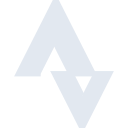

# strava

[← Back to main README](../../README.md)

<table><tr>
  <td></td>
  <td></td>
  <td></td>
</tr></table>

## 16 px

### black
```
https://georgegach.github.io/compatible-icons/simple-icons/compat/strava/16/black.png
```

### slate
```
https://georgegach.github.io/compatible-icons/simple-icons/compat/strava/16/slate.png
```

### white
```
https://georgegach.github.io/compatible-icons/simple-icons/compat/strava/16/white.png
```

## 64 px

### black
```
https://georgegach.github.io/compatible-icons/simple-icons/compat/strava/64/black.png
```

### slate
```
https://georgegach.github.io/compatible-icons/simple-icons/compat/strava/64/slate.png
```

### white
```
https://georgegach.github.io/compatible-icons/simple-icons/compat/strava/64/white.png
```

## 128 px

### black
```
https://georgegach.github.io/compatible-icons/simple-icons/compat/strava/128/black.png
```

### slate
```
https://georgegach.github.io/compatible-icons/simple-icons/compat/strava/128/slate.png
```

### white
```
https://georgegach.github.io/compatible-icons/simple-icons/compat/strava/128/white.png
```

## 512 px

### black
```
https://georgegach.github.io/compatible-icons/simple-icons/compat/strava/512/black.png
```

### slate
```
https://georgegach.github.io/compatible-icons/simple-icons/compat/strava/512/slate.png
```

### white
```
https://georgegach.github.io/compatible-icons/simple-icons/compat/strava/512/white.png
```

## 1024 px

### black
```
https://georgegach.github.io/compatible-icons/simple-icons/compat/strava/1024/black.png
```

### slate
```
https://georgegach.github.io/compatible-icons/simple-icons/compat/strava/1024/slate.png
```

### white
```
https://georgegach.github.io/compatible-icons/simple-icons/compat/strava/1024/white.png
```

## 16 px in base64

### black
```
data:image/png;base64,iVBORw0KGgoAAAANSUhEUgAAABAAAAAQCAYAAAAf8/9hAAAABmJLR0QA/wD/AP+gvaeTAAAA70lEQVQ4jZ3SzyvEQRjH8Vet5cJRubjsgXCS/8ZfIKUokqO/xL+wyUF7UCQl5Uhp9+CgXcSJuK3DzPSdlO8Pn3pqnpl5f2bmmYe/1UO3ZL1UyxjiCZ3/GJxhHOO4KbyCUWYwwkITg/MMTnFSF17Fc4Te8BnHQyzWMbjMTj1AP8tPq+A1vMTNr5jGJj4UtVgqM7jOTtvDnFC8x2z+QvjWDqZgIsIzuMV9zI+wjsMI3uFG6I8rtDBf9aS2ogZ9zOId39ivgpO28RWjF80G6fp1lN9iHI1268JJW4p+GGCyqUELD8Lbd5rCSRtCN7Z/L/wAW/xHbt8Wo0sAAAAASUVORK5CYII=
```

### slate
```
data:image/png;base64,iVBORw0KGgoAAAANSUhEUgAAABAAAAAQCAYAAAAf8/9hAAAABmJLR0QA/wD/AP+gvaeTAAABnElEQVQ4jZWSzU4UURCFv7rdZpSIwkIaNcZkDP5gTDSgiQ/gS/gWPoFxqTETkRHjypV718S1G4lLiRITe0LPDwNOA44OkL7HBT3GgD0yZ3WrKverU/cWFKjW2lys1Ttvi+p9uX8l48b2NOgGgbsdt9Ly0ABnWRUxiXTOZM+GAsSNjeuC6X4sdGe1vXV5CAduAYj6kUGkTJUjAZK1zi1n7mre+jvwE0DSTJJsXfkvIPPMC00AyHgKNHIbk1mouYGAuJ7OIOvPun7C7c5jVsHUBZDXzW/17WuFADMWMM7k5yddRk46Z+/M20aei1zgX8WttBy30vLKikoAIUC73R795fmI1zJA4IPXhNl973mEQ5I+mfjA/u+8NxGEIRf2pyvQknRsYm1zGXEJ+Lqj4G7JZZ/lGQEeXjw79vjQI/6tWbM9J6tK9CTOl5x/gxg3R7L74/Sf5SoEADSjUy/MSMw4jnQPrOdxL6embOdIgFmzPUNz5PsAqnfXR58PunNIkoJaK/0SN9LearPz4GB9oAMAM8vAV8xZpxmNVQ/WfwN5XKz2k9EwwQAAAABJRU5ErkJggg==
```

### white
```
data:image/png;base64,iVBORw0KGgoAAAANSUhEUgAAABAAAAAQCAYAAAAf8/9hAAAABmJLR0QA/wD/AP+gvaeTAAAA+ElEQVQ4jZ2SzyqEYRSHnxrDhqWysZnFyFjJ3bgCKUWRLF2JW5hkoVkokpKypDSzsNCMESti99icyYlmvu9z6tT7vuf9PedPB8aY2lHb4+ITTW2pffVJbfwHcOaPHVcVr6iDBBiozSqAc//aSVnxqvocolf1I859dakM4DJlPVC76X5aJF5Th/H5RZ1VN9X3NIvlSYDrlG1PXVCb6mN6v1Ab4TMAUyGeA26B++AdAevAISBwB9wALeAKqAGLRS3V0wy66rz6pn6p+4UDDci2+hneCVhvVH4ZQK7CAO2WEifIVtqHnjpdFVBTH6L3nUriBNmIbaz/jn0DztRjYEdR53IAAAAASUVORK5CYII=
```

