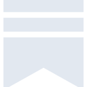
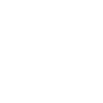

# substack

[← Back to main README](../../README.md)





## 16 px

### black
```
https://georgegach.github.io/compatible-icons/simple-icons/substack/16/black.png
```

### slate
```
https://georgegach.github.io/compatible-icons/simple-icons/substack/16/slate.png
```

### white
```
https://georgegach.github.io/compatible-icons/simple-icons/substack/16/white.png
```

## 64 px

### black
```
https://georgegach.github.io/compatible-icons/simple-icons/substack/64/black.png
```

### slate
```
https://georgegach.github.io/compatible-icons/simple-icons/substack/64/slate.png
```

### white
```
https://georgegach.github.io/compatible-icons/simple-icons/substack/64/white.png
```

## 128 px

### black
```
https://georgegach.github.io/compatible-icons/simple-icons/substack/128/black.png
```

### slate
```
https://georgegach.github.io/compatible-icons/simple-icons/substack/128/slate.png
```

### white
```
https://georgegach.github.io/compatible-icons/simple-icons/substack/128/white.png
```

## 512 px

### black
```
https://georgegach.github.io/compatible-icons/simple-icons/substack/512/black.png
```

### slate
```
https://georgegach.github.io/compatible-icons/simple-icons/substack/512/slate.png
```

### white
```
https://georgegach.github.io/compatible-icons/simple-icons/substack/512/white.png
```

## 1024 px

### black
```
https://georgegach.github.io/compatible-icons/simple-icons/substack/1024/black.png
```

### slate
```
https://georgegach.github.io/compatible-icons/simple-icons/substack/1024/slate.png
```

### white
```
https://georgegach.github.io/compatible-icons/simple-icons/substack/1024/white.png
```

## 16 px in base64

### black
```
data:image/png;base64,iVBORw0KGgoAAAANSUhEUgAAABAAAAAQCAYAAAAf8/9hAAAABmJLR0QA/wD/AP+gvaeTAAAAu0lEQVQ4jc3TsWoCQRSF4U+dYBNEU6SxsrAPCD5JGrupxSpFqjxBCntfTATFFOm0WUghiy5auNslkp3KAxcuzJzDf2e4EHFOrBhc9YOjenqABp4wqGmu9BUwwieKmuYW3gP6eEkk6AfssZL2BvsGHvGcSLALeMUceU1zG2/VN/YSCTRTjfcTEG6cZViX/RDd/xLk2GCGcVkTLHH4LSS6blaBb3z8QdbEFFucSk+sAjIs0LkxUqVOeTdDvAAMIC27KLJuxgAAAABJRU5ErkJggg==
```

### slate
```
data:image/png;base64,iVBORw0KGgoAAAANSUhEUgAAABAAAAAQCAYAAAAf8/9hAAAABmJLR0QA/wD/AP+gvaeTAAABIUlEQVQ4jcWSsUoDURREz7zdRAXBTQpjFJdYWIgIASFfYmOnvZWIX2BlYWmlWPkPfokICham2jRGi2TVd6+FiiAEXBunHc7McLnqF087ZnbBHxRC2E0tggLPbrxWgRWoWQQ9PAyblvjKnxZE3adW902cY4lYBXYnscQP00Rhydy6eLV2AUFhKSX6QOLG8Wo3QDWiD1QUxezI6/PV+j80o5ciHcfpLQU7AZXVcJ8ax+n9NCRgRoOqRwBCAqEy9TPk3wPSSYbDo5xbABerguxXC9wpHb9zs728nfXydtYLQduOXwOjiQFChnvf5Ud5K1vrLDYvv7zl+bmrvJVtIDsA7uH77cMnPUQ6K+u23lloHEl6+9kkyfJW87Ssxa4UzhFDgHfkXGpzv7l38wAAAABJRU5ErkJggg==
```

### white
```
data:image/png;base64,iVBORw0KGgoAAAANSUhEUgAAABAAAAAQCAYAAAAf8/9hAAAABmJLR0QA/wD/AP+gvaeTAAAAy0lEQVQ4jc3TsUoDURCF4e/GFRsJamGTysJeEPIkNnZbi5WFlU9gYe+LiaBoYWeaBQsJGo5FsiAEgnsrTzUwcw7/3MtI0qZebWOpD3wZpm0oSQ5wNNDc67XBKW6xGGjewnWDCU4qCSYNZnhU9wazkmQXh5UE7w3OcIf5QPMOrvpv3K8kMKo1/p+AZkOvw9OqPsbeXwnmeMZlKWVaSpniHA/4XJv+dY2LJG9JbpKskSUZJblI8pLku7/GPqBLcp9kvHHhZdB4NdslaX8AWOefT6lnMpcAAAAASUVORK5CYII=
```

