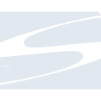
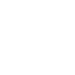

# subversion

[← Back to main README](../../README.md)





## 16 px

### black
```
https://georgegach.github.io/compatible-icons/simple-icons/subversion/16/black.png
```

### slate
```
https://georgegach.github.io/compatible-icons/simple-icons/subversion/16/slate.png
```

### white
```
https://georgegach.github.io/compatible-icons/simple-icons/subversion/16/white.png
```

## 64 px

### black
```
https://georgegach.github.io/compatible-icons/simple-icons/subversion/64/black.png
```

### slate
```
https://georgegach.github.io/compatible-icons/simple-icons/subversion/64/slate.png
```

### white
```
https://georgegach.github.io/compatible-icons/simple-icons/subversion/64/white.png
```

## 128 px

### black
```
https://georgegach.github.io/compatible-icons/simple-icons/subversion/128/black.png
```

### slate
```
https://georgegach.github.io/compatible-icons/simple-icons/subversion/128/slate.png
```

### white
```
https://georgegach.github.io/compatible-icons/simple-icons/subversion/128/white.png
```

## 512 px

### black
```
https://georgegach.github.io/compatible-icons/simple-icons/subversion/512/black.png
```

### slate
```
https://georgegach.github.io/compatible-icons/simple-icons/subversion/512/slate.png
```

### white
```
https://georgegach.github.io/compatible-icons/simple-icons/subversion/512/white.png
```

## 1024 px

### black
```
https://georgegach.github.io/compatible-icons/simple-icons/subversion/1024/black.png
```

### slate
```
https://georgegach.github.io/compatible-icons/simple-icons/subversion/1024/slate.png
```

### white
```
https://georgegach.github.io/compatible-icons/simple-icons/subversion/1024/white.png
```

## 16 px in base64

### black
```
data:image/png;base64,iVBORw0KGgoAAAANSUhEUgAAABAAAAAQCAYAAAAf8/9hAAAABmJLR0QA/wD/AP+gvaeTAAABGklEQVQ4jaXTyy5EQRgE4O9wXEYYZgQJEQseQEI8hqews/AknsLO1pLE3lZiLa5xm8RlcJjBon/JEDORTG066VT93VXVTZfIsNSF/jTDI97+Qe7FAPrxikNsZfjsICpwE4c08RCDShhF5a8B10E8xjOmMIERjKOnlZzHeosadrCHNSyHeLCTrxzb2MQBZsJbpYXTCAsvYaOQMivwlP0amGEdi7jDeVi5xAWuYuAPAZQxjUnMYR4LsVeWku8L/glWpSbkMfU9CCUprHa4j5s1sIKNXEq2wFAb0ZvUzBn2MYYjVDGetQRTCsG71EpdqvM+bFRCXP2dQU16LPU4rYlhqb4R6Q3k2iDDrhTYbMuVC3x0yOIb/d1+pu7xBZM2RJkX+dzUAAAAAElFTkSuQmCC
```

### slate
```
data:image/png;base64,iVBORw0KGgoAAAANSUhEUgAAABAAAAAQCAYAAAAf8/9hAAAABmJLR0QA/wD/AP+gvaeTAAABnklEQVQ4ja2TwU5TYRSEvzn3tlIjhdIoikYhsGJhTDQ+hk/hzoVP4lO4c+vWRNcmrkjcuMEWoYVW2yLIbXv/cQHRIIqJOPuZyZc5By4ofdwe3P9X8ySydq7wG6zx36vIbC5JroKOgI1qpOdqdQY+x1Ug72Ht41RaMRLOgJrNHEEjP1vErmFk2BTpEMei8VVJs8LrQABIgCE/MfUsPqfEyyzTK9uPwzwwsQie0TlkueGFrGe3r8+9bfd6Nz3JNyQax1wGMSWxL+kbuEQUtse2CuGvp8Jta6vz5QmKe0n0w/5k2MSxo8pk+1az2ZU0/QUZPvT79byoLGWU1yKLOyVpNRxrkJYs1QVVrApCxq3ycO7RyoqOAPJ2Z9j1JE0cqSJUS/asEMbH+YYfODAU6i8vM23vDB8SPM0NTVAhuPz7PTWWvAvaSqVfI8+3u4P3hgVZTbU6gxIogNqJYwLuQRxgjwxDwnWshmAeWDi1AmIo2AMOsMZJlDJXJGYSvhHSXVtn7uVngPUu4bUQq8bIjMGFE0kIm9Efj0CuXuiZ/ou+A47v0wsVtNEdAAAAAElFTkSuQmCC
```

### white
```
data:image/png;base64,iVBORw0KGgoAAAANSUhEUgAAABAAAAAQCAYAAAAf8/9hAAAABmJLR0QA/wD/AP+gvaeTAAABNUlEQVQ4jaXTvUpdQRQF4G/0xHgl/lwlCZjCwjxAIJLH8CnsLPIkeQo7W1vBPpAqkDqoMWgSwX+PXt0pZgtHyJXAXc0ww1p79lp7hhFRIuL9CPq9EhFnuPkP8jieYwLX+IqNEhHxhKjFL5zhDqdZqIdZ9P9V4CiJ33GJ13iJaSxgrEtucv2NY2xhG2tYSfHkU74abOJTKeVzRLxJb/0OZ5AWrtJGq2bW4rx0q0VEwTre4Q9+pJWfOMBhKWXQ1ZQUzmARr7CEZbzNsxk1+WfJ38VqKeUamog4xG0SehnWMJxkZ4OI+ICPjZpsi6khoht1MvvYwRy+YR4LJSIeguml4FadyoU6zpO00U/x/KMMIuJYfSwXedsdXqjjm1bfQGMIGnxRA1vutNziPvenQxNhYtTPNDr+An/qaYt/kqgMAAAAAElFTkSuQmCC
```

