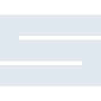
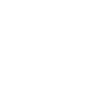

# suckless

[← Back to main README](../../README.md)

<table><tr>
  <td></td>
  <td></td>
  <td></td>
</tr></table>

## 16 px

### black
```
https://georgegach.github.io/compatible-icons/simple-icons/compat/suckless/16/black.png
```

### slate
```
https://georgegach.github.io/compatible-icons/simple-icons/compat/suckless/16/slate.png
```

### white
```
https://georgegach.github.io/compatible-icons/simple-icons/compat/suckless/16/white.png
```

## 64 px

### black
```
https://georgegach.github.io/compatible-icons/simple-icons/compat/suckless/64/black.png
```

### slate
```
https://georgegach.github.io/compatible-icons/simple-icons/compat/suckless/64/slate.png
```

### white
```
https://georgegach.github.io/compatible-icons/simple-icons/compat/suckless/64/white.png
```

## 128 px

### black
```
https://georgegach.github.io/compatible-icons/simple-icons/compat/suckless/128/black.png
```

### slate
```
https://georgegach.github.io/compatible-icons/simple-icons/compat/suckless/128/slate.png
```

### white
```
https://georgegach.github.io/compatible-icons/simple-icons/compat/suckless/128/white.png
```

## 512 px

### black
```
https://georgegach.github.io/compatible-icons/simple-icons/compat/suckless/512/black.png
```

### slate
```
https://georgegach.github.io/compatible-icons/simple-icons/compat/suckless/512/slate.png
```

### white
```
https://georgegach.github.io/compatible-icons/simple-icons/compat/suckless/512/white.png
```

## 1024 px

### black
```
https://georgegach.github.io/compatible-icons/simple-icons/compat/suckless/1024/black.png
```

### slate
```
https://georgegach.github.io/compatible-icons/simple-icons/compat/suckless/1024/slate.png
```

### white
```
https://georgegach.github.io/compatible-icons/simple-icons/compat/suckless/1024/white.png
```

## 16 px in base64

### black
```
data:image/png;base64,iVBORw0KGgoAAAANSUhEUgAAABAAAAAQCAYAAAAf8/9hAAAABmJLR0QA/wD/AP+gvaeTAAAAPUlEQVQ4jWNgGGjAyMDAcIxSA/5TYgATJZoZGBgYWJDYbxkYGG7R3QWDIwyOk6FPjYGBQZgqLhi6YTCIAADnpAds0IcSewAAAABJRU5ErkJggg==
```

### slate
```
data:image/png;base64,iVBORw0KGgoAAAANSUhEUgAAABAAAAAQCAYAAAAf8/9hAAAABmJLR0QA/wD/AP+gvaeTAAAAVElEQVQ4jWNgGGjA+Pjlx2OUGMDy//9/S0oMYKJEMwMDAwMLjMHIwPCWgZHxFt1dwPjoxYf/lBhAeRgwMjIeJ1nX//9q/xkYhKnjgoFPB2SFwaACALa5FF2cAyltAAAAAElFTkSuQmCC
```

### white
```
data:image/png;base64,iVBORw0KGgoAAAANSUhEUgAAABAAAAAQCAYAAAAf8/9hAAAABmJLR0QA/wD/AP+gvaeTAAAAPUlEQVQ4jWNgGGjA+P///2OUGvCfEgOYKNHMwMDAwILEfsvAwHCL7i4YHGFwnAx9agwMDMJUccHQDYNBBADtUhNgYNqsJgAAAABJRU5ErkJggg==
```

