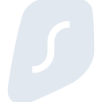

# surfshark

[← Back to main README](../../README.md)

<table><tr>
  <td></td>
  <td></td>
  <td></td>
</tr></table>

## 16 px

### black
```
https://georgegach.github.io/compatible-icons/simple-icons/compat/surfshark/16/black.png
```

### slate
```
https://georgegach.github.io/compatible-icons/simple-icons/compat/surfshark/16/slate.png
```

### white
```
https://georgegach.github.io/compatible-icons/simple-icons/compat/surfshark/16/white.png
```

## 64 px

### black
```
https://georgegach.github.io/compatible-icons/simple-icons/compat/surfshark/64/black.png
```

### slate
```
https://georgegach.github.io/compatible-icons/simple-icons/compat/surfshark/64/slate.png
```

### white
```
https://georgegach.github.io/compatible-icons/simple-icons/compat/surfshark/64/white.png
```

## 128 px

### black
```
https://georgegach.github.io/compatible-icons/simple-icons/compat/surfshark/128/black.png
```

### slate
```
https://georgegach.github.io/compatible-icons/simple-icons/compat/surfshark/128/slate.png
```

### white
```
https://georgegach.github.io/compatible-icons/simple-icons/compat/surfshark/128/white.png
```

## 512 px

### black
```
https://georgegach.github.io/compatible-icons/simple-icons/compat/surfshark/512/black.png
```

### slate
```
https://georgegach.github.io/compatible-icons/simple-icons/compat/surfshark/512/slate.png
```

### white
```
https://georgegach.github.io/compatible-icons/simple-icons/compat/surfshark/512/white.png
```

## 1024 px

### black
```
https://georgegach.github.io/compatible-icons/simple-icons/compat/surfshark/1024/black.png
```

### slate
```
https://georgegach.github.io/compatible-icons/simple-icons/compat/surfshark/1024/slate.png
```

### white
```
https://georgegach.github.io/compatible-icons/simple-icons/compat/surfshark/1024/white.png
```

## 16 px in base64

### black
```
data:image/png;base64,iVBORw0KGgoAAAANSUhEUgAAABAAAAAQCAYAAAAf8/9hAAAABmJLR0QA/wD/AP+gvaeTAAABEklEQVQ4jYXTzypFURQG8J97lT+JIh5CGRuIYmbsARgZeYBbRl7AO5grJSMxJzIzIMXo6CYZqMvNdRnsc7Tb9uGrNdhrre9r/dv8xiyuUKCLr8g+8YxzjGS4ZvCQkHL2gZ2cwC76NaRe8j6ERiKwgoHE18YBtsq2KkzBYOQYx2RCfsKG0HsLQ1GsmQosVKoRbvCIY2E+MRppC6sYTZLOsJYh/1QQC8xnkjoZ0doK0vL7wtDGagR6scA0hpPgHfaxmCH3cRI7lvEq7LfAurCRvbKN9CbuMRELbEfBNk5xi/cMucBSWtJRJjG1rrDWudxALv4gdsqSW2o+EOH3pcQXXJfzaNYRK2wKF/dW9ngpHNa/+Aa50WWx8am2CQAAAABJRU5ErkJggg==
```

### slate
```
data:image/png;base64,iVBORw0KGgoAAAANSUhEUgAAABAAAAAQCAYAAAAf8/9hAAAABmJLR0QA/wD/AP+gvaeTAAABtElEQVQ4jXWTMWtTURzFf+feGGOpGhKMcUhV3MTBukgVQbo5K7ipg6MfIIuImzg4+wE6Cm4KxQ/QvZOYoTrkKVKsBCy0793jkLyYl8T/9Djnf84991yemJuv2egqFFuSurbbEvUZOgEHNoOQj+72er3DMCsefB91UP5BYh18YU4MEIBWCNygvtovgenUSf1AWJtPBSBUlN82NSfWFwzAm8aqIPADeC/5GfJwios2QK0Evuzvn9ERrYrc/AxRT9KxiyLSl3USlXdRrBg0itpty+3qjf1Zdhaitg0dVGUrBiTuASuzGyl5B3Qf0ZnvxCJWOjC+Ob8k/Ae0Mo+PubF2tsRqfJxiiEPE6jIDm3xqkGWjcxKNGT7HGnAc3iHfWaJPTnyaGhTk12zOTrwzOzxVro0i+g2Jywunw7e8kV5NDXLVbsE4qggR0iOfYAd4iHSqKnZWhPj4Sqv1GyavEJ1vWCoXOhKbYFR9tiPMXpAfXOyc3i3BcYnS+WVFjRNxaLznwAvlo+u9bmt3lq9NtiJe0B6Ah8m8Xus2t6R//8KCgeCt0UvsJsG/nDR01PNLnebH/yUr5y/bqqDbiKeGAgAAAABJRU5ErkJggg==
```

### white
```
data:image/png;base64,iVBORw0KGgoAAAANSUhEUgAAABAAAAAQCAYAAAAf8/9hAAAABmJLR0QA/wD/AP+gvaeTAAABK0lEQVQ4jY2TvUoDQRRGj4ngD6IQMaUPIFhYWYiCdql9AK2s8gABKx/FXrCxEu0VJZ1FRNBqQxCxEKJBk2ORzbKZTKJftTt3vjPfnb0LgdQ1ta4masdhddU39VadC72oZfXFv/WtngAUAkYNWB0h99XNPU8DGzHAHjAVrLWAc6AKJLn15QFpEH8RKAXmV+AwPb0GzORqxSEAsDWg5tQAmsAlUA5qhbCFCjAfbLoB9iPmLEEesBnZ1I5AxyYI4/foX9rCGMBPBlBXgNmg+AScAdsRcw+4yt7UXfUjHZJEPVBL6qnajgzSs7qUBxznii31Wn1UvyLmRN0ZyqNe/GN8O2pDXR9pSL2bYGynkWvGfqAUUI8Y39UH+/dRHPMlMsCR2lQ/0x7v1cpEU6pfd9tpShsXScEAAAAASUVORK5CYII=
```

