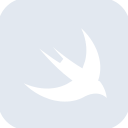

# swift

[← Back to main README](../../README.md)

<table><tr>
  <td></td>
  <td></td>
  <td></td>
</tr></table>

## 16 px

### black
```
https://georgegach.github.io/compatible-icons/simple-icons/compat/swift/16/black.png
```

### slate
```
https://georgegach.github.io/compatible-icons/simple-icons/compat/swift/16/slate.png
```

### white
```
https://georgegach.github.io/compatible-icons/simple-icons/compat/swift/16/white.png
```

## 64 px

### black
```
https://georgegach.github.io/compatible-icons/simple-icons/compat/swift/64/black.png
```

### slate
```
https://georgegach.github.io/compatible-icons/simple-icons/compat/swift/64/slate.png
```

### white
```
https://georgegach.github.io/compatible-icons/simple-icons/compat/swift/64/white.png
```

## 128 px

### black
```
https://georgegach.github.io/compatible-icons/simple-icons/compat/swift/128/black.png
```

### slate
```
https://georgegach.github.io/compatible-icons/simple-icons/compat/swift/128/slate.png
```

### white
```
https://georgegach.github.io/compatible-icons/simple-icons/compat/swift/128/white.png
```

## 512 px

### black
```
https://georgegach.github.io/compatible-icons/simple-icons/compat/swift/512/black.png
```

### slate
```
https://georgegach.github.io/compatible-icons/simple-icons/compat/swift/512/slate.png
```

### white
```
https://georgegach.github.io/compatible-icons/simple-icons/compat/swift/512/white.png
```

## 1024 px

### black
```
https://georgegach.github.io/compatible-icons/simple-icons/compat/swift/1024/black.png
```

### slate
```
https://georgegach.github.io/compatible-icons/simple-icons/compat/swift/1024/slate.png
```

### white
```
https://georgegach.github.io/compatible-icons/simple-icons/compat/swift/1024/white.png
```

## 16 px in base64

### black
```
data:image/png;base64,iVBORw0KGgoAAAANSUhEUgAAABAAAAAQCAYAAAAf8/9hAAAABmJLR0QA/wD/AP+gvaeTAAABJ0lEQVQ4jY3Tvy5EURAG8N9ekiUEQSJeQKNSikIhHodGFJ7Cs2hUu4VEdBKR+FcpxBJCEP9W2Ku4Izm5dl2TTOacud989ztnzsAYmmihjbzC3wPbjFpNdP5RWPYOGoKtCvzUI9/KMK6wPOKr3/aCqy758Qz1hOAFWcQ8AU6F3PMSQT1LNhm+IvYpLqsd32qYwToeyzLK57rFKT5xhPvI7wfRWYrPymyYxAg2sItVXOAuig6rFPz4JZYCM425WG+WcHK84aYLyTVWSj/cSjH9kRzAMw4wFPscD0Ge2jYWMdrtCJdYw6CiE6n1YR6zikvOkdcU7aonwFfF69zDDj6wgGVMKLozHCrbVD/lv+akleHk5zZ7WK1HvoNjipFshJL3CjXpODcw+g0eDJsSmPiAigAAAABJRU5ErkJggg==
```

### slate
```
data:image/png;base64,iVBORw0KGgoAAAANSUhEUgAAABAAAAAQCAYAAAAf8/9hAAAABmJLR0QA/wD/AP+gvaeTAAABrklEQVQ4jYWSwU5TQRiFvzNXSxMMaEEU00TiwgQfwI0L4sIn6N430Lhx4Uu49A1c6tKVxZgQtxoXsjJQEW6VaKtQ7C3tHBdXmtvS4r+ZzOScb87882ur1boYMr0QXgUtACXOKpMh/5TZ7JepqdFs14O4a6MzjWMlYcx6EF79n9nmYMKZjG8FW5VhuLyOTt+mDig9DVElSMwUAB1QyNchEPAVKb5GbI09YyYU9gExsB2ABLuLlZ1osW4KHhv/YsQ0kom5IH7baiBKKH5GtAAszleX5l/KfJsOyHMvKsS5aD8RyYaIDwU7mB+SrMDHov7cOCCnaDkoPIr9eP96tVLf3u/Uce9q3rjwtdiekwRd2ftjlGtKeL7TbD1YuTybrixdev/PcGNSgrLRoeGDYBZTzn9a7UHUnxGu/AqzBsyPPkEsSupBfKrjw2fVarUnaTDMYye73w9uD+LxBiRNKQeokba7hVlAcGTYs/TO1ttE7sXoOwrcAxaI6oMvIMo2mb40W3ug5YnNzIlm6qg7DTKbUnHqxjVTzCIKfQr9MjXMOjjFZBPFo8AMnMq86ZVi7S8PAsIc6+LMWAAAAABJRU5ErkJggg==
```

### white
```
data:image/png;base64,iVBORw0KGgoAAAANSUhEUgAAABAAAAAQCAYAAAAf8/9hAAAABmJLR0QA/wD/AP+gvaeTAAABSklEQVQ4jY3Tv2pUURAG8N+9G40SMSEJSF5AUCtLsbAQH8c0wcKnyJsE0qTaFAGxFgu1ERHJRgVR88fsiu5nsWfNzeVm9WvmzJxvvjmHmZFkKclukkGSUf6NYeHuJllSDuP/SGxjnKRf4xYqs3HUEatwu8ZyCaTYHx3kExx0xJdrzDcETlAXmwbxBvp41xKYrxtOjd/F9jDEqPHcm3iC71pJTVzHId7jMt7ia7m7hC18miUAq0XoKZ5hHR/wpaqq4OU59ow27Sd5WDhrSe6W82aTNBU4TfK5Q+RjksetgttNwlyJX8ExXmCh+ME3nLa+uIMHWOz6wn6SjSRXk/RalXtJ7iW5k+TNNKFKMnQ2C0wGaYDn2MNP3McjrOAXrpVXjqokA6x1dONvcReP+kGN185PXRsXJY/xSibr3M9kRYcz2jrFdJ37SRb/AGt+hAno0+YvAAAAAElFTkSuQmCC
```

