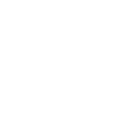

# swiggy

[← Back to main README](../../README.md)




## 16 px

### black
```
https://georgegach.github.io/compatible-icons/simple-icons/swiggy/16/black.png
```

### slate
```
https://georgegach.github.io/compatible-icons/simple-icons/swiggy/16/slate.png
```

### white
```
https://georgegach.github.io/compatible-icons/simple-icons/swiggy/16/white.png
```

## 64 px

### black
```
https://georgegach.github.io/compatible-icons/simple-icons/swiggy/64/black.png
```

### slate
```
https://georgegach.github.io/compatible-icons/simple-icons/swiggy/64/slate.png
```

### white
```
https://georgegach.github.io/compatible-icons/simple-icons/swiggy/64/white.png
```

## 128 px

### black
```
https://georgegach.github.io/compatible-icons/simple-icons/swiggy/128/black.png
```

### slate
```
https://georgegach.github.io/compatible-icons/simple-icons/swiggy/128/slate.png
```

### white
```
https://georgegach.github.io/compatible-icons/simple-icons/swiggy/128/white.png
```

## 512 px

### black
```
https://georgegach.github.io/compatible-icons/simple-icons/swiggy/512/black.png
```

### slate
```
https://georgegach.github.io/compatible-icons/simple-icons/swiggy/512/slate.png
```

### white
```
https://georgegach.github.io/compatible-icons/simple-icons/swiggy/512/white.png
```

## 1024 px

### black
```
https://georgegach.github.io/compatible-icons/simple-icons/swiggy/1024/black.png
```

### slate
```
https://georgegach.github.io/compatible-icons/simple-icons/swiggy/1024/slate.png
```

### white
```
https://georgegach.github.io/compatible-icons/simple-icons/swiggy/1024/white.png
```

## 16 px in base64

### black
```
data:image/png;base64,iVBORw0KGgoAAAANSUhEUgAAABAAAAAQCAYAAAAf8/9hAAAABmJLR0QA/wD/AP+gvaeTAAAA90lEQVQ4jZXTvUrEQBQF4I8lYqPFvoEKdla2Nj6B4AP4Aoqlnb6Hb6LYClb2Kiz+oEu0Eo34B2YtMmHjJpONBy7DzNxzztyZO9SxhDMM8Y4vpDjHSkP+H6ziAaNIDLEeI89i0EIu4xpzTQI7+GggvE7Mv7HXJHAcccyQT6ydlqSkItCPlPYWXPMwXuKg3OxVEtOIwHwlN8FyOEUNW4onm3aJObZjTrcdBFIsNpWQ4SjU2YZH3MQ2E+ziPgjehSjdn7E5xcCGcT9kwbH2fG3o4SoQPhU1jxQtvtBFANbwVHF+wX5XconDcIIfnPyXDDOKL3xh3Ew1/AJMBGukS2wtBQAAAABJRU5ErkJggg==
```

### slate
```
data:image/png;base64,iVBORw0KGgoAAAANSUhEUgAAABAAAAAQCAYAAAAf8/9hAAAABmJLR0QA/wD/AP+gvaeTAAABpUlEQVQ4jXWST08TURTFz7mdsRWo2oYZi4KKhC0JLPwW8AWIiTFuXLhz68ZPwQdwazTGhMSVOzcuISFhAZ0ILZDgQLvQOn3HRVv6503v5uW+e+7vnvvyiImon6VPIXwg+BhwFYkFEJcUTkD34lGtujeq52hyepFuZA5fIDycBPflp13Z9vJC+bsHODxU8dZcuk9yJb+5FwKObltnLY7jNgDYoBDO/H5FmjeZUGv8got/VXo9SG8ANNsEVMqZyN7R10mhc92tQR7ckAwVCTnBNsAOJAeyI7gDucI7z4GkRl4/wTJ6ZBMUGLgaBENHQ4DDRwgdfwXNgqiCqBKInbCYuWzdA8yE2WcjGnlLjDkiz0Db9QBRFLUk7Ar0XEw4aj6p3TvyAACwVLv7xgxvIf0C1IaUUEiGzUiN9n60ZwxAMjOyLnAe4BzJqsjisK69pft3Pk0FAMCD+fJXWm+qyBD9P0DipOvwfFLvAUi6AuylgHNIRUA1ENcSd5YXKsfT3saLpJnu1BtXf5JG2k2a6bdpOk4r/JTC+Pz6B51mS8G/Z1EUtfJ0/wFemaAS5WV+MQAAAABJRU5ErkJggg==
```

### white
```
data:image/png;base64,iVBORw0KGgoAAAANSUhEUgAAABAAAAAQCAYAAAAf8/9hAAAABmJLR0QA/wD/AP+gvaeTAAABIElEQVQ4jZWTwS4EQRRF75v0hGT0gogNCyR2Nmxt/ACJf7Cx8Af8h5+QWUp8gJWlBIlgwqRZiTSC4FhMNS89VWPcpNJ5qXtv3VevWqoBmAeOgC7wArwBBXAMLNb5dfEycEsaXWA1JR4BLgaIK1wCY5Wu4Tw2JU1HvMtaPSNpK2awJmk0YmCScHVT0npVZG5jPNqb9CTpXdJX+J5J2o0lKBIGueNmkhZ8Im+wH06ooyVpIqwp9e5gqY8F5MD1EFMogLm+BGZWSjpIpPC4M7Or6A6QAdvADVACnbAqPAAbXuOnIDP7ADqSJvU70mdHOTGz9sB8QAM4Dye+hp4JT3z2j/Z+TFaAexf9EdgZSuxM9kKCT+DwX+Jg0KT3C58CeYr3DTmjLnuapwPHAAAAAElFTkSuQmCC
```

