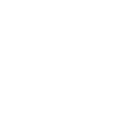

# symfony

[← Back to main README](../../README.md)




## 16 px

### black
```
https://georgegach.github.io/compatible-icons/simple-icons/symfony/16/black.png
```

### slate
```
https://georgegach.github.io/compatible-icons/simple-icons/symfony/16/slate.png
```

### white
```
https://georgegach.github.io/compatible-icons/simple-icons/symfony/16/white.png
```

## 64 px

### black
```
https://georgegach.github.io/compatible-icons/simple-icons/symfony/64/black.png
```

### slate
```
https://georgegach.github.io/compatible-icons/simple-icons/symfony/64/slate.png
```

### white
```
https://georgegach.github.io/compatible-icons/simple-icons/symfony/64/white.png
```

## 128 px

### black
```
https://georgegach.github.io/compatible-icons/simple-icons/symfony/128/black.png
```

### slate
```
https://georgegach.github.io/compatible-icons/simple-icons/symfony/128/slate.png
```

### white
```
https://georgegach.github.io/compatible-icons/simple-icons/symfony/128/white.png
```

## 512 px

### black
```
https://georgegach.github.io/compatible-icons/simple-icons/symfony/512/black.png
```

### slate
```
https://georgegach.github.io/compatible-icons/simple-icons/symfony/512/slate.png
```

### white
```
https://georgegach.github.io/compatible-icons/simple-icons/symfony/512/white.png
```

## 1024 px

### black
```
https://georgegach.github.io/compatible-icons/simple-icons/symfony/1024/black.png
```

### slate
```
https://georgegach.github.io/compatible-icons/simple-icons/symfony/1024/slate.png
```

### white
```
https://georgegach.github.io/compatible-icons/simple-icons/symfony/1024/white.png
```

## 16 px in base64

### black
```
data:image/png;base64,iVBORw0KGgoAAAANSUhEUgAAABAAAAAQCAYAAAAf8/9hAAAABmJLR0QA/wD/AP+gvaeTAAABN0lEQVQ4jY3Tyy5EQRQF0KU9gsSbAfERwsyAECOf4VvMjRhIempibCjxCRISIS3aI9JMSHukEY/BPZ0urS92cnLrVtXe59SpXXzHMIo4xS1qEbcxV8SQHCzhHO/4zIl3lLHYilz5hViPj/hWsJCWff4H8R6vuMNhzJUx1I51zKEt52hvOEJ3EGEQ/RgVzUmzXeIZL7jBGTaStXRvqYC+poxrQexCO3YwjceoIkVfK4FprMZ5O7GNMTxE6Sn6C8nPDU6wjCdcyJp3HNWMo6O5QYVQFtlGZM1ciXEVszFuhYdUYBi9kX0GkzgIsZ4cgWoBezKDiI0TIVbDPqZyyB/YJfN2WeNqtnCFa1lP8sxVxkBdbVHDypehXtGwbnNUMN9c0kKo/ucx/SDXMYhNlGTXmj7nUqx988IXQk+ChoYdgi4AAAAASUVORK5CYII=
```

### slate
```
data:image/png;base64,iVBORw0KGgoAAAANSUhEUgAAABAAAAAQCAYAAAAf8/9hAAAABmJLR0QA/wD/AP+gvaeTAAAB7ElEQVQ4jXWTPU/TYRTFf+dpS4VYbIvEQIqFqJODipuJLxgmv4ETST+D8RM4oYmfwLiYODgziri6YOKkMdFaG/N36RsEgfY5Di2VmvZMNzf33HvOvbniFGq1VpGMnxruYXLALACiDepA3PGhHpXL+cYJRydBPWmu96JfSKFkHBiPaFHzMZXlUn572KCeNNe75pXgwgTiADZIQBLth8sLhXeq1VpFZ+Iu6OJEnmgZzWDvy6ojXzVUOeRGcCY+E6E0caY4Br4GuyXUM/HsQPpSyLIZQHdHPIuf2AdYR0K/MXUiHwznsQ8klQeVwWgtALmRkSE8RyTIU+CU5C1Jq+A9pDOjzsiFwbn+Se71ViN6gmlEnFHkjYnzEDrC+dGVenYo3ZDIfJH1wMR9BX4Imt1U5jPSFHjBkP5/RwHR6QdkLOYIKEWqAsyB2mkf35KZm7DjToB+A0MRmMHeB9+0KQl9ig4Vw/RYutQO4B0gDlLToEWgiPkT5Y8BXx/HNUTht6pWmwWy3hXD87w2viMIoD3gyvgGrnanfC2Uy/mGu6oYkr4sbgstQgiIyxO8JzGV3rhULLaGz/T9V2NN0kvZS0hjn8kQsWsxnd5Ymc+97887hW+NRj59pE2s+0Au2ucGRW2ktvB2N+vHK4VC84TzFyzt1ynwXlmaAAAAAElFTkSuQmCC
```

### white
```
data:image/png;base64,iVBORw0KGgoAAAANSUhEUgAAABAAAAAQCAYAAAAf8/9hAAAABmJLR0QA/wD/AP+gvaeTAAABW0lEQVQ4jY3TP2sUURQF8J/jHxIxmo2mUBS/gsTOZtlg5cfIZ7ESwT6Q1sbaUrC2ErQxrLDRKLvbJCYRQ2T3pMgLzA6z0QOPeZy559z7eOdRQ5KVJFtJviYZJzkua1y4rSQdbUjyNMlOkknmY5JkkGS9TTy8QHiOafkOk/TqY+/8Q7if5CTJXpLPhRsk6VR4ifut5zrDX/TxCxPcKPwDvKjQRVUT7OIPTjDGD3zAncI/LHUVehWWGh1fYYRruIy3WMMRFhq1S20Ga3iOPVzFG6ziEMuN2pv10UfYxjP8xjfs40uZ5i6uNAxUxVnpdhuXsFH2B3hS9m04rBus4Hrp/tjZzXwqZotzDA4qvMe0EIu4V8yO8RGP5oineCdJp4TiHK+T7Cb5mWT7gnANktwCSdZrUf5eIjusRbeJYZLuzDxJesX1fx5Tt+VIJFlOspmkn2SU2efcL/9msnAKeUOy9tiUaDwAAAAASUVORK5CYII=
```

