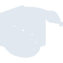
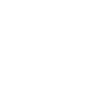

# sympy

[← Back to main README](../../README.md)





## 16 px

### black
```
https://georgegach.github.io/compatible-icons/simple-icons/sympy/16/black.png
```

### slate
```
https://georgegach.github.io/compatible-icons/simple-icons/sympy/16/slate.png
```

### white
```
https://georgegach.github.io/compatible-icons/simple-icons/sympy/16/white.png
```

## 64 px

### black
```
https://georgegach.github.io/compatible-icons/simple-icons/sympy/64/black.png
```

### slate
```
https://georgegach.github.io/compatible-icons/simple-icons/sympy/64/slate.png
```

### white
```
https://georgegach.github.io/compatible-icons/simple-icons/sympy/64/white.png
```

## 128 px

### black
```
https://georgegach.github.io/compatible-icons/simple-icons/sympy/128/black.png
```

### slate
```
https://georgegach.github.io/compatible-icons/simple-icons/sympy/128/slate.png
```

### white
```
https://georgegach.github.io/compatible-icons/simple-icons/sympy/128/white.png
```

## 512 px

### black
```
https://georgegach.github.io/compatible-icons/simple-icons/sympy/512/black.png
```

### slate
```
https://georgegach.github.io/compatible-icons/simple-icons/sympy/512/slate.png
```

### white
```
https://georgegach.github.io/compatible-icons/simple-icons/sympy/512/white.png
```

## 1024 px

### black
```
https://georgegach.github.io/compatible-icons/simple-icons/sympy/1024/black.png
```

### slate
```
https://georgegach.github.io/compatible-icons/simple-icons/sympy/1024/slate.png
```

### white
```
https://georgegach.github.io/compatible-icons/simple-icons/sympy/1024/white.png
```

## 16 px in base64

### black
```
data:image/png;base64,iVBORw0KGgoAAAANSUhEUgAAABAAAAAQCAYAAAAf8/9hAAAABmJLR0QA/wD/AP+gvaeTAAABM0lEQVQ4jaXSvU5VURAF4O9cr9fLj0IIdBTm9pZWJtZW+gDWvoU0ND4DPgKlLS9AA2+hiSQoELw/HLmH4qydHJUTE51kMtl7z6xZs/bwn/bgnvMr7OMHnuIxFpj3gVR4gUN8xxQ3uI0vE7/gAK/xvAvwFU2SFvGmx+d5v8CHAtCEbo3rTtdSUOMMP8OsxlXuJlUHfZY4xCBgY4w6Wh0l7xnWcTLojDGPHnVYDPM2yJ3kvMEEu/hWkjbxMIWjCPYotEeh3vyqvRu8LQDjJNeZfzv3F9FnnAZ/WBnhMjOvdZjMsBXAq5x7AZ4kUYfFRnSotMs07QM41Yqznlg2rnRcCeAUn+4DgT2tSEvtzPMO9bLGO33Fxd7hPJ3KOl8H5H1fUfXbeVX7zy+1f/0ZH3H8t+7/bHe/2WlOqt+LtwAAAABJRU5ErkJggg==
```

### slate
```
data:image/png;base64,iVBORw0KGgoAAAANSUhEUgAAABAAAAAQCAYAAAAf8/9hAAAABmJLR0QA/wD/AP+gvaeTAAABxElEQVQ4ja2SvW4TQRSFvzNrrxMS4zhCEEv5EWkjekRBB20eANHSUlPQAO+ARMkjgKh4ASQE74ABY2MpNonxrmN7DoXXJkJLBaeZGV3dM9/9gX+ULj5sJ1/6p3cdfV9BL6M9S3B/mvLperM5LDWwrfb3s1sQHwruYGrGFaFEApvl0RN+bfwGh2/7rcZ7AH3uDnuGq4JomBUk6eoH/YY0mmBLIhM839vZeqR2d2jjcVBIbU8k1m0EyDARJNEMQtA2OGoRy4xzSzfV7g4NGJyJYEMFEYhxZFiTQgpOAIi8dVCG4w2hTQU+hIKuh5UbCzwlem6pIgnjgDwFICg/2GkcH7Sah2cnjV2bk0pR6RZy1WYukSJ3AqohzTCpzLmRL3b/6EjnwL2CwGsgS0xBOehKNHXsKfhnhCq4WjbGsOiuf5g4AjbAVew5IgNtG2IQp+DsrwZCl4VicZ8iRUHDuAKWTR00LjcwHw051qYht8iLWLbYtLAORGAs9OpPAwG0e4PHWE+W47SVSKSCUTQ1gaske61WvV9awv615lPBA/AAUNBqKwNigvWsLHlFsFSn07k0CxvH2LeRDsFfA3qxu9N4V5b8X/QLKcvjHvydfMgAAAAASUVORK5CYII=
```

### white
```
data:image/png;base64,iVBORw0KGgoAAAANSUhEUgAAABAAAAAQCAYAAAAf8/9hAAAABmJLR0QA/wD/AP+gvaeTAAABUElEQVQ4jaWTu04CURCGvwFBUbzEaGdFb2liYmJpKQ9gLH0LrX0GLS0tbX0BG30HC0mIUZBwWUD4Lfg3bsxiwyQnZ8/MnO/MbWFBiexBUhE4Ac6BO+AbeAdeI6KdS5AUko4k3UtqSepLGkmaeE29NyTdSDqVdJAFNDWTiaSh1zxJbG9LugYISQL6QBkYAhWnFj4XgRawDUytHwAJcJgCZKWAJaAAdIEVg4sO+NF++0AVeC7Y0DQxgDEwMQjDxv5OIqIeETVgD/hMnbaAki+WgQaw7C6UgZGj+21fxAg4SwErdh47zx3r20DP9lJeF9MUvpzzWiaSQaZwHZ/nAjbsSCaKTdchgHVmncoFvDArYNV7Ylv6YsXAPvCQB0HSlQdlKqnngZlK6nhwEkm7uZczkAtJHx7ldJy7hlzOu/f3Z1oF6sAxUAPegNuIePr39UXkB0W2/FwuVswBAAAAAElFTkSuQmCC
```

