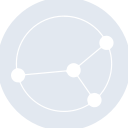
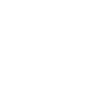

# syncthing

[← Back to main README](../../README.md)





## 16 px

### black
```
https://georgegach.github.io/compatible-icons/simple-icons/syncthing/16/black.png
```

### slate
```
https://georgegach.github.io/compatible-icons/simple-icons/syncthing/16/slate.png
```

### white
```
https://georgegach.github.io/compatible-icons/simple-icons/syncthing/16/white.png
```

## 64 px

### black
```
https://georgegach.github.io/compatible-icons/simple-icons/syncthing/64/black.png
```

### slate
```
https://georgegach.github.io/compatible-icons/simple-icons/syncthing/64/slate.png
```

### white
```
https://georgegach.github.io/compatible-icons/simple-icons/syncthing/64/white.png
```

## 128 px

### black
```
https://georgegach.github.io/compatible-icons/simple-icons/syncthing/128/black.png
```

### slate
```
https://georgegach.github.io/compatible-icons/simple-icons/syncthing/128/slate.png
```

### white
```
https://georgegach.github.io/compatible-icons/simple-icons/syncthing/128/white.png
```

## 512 px

### black
```
https://georgegach.github.io/compatible-icons/simple-icons/syncthing/512/black.png
```

### slate
```
https://georgegach.github.io/compatible-icons/simple-icons/syncthing/512/slate.png
```

### white
```
https://georgegach.github.io/compatible-icons/simple-icons/syncthing/512/white.png
```

## 1024 px

### black
```
https://georgegach.github.io/compatible-icons/simple-icons/syncthing/1024/black.png
```

### slate
```
https://georgegach.github.io/compatible-icons/simple-icons/syncthing/1024/slate.png
```

### white
```
https://georgegach.github.io/compatible-icons/simple-icons/syncthing/1024/white.png
```

## 16 px in base64

### black
```
data:image/png;base64,iVBORw0KGgoAAAANSUhEUgAAABAAAAAQCAYAAAAf8/9hAAAABmJLR0QA/wD/AP+gvaeTAAABbklEQVQ4jXXTz45MURAG8N/oDm0EPRMiGRsPIN4AMfEEdhJbT8NOLMSfRCKWHsBG7Gyw587oHkPrFmKI6GlMW5zvxu1JdyWVe865p76q76tTzNoqHmADI4zjo5zdw4oFdhl9/MUePmXfxxDT/OthvQ5aagQ/wil8wC4OJDscDsBBrAXwKp7VZfdz4T028T37pu+gwlb2PXRbuI0L+IgJzqAzh+IhHMcbvMDZVGMjiFWy7M/c9D3cQDtA1ZKiMPxM9kW2i0F0G9Z32ziKz/i1IHCU4DGWcTrrCU60gzjBS5zEn4b/xi3cx9uac4OSttLbh7iJ14qAY6WNHVwLvaYtx3/AO6V9T0NlnnjfFNHGWW/mvGrhHM5Hix0cQ2tfxk40epVqVnEETyhvuxfEbaWdX+ZUMQjwdaWdPXTrp7yOx8pTHqTUdr7TVDBV2rcW/lfwvFnmJf+Hqea9Hf9qdpguWmAruBsaQ7PjXOEOus2Af+RQjEDhydNSAAAAAElFTkSuQmCC
```

### slate
```
data:image/png;base64,iVBORw0KGgoAAAANSUhEUgAAABAAAAAQCAYAAAAf8/9hAAAABmJLR0QA/wD/AP+gvaeTAAACIklEQVQ4jXWTz0qUYRTGf8/rpzMOjDoyOmX+GW8g6grEcNG6VUEQdA39uYdy1zKEgmjXJaRY63AZFJE6Djoj6KiJ34yf79PCGTG0Z/XCeX/nPDyHIy6pVjsYdX9cBM1hisAQAOIQdARxxW09n5kZ2e8x6j3qjdbCmb0kwiQgQ1O43S3nDeNANK4509Pq5MjyRYN6o7WQmQ+CCqKO3cYKEimIaA9KGHkAawJoRPtR9WZpRV3ba6Bp5C1bp8GULYr8q0PELmYAmDLeiDnuBPfHRREmEXWiOpiZa2CAIUxVaNviU4DRpK3XATRnHEApgbJEuAbuJRaQv0yPDz9EYcdoXps7rWa3fAxU/wujNva2hIBGhGpAJN117RqdSL5mqJrgtiFFLhjdkkgFHUeXE4MQnUD8ZmuMoEw4s8mAU4hv+uLJUhYGf4ImALCMbYBE8hkK7+kcLToZWgt2Poo0SMGOeVuPszB4jAK459AFoAAcaXOn9Vt2YoXv4LtA+ZoADoAmMG1IBXvArNCvAF62NAG+jdg/t31Fw9iDwFfBD1DeEMHLwW09s6gBFUwB2BTau5qmkqnK8H1H3oJvYNeynF8IYH2rdU8JHwUV422hVDhBSh2x5DxgWw0CE0QKZ0nfg9mx4urFMa1v788HeIc0CQTjA8EfA1IoYJfoHlPsS57MjhVXz9d8SRsbrVLI8Qo0DxSjPdz9dIh0KPw5y/nlbKnU6jF/AZEwC7Dkceq+AAAAAElFTkSuQmCC
```

### white
```
data:image/png;base64,iVBORw0KGgoAAAANSUhEUgAAABAAAAAQCAYAAAAf8/9hAAAABmJLR0QA/wD/AP+gvaeTAAABi0lEQVQ4jX2TwWoUQRiEvxkX0YC4kYgQQfQFBJ8gJPgEnhS8+ja5eZKoIIgnnyGinjyIR0E3uquRzW4wGkXcxEw+D1Mj47qxoJnunq7+q7qroQX1jHpf3VDH6iRtnLm76jyzoF5VB2qlHqpbGQ/UkTUqta+uNLyiIQMPgXPAJ2APKIFJ1p0EBI4Di8AIuFEUxZNG9iAVPqrv1G/+i121p37IuK92iedK3YzPaga5wYH6Qn2cImslsNSSu5D+USiBZ8B1YAtYLtRxfv4ALv6HvAcMc26jZm0HOAVsAz+PII5DngBzwPn094GFTnbcB14CZ4GDVvsF3AbuAW9zA+RGbBRUwANgFXgFnEiFMv2bsdfGXNr3Qn2fjV4DV6gPchq7sXIhm+8Al4CNEliPtMvAl8iexmnqMD0H3kTZIbCOOp9QmCz01M8zMjBUj6m3EvW+2m2ivAI8oo7yMDI7+ZqKUl/fYvxfK4ri6R+N6nLrMal+jaJNdWfqMS3NsEljZy02Rv79nHvqHbXb5vwGvN2jzMpEG64AAAAASUVORK5CYII=
```

