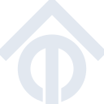

# tasmota

[← Back to main README](../../README.md)

<table><tr>
  <td></td>
  <td></td>
  <td></td>
</tr></table>

## 16 px

### black
```
https://georgegach.github.io/compatible-icons/simple-icons/compat/tasmota/16/black.png
```

### slate
```
https://georgegach.github.io/compatible-icons/simple-icons/compat/tasmota/16/slate.png
```

### white
```
https://georgegach.github.io/compatible-icons/simple-icons/compat/tasmota/16/white.png
```

## 64 px

### black
```
https://georgegach.github.io/compatible-icons/simple-icons/compat/tasmota/64/black.png
```

### slate
```
https://georgegach.github.io/compatible-icons/simple-icons/compat/tasmota/64/slate.png
```

### white
```
https://georgegach.github.io/compatible-icons/simple-icons/compat/tasmota/64/white.png
```

## 128 px

### black
```
https://georgegach.github.io/compatible-icons/simple-icons/compat/tasmota/128/black.png
```

### slate
```
https://georgegach.github.io/compatible-icons/simple-icons/compat/tasmota/128/slate.png
```

### white
```
https://georgegach.github.io/compatible-icons/simple-icons/compat/tasmota/128/white.png
```

## 512 px

### black
```
https://georgegach.github.io/compatible-icons/simple-icons/compat/tasmota/512/black.png
```

### slate
```
https://georgegach.github.io/compatible-icons/simple-icons/compat/tasmota/512/slate.png
```

### white
```
https://georgegach.github.io/compatible-icons/simple-icons/compat/tasmota/512/white.png
```

## 1024 px

### black
```
https://georgegach.github.io/compatible-icons/simple-icons/compat/tasmota/1024/black.png
```

### slate
```
https://georgegach.github.io/compatible-icons/simple-icons/compat/tasmota/1024/slate.png
```

### white
```
https://georgegach.github.io/compatible-icons/simple-icons/compat/tasmota/1024/white.png
```

## 16 px in base64

### black
```
data:image/png;base64,iVBORw0KGgoAAAANSUhEUgAAABAAAAAQCAYAAAAf8/9hAAAABmJLR0QA/wD/AP+gvaeTAAABJ0lEQVQ4jZXSsWrTYRQF8J9/B8GaqYtNUii0b2C7uTiJuOsDNL6EY+kgXfoAfZqMNu1SwSCpGBGS4BAo2NKhqQ45fwnpP9pcuHwf555z7v0uH4ujiR6+5r5UlOKbZG8Zk1I8wQmOY3KvSZohTnCKJ3iMjzH5ho1lxGX812T2zR00sI92cg/11O7sZF78Dv1M8js5SedWlcms+DWGGKfzj2Q72BCv5kycB1hBF7/wIdP18T33g9Q+h9uJVj3AFkYBiwqDIrUhNqOpFxjgEusBx7id33KwcTjNaAbFDGGEK9QqxGXUwhmVwKxBNx2eYrdC3MJaOF9K8OEc6QIv8cJ0Yc/xANemfwHe49MigzOsYifCRs5Hpks+wuE/nvg3tvEWP5Nv8KyK+AdyjGJgnnROiwAAAABJRU5ErkJggg==
```

### slate
```
data:image/png;base64,iVBORw0KGgoAAAANSUhEUgAAABAAAAAQCAYAAAAf8/9hAAAABmJLR0QA/wD/AP+gvaeTAAACE0lEQVQ4jY2SzU5TURSF1zr3tiKkYiGFW7n9ARNnDowONS3hBXwGNRET38CJMXamIycGcaYP4BMQolOExIFRo5D2pl5CqEV+AnjPWQ4qTYEa3cOd/X3n7OxF/KWiaDN0vrcAwJjEVsJwNOo3Z/4BTwIoOd9biKLN8L8EPfAUyBUA7wFMOt9b7CcxfeBFAFMQVgZ4UPXdXhXCEomS8723q99/lHsZ9oHLEFYGvMPK2NjYDgA0m83BhIMLNLgqoWGl6cl8dq0rOLazsMxUclOJfw/UjT/fXHQmeY4k9QbEFQCrJrHTYTga8RTsmzlY90BAoWdFB7BOjzUl7m6vhPW4/eUINj4fOod5OJ0B9AHgVIfXNxpeFnhA4pasHnUlAAhhOc39qrV6QilDg7liPlshYUG5Yj5bcQ7zlDJyeprmfhXCMgCyvrFxIW3t1i9zNu+c3lHYKQTDl0i6RtxeE8RikC1JMo146zPIIVDX09qPDz1v2BRzuWYQBLu0rkBiCFCLpDt5705PLUFDdAqDINgt5nLNbg4S+TGFPdJk+iWuczKTIbhnnBefClL5QuYjwJaoYC1u3z4JNzZ+3nF0eQCtiYlzn04JOk/YGgVLsBatb892Q7a+PeusHhNMHG2tFzkmKIyPvILw0kgpwc4c9QU7QykluBfl8ZHXx9fqU/Vm+xqMvUh5z0DAyd6H730t5c4vnZz9DVHNCy/cpXL4AAAAAElFTkSuQmCC
```

### white
```
data:image/png;base64,iVBORw0KGgoAAAANSUhEUgAAABAAAAAQCAYAAAAf8/9hAAAABmJLR0QA/wD/AP+gvaeTAAABNUlEQVQ4jY2SO0pDURRF93lgY0yvMYKgM9AZpBJ7LbQzguMQC3EKYqcDSanR1iBJMCIkD5FUxsq4bHbkGV8+Fw5czv6cz73ShAOUgSbQBsqTeLPEX47m3CYZ8RC4B+5sMrsTi9sWPwBLwCJwa5NnYH1ucQabbjI2cx1YBc6AmuMUKBn7u5Mc8THQcSejM3Tl6j+TMfEu0AP6rvzqqDnXA3ayJgJaThSABvABnLu7DvDi+4WxR3PrQEuerQBsAqkNkxyDxFgP2LCmlERENyIGktYkFST1I+J7/JWc65tTjohBRHSTDCeV9CmpOOWrFM1JR4lfg4houMIycJTzT6qSVtzhU649cAi8excnox34nho7yGqyIygiriVdSVqQVMlAFecuI+Jmyoi/nWwD+8CbYw/YyuP+AB6v6QcS74C8AAAAAElFTkSuQmCC
```

