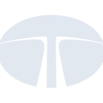

# tata

[← Back to main README](../../README.md)

<table><tr>
  <td></td>
  <td></td>
  <td></td>
</tr></table>

## 16 px

### black
```
https://georgegach.github.io/compatible-icons/simple-icons/compat/tata/16/black.png
```

### slate
```
https://georgegach.github.io/compatible-icons/simple-icons/compat/tata/16/slate.png
```

### white
```
https://georgegach.github.io/compatible-icons/simple-icons/compat/tata/16/white.png
```

## 64 px

### black
```
https://georgegach.github.io/compatible-icons/simple-icons/compat/tata/64/black.png
```

### slate
```
https://georgegach.github.io/compatible-icons/simple-icons/compat/tata/64/slate.png
```

### white
```
https://georgegach.github.io/compatible-icons/simple-icons/compat/tata/64/white.png
```

## 128 px

### black
```
https://georgegach.github.io/compatible-icons/simple-icons/compat/tata/128/black.png
```

### slate
```
https://georgegach.github.io/compatible-icons/simple-icons/compat/tata/128/slate.png
```

### white
```
https://georgegach.github.io/compatible-icons/simple-icons/compat/tata/128/white.png
```

## 512 px

### black
```
https://georgegach.github.io/compatible-icons/simple-icons/compat/tata/512/black.png
```

### slate
```
https://georgegach.github.io/compatible-icons/simple-icons/compat/tata/512/slate.png
```

### white
```
https://georgegach.github.io/compatible-icons/simple-icons/compat/tata/512/white.png
```

## 1024 px

### black
```
https://georgegach.github.io/compatible-icons/simple-icons/compat/tata/1024/black.png
```

### slate
```
https://georgegach.github.io/compatible-icons/simple-icons/compat/tata/1024/slate.png
```

### white
```
https://georgegach.github.io/compatible-icons/simple-icons/compat/tata/1024/white.png
```

## 16 px in base64

### black
```
data:image/png;base64,iVBORw0KGgoAAAANSUhEUgAAABAAAAAQCAYAAAAf8/9hAAAABmJLR0QA/wD/AP+gvaeTAAABAElEQVQ4jcXSzyqEYRQG8N/7Uf6kLCiWspILEEtlLN0DV+Ey2GDnImzmCmiYKBtWFFNGRmFMWEws5pTP9H2289RTp+c853TOe14GjVSgzWEDy5gN7REnOMJtWbN1XOABXXz3sRu5c1T6p9hHq6CojC3sIQ1jG5to4w5f+AzO5FYYDY5gDFu4T7jERHR+x1DwGIvR4AorsUY3/AnthA7GC97kGi9hnMRCgaeTIStIwGsUp4iLkDI8lSRrfs9cK/E8ZzjQWyOPD1RzE1RDy+MNh8Kw5+8ZG5jCGeoRN3L5Jnb6x6nofZImbkKrB4XWwCmWSlYC81iLeDcIq5j+r3Aw+AF/zE4UoMbkTQAAAABJRU5ErkJggg==
```

### slate
```
data:image/png;base64,iVBORw0KGgoAAAANSUhEUgAAABAAAAAQCAYAAAAf8/9hAAAABmJLR0QA/wD/AP+gvaeTAAABiklEQVQ4jcWSMWsUURSFv3NnwShxsyK4k7gxITbiLzB/wDKdhbVdbOyCVbAS/4DYBSxtbQKpVYyFYAo7QwiSHXU2G5OYuLBzLHZmxWUDdjnV4Z37vnc5PDhvafRge29/viaWTNwRRToYiswU7/ro9Xza2B4L+JJ17ybmmVBqfE0QI+wC9E32XhGszDUbGwCyrd32wXOCe5ir/7l3TsGr2XTqoXbancciWcXFoaRfiN/Aqc0puFneyIAJiQnMBaSLNnXTf6LddveT8aSRZY6QEkFi/FZwG8D2ZykWDX3svsWkhASHNds3kS5p2IhxZaWubUlaNL5VtVaOYTgO0GhZlQ5Kjko/to0Avp+RvbctlX7siMkjFC/AxyPJCcH6cINgHXzyL5+fxmtxvXn5KdZLIP+bqaOeNgFZhHraFOoM8SaTtTY3fWU1JPnGdGPZ4r7MR0NW2L1Wq56jQV+tVj0v7B7wFfgQaGk2nXoEUKuo5c/a2Mm6C0gLDJ5/U+UJPIgitmZm6j/OKPSc9AezF6DmpZBLgwAAAABJRU5ErkJggg==
```

### white
```
data:image/png;base64,iVBORw0KGgoAAAANSUhEUgAAABAAAAAQCAYAAAAf8/9hAAAABmJLR0QA/wD/AP+gvaeTAAABGUlEQVQ4jcWSPUpDURCFvxsFfwhYKGgpVuICREvBWLoHXYXLME20cxE2WYESDQo2WkXQgBEjqDGoRfhsRnzG9+ocOHCYMzPcmbkwaqThgLoIbANrwEKEH4FT4DildJvbSd1SL9UHdeB/DMK7UCvZwqQeqN2coiJ01ZqaxoE9YAfoAXfAF/AZnM+MMBmcAKaAXeA+qVdAGRB4B8aCJ8BKNLgG1oFBsBz76yW1D0znrOUGeInEGWA5J6dfAkq5W4XXKE6h85BKwFOB2eD3zI2CnOcScAj0h4wPoJ55QT1iWbwBRz9nrA2dsa3OqudqM3Q743fU/T/t1Ep8ko7ailhTbYZuRZMzdbVgJFCX1M3QVbUaekOdKywcGb4Bq/IHbAy7M2kAAAAASUVORK5CYII=
```

