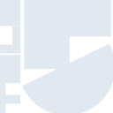
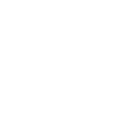

# tele5

[← Back to main README](../../README.md)





## 16 px

### black
```
https://georgegach.github.io/compatible-icons/simple-icons/tele5/16/black.png
```

### slate
```
https://georgegach.github.io/compatible-icons/simple-icons/tele5/16/slate.png
```

### white
```
https://georgegach.github.io/compatible-icons/simple-icons/tele5/16/white.png
```

## 64 px

### black
```
https://georgegach.github.io/compatible-icons/simple-icons/tele5/64/black.png
```

### slate
```
https://georgegach.github.io/compatible-icons/simple-icons/tele5/64/slate.png
```

### white
```
https://georgegach.github.io/compatible-icons/simple-icons/tele5/64/white.png
```

## 128 px

### black
```
https://georgegach.github.io/compatible-icons/simple-icons/tele5/128/black.png
```

### slate
```
https://georgegach.github.io/compatible-icons/simple-icons/tele5/128/slate.png
```

### white
```
https://georgegach.github.io/compatible-icons/simple-icons/tele5/128/white.png
```

## 512 px

### black
```
https://georgegach.github.io/compatible-icons/simple-icons/tele5/512/black.png
```

### slate
```
https://georgegach.github.io/compatible-icons/simple-icons/tele5/512/slate.png
```

### white
```
https://georgegach.github.io/compatible-icons/simple-icons/tele5/512/white.png
```

## 1024 px

### black
```
https://georgegach.github.io/compatible-icons/simple-icons/tele5/1024/black.png
```

### slate
```
https://georgegach.github.io/compatible-icons/simple-icons/tele5/1024/slate.png
```

### white
```
https://georgegach.github.io/compatible-icons/simple-icons/tele5/1024/white.png
```

## 16 px in base64

### black
```
data:image/png;base64,iVBORw0KGgoAAAANSUhEUgAAABAAAAAQCAYAAAAf8/9hAAAABmJLR0QA/wD/AP+gvaeTAAABA0lEQVQ4jaXTTS4EURAH8N+MlogJG1bEBWzsRdzAAWzsHMAVrMQFbK1FSMQZhk3vJRY9BtsxRMT4XvRrOnRPd0Yllbz6eP/6v6p68Bn0Dkc5u47GTf+T9zxAYxSECGdoYXJUgGWs4GRI3hOeywAyGfaEW6wX+B8itDFdAfCGOGePYQOLEaYCvbjgYhHjTWxhDj1+ZtpTvgcX4dKltB/fu9MIB+hjD2s5XxQqjaOJiV+MXvIM+rlAC9tIMChhlW2vAW5wLm3mLjoBvWqVr4QqmRxLO17nH3zgAB6xjx0s4LomQIIZ0hG2MzSsoltROcFSRrvrr8zjNMTu8SodcweHmM0SvwDKXHf/XtFOEQAAAABJRU5ErkJggg==
```

### slate
```
data:image/png;base64,iVBORw0KGgoAAAANSUhEUgAAABAAAAAQCAYAAAAf8/9hAAAABmJLR0QA/wD/AP+gvaeTAAABoklEQVQ4jZWSu2pUURiFv7XPTsiMOBmxSJibaGEhamWj+AqCNoIIdoLYpRVr38DCdxAUX0CriGCsLASbOEfDyXVmEglJzNnLIiGJibn93V7s9e+1Pra6Rd8ASH2c3oPucdKRvoT9mk/sBtnlzgJjncK7M1HSR9tnZFVP9/72gvbY6K0fc0u35ezdoX57FbR2QJaIe86HV5B+OfFgvxwylmM+O5hMKdXQkQw2LzTqU7uBnM3Mrzwqna5EO51FWrOZOo6i7ZgXvcf57GBC0AAvRdBVGZB62B/+b1ToFoOJfG7w1FJTUPFWtT//Mkj6psBX8DbOEMENyW3QC8yI9qCyqe7+A1udRv1ZZ7x+bZj1m4i3kCpABaiCRw5EE6sRtIHSvKyf3xcXa8Mb2fN1c3+rI0NHMVFiOYJnOmPnLgJ0i/4biTuG7BieW6EDn5QXvd82r42KmMqXZcwmMa3j7UyHMtwIJkSFcDkELjWb5/NNZQ+F8yOtZjoE3221aovKi363PV7v7L2RLyw02Rx6Bb6e8GiQqoYVmeUkPg+V4UmjUVsA+AuEirQVD27zcAAAAABJRU5ErkJggg==
```

### white
```
data:image/png;base64,iVBORw0KGgoAAAANSUhEUgAAABAAAAAQCAYAAAAf8/9hAAAABmJLR0QA/wD/AP+gvaeTAAABH0lEQVQ4jaWTsS6DURiGn1O/RDS6MBGLweASxC1ITBKR2FxAd5PJHVjNIiTiGpi6SwxtWibRViMNVR6D/+cE/VW92/nynvd9v/N9Bz/RUo/9GyoF/oeXWCCMopAAF0ARmBxJIISwrK4Apzm8LvA4KEGGvBZugI0f6p1EPQdKvwj0QwiV7KCOAVvAUgJMpfEqAy5/QE2AbaAMzAJNopk2c/bgUi2rV2o33p2gmhq0gX1gFchqSeo0DhSAiS+henGCdhS1qO6qVfUpZxNbCdADboFrtQTsAOuRcx46qNXI+UTtD/cNfFUPUR/UA3VPnVcbQwpU1elC+lCLwEIIoQFsAo28aQI1YC2EcIda/8bQOfVMrav36rPvY66pR+pMxn0DbX570bSyV+gAAAAASUVORK5CYII=
```

