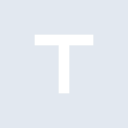
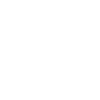

# telegraph

[← Back to main README](../../README.md)





## 16 px

### black
```
https://georgegach.github.io/compatible-icons/simple-icons/telegraph/16/black.png
```

### slate
```
https://georgegach.github.io/compatible-icons/simple-icons/telegraph/16/slate.png
```

### white
```
https://georgegach.github.io/compatible-icons/simple-icons/telegraph/16/white.png
```

## 64 px

### black
```
https://georgegach.github.io/compatible-icons/simple-icons/telegraph/64/black.png
```

### slate
```
https://georgegach.github.io/compatible-icons/simple-icons/telegraph/64/slate.png
```

### white
```
https://georgegach.github.io/compatible-icons/simple-icons/telegraph/64/white.png
```

## 128 px

### black
```
https://georgegach.github.io/compatible-icons/simple-icons/telegraph/128/black.png
```

### slate
```
https://georgegach.github.io/compatible-icons/simple-icons/telegraph/128/slate.png
```

### white
```
https://georgegach.github.io/compatible-icons/simple-icons/telegraph/128/white.png
```

## 512 px

### black
```
https://georgegach.github.io/compatible-icons/simple-icons/telegraph/512/black.png
```

### slate
```
https://georgegach.github.io/compatible-icons/simple-icons/telegraph/512/slate.png
```

### white
```
https://georgegach.github.io/compatible-icons/simple-icons/telegraph/512/white.png
```

## 1024 px

### black
```
https://georgegach.github.io/compatible-icons/simple-icons/telegraph/1024/black.png
```

### slate
```
https://georgegach.github.io/compatible-icons/simple-icons/telegraph/1024/slate.png
```

### white
```
https://georgegach.github.io/compatible-icons/simple-icons/telegraph/1024/white.png
```

## 16 px in base64

### black
```
data:image/png;base64,iVBORw0KGgoAAAANSUhEUgAAABAAAAAQCAYAAAAf8/9hAAAABmJLR0QA/wD/AP+gvaeTAAAATklEQVQ4jWNkYGD4z0ABYKJE8+AwgAWLWB8DA8MJHOotGBgYikhxwXEoxgkYGfDHQhiUXoVLwcAH4sAbgC0akYEFIQMIxQJBMPBhQLEBAHXEB+WejlzDAAAAAElFTkSuQmCC
```

### slate
```
data:image/png;base64,iVBORw0KGgoAAAANSUhEUgAAABAAAAAQCAYAAAAf8/9hAAAABmJLR0QA/wD/AP+gvaeTAAAAZ0lEQVQ4jWN89OLDfwYKABMlmgeHASwYIv8Z+/4z/D+BTTEjA6MFA+P/IqJdwPz373Hmv3+P41PDiC8W/v9nCGNgYGBgZGRYhUvNwAfiwBuAGY1IgJGB0QLCwp3a8cYCMWDgw4BiAwB94xsODWZQjgAAAABJRU5ErkJggg==
```

### white
```
data:image/png;base64,iVBORw0KGgoAAAANSUhEUgAAABAAAAAQCAYAAAAf8/9hAAAABmJLR0QA/wD/AP+gvaeTAAAATklEQVQ4jWP8////fwYKABMlmgeHASxYxPoYGBhO4FBvwcDAUESKC45DMU7ASCAWwqD0KlwKBj4QB94AbNGIDCwIGUAoFgiCgQ8Dig0AAChVENzOOjy8AAAAAElFTkSuQmCC
```

