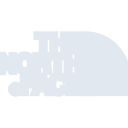

# thenorthface

[← Back to main README](../../README.md)

<table><tr>
  <td></td>
  <td></td>
  <td></td>
</tr></table>

## 16 px

### black
```
https://georgegach.github.io/compatible-icons/simple-icons/compat/thenorthface/16/black.png
```

### slate
```
https://georgegach.github.io/compatible-icons/simple-icons/compat/thenorthface/16/slate.png
```

### white
```
https://georgegach.github.io/compatible-icons/simple-icons/compat/thenorthface/16/white.png
```

## 64 px

### black
```
https://georgegach.github.io/compatible-icons/simple-icons/compat/thenorthface/64/black.png
```

### slate
```
https://georgegach.github.io/compatible-icons/simple-icons/compat/thenorthface/64/slate.png
```

### white
```
https://georgegach.github.io/compatible-icons/simple-icons/compat/thenorthface/64/white.png
```

## 128 px

### black
```
https://georgegach.github.io/compatible-icons/simple-icons/compat/thenorthface/128/black.png
```

### slate
```
https://georgegach.github.io/compatible-icons/simple-icons/compat/thenorthface/128/slate.png
```

### white
```
https://georgegach.github.io/compatible-icons/simple-icons/compat/thenorthface/128/white.png
```

## 512 px

### black
```
https://georgegach.github.io/compatible-icons/simple-icons/compat/thenorthface/512/black.png
```

### slate
```
https://georgegach.github.io/compatible-icons/simple-icons/compat/thenorthface/512/slate.png
```

### white
```
https://georgegach.github.io/compatible-icons/simple-icons/compat/thenorthface/512/white.png
```

## 1024 px

### black
```
https://georgegach.github.io/compatible-icons/simple-icons/compat/thenorthface/1024/black.png
```

### slate
```
https://georgegach.github.io/compatible-icons/simple-icons/compat/thenorthface/1024/slate.png
```

### white
```
https://georgegach.github.io/compatible-icons/simple-icons/compat/thenorthface/1024/white.png
```

## 16 px in base64

### black
```
data:image/png;base64,iVBORw0KGgoAAAANSUhEUgAAABAAAAAQCAYAAAAf8/9hAAAABmJLR0QA/wD/AP+gvaeTAAAA5ElEQVQ4jd3QzS6DURDG8V/7Sl8VRcQlWNi5Fy7IPdjZuBLXIGIjTbAQEfUdRSlSm+dNTqRhzSQnZ87Mmf/MPPx5a02JLaCK/4GZIveE99+gx5jknBT+CGfYx+ZPgLV0uca4ANwV/j12Zbwt9FIwh1W0MYshlgPs4QIrWMIGDloFdYznFMBtgF28BdLJP5jHaTtCtdK1k+QQAzzk/ZK7E2gj7GKFI+xlivVCi26maaNO0Wsgo8Tq5vMOzot1mrONz0LEwRRBQT87HmalfpLN7pN0f8RVtLrETQOoMup3q6fE/pt9AcAoSbRq2IGAAAAAAElFTkSuQmCC
```

### slate
```
data:image/png;base64,iVBORw0KGgoAAAANSUhEUgAAABAAAAAQCAYAAAAf8/9hAAAABmJLR0QA/wD/AP+gvaeTAAABYklEQVQ4jd2RwU5TYRSEvzm3XvBi6ZWYEEyqCRoX7EyI70DiRnY8DStewRXxCeBd2BlTIbEmpk1pKLYW6MV/XNwaTU3cw1nOZObMnAN3frQIdIbD1XySZQBFUd1Opw8av7nBs9ZkW6r+a9DtjT4DL+bsGWYTwOY6xCCZ8wgO2uvlMUAsGvxM8VbiFji3af+16crQlnhtOOz2Lj4ANL70L/adaGZkg0RVhPzSJiSWSYwRa0ZVhJu2voGfYErQ7tfe5Ym6vZEBg2Z2+iFpDQAztFwIPQRuMBVSDp6pFjwCn8U8rhARirzWeozUl2IEYDGtizgHCqP5YaPVSIk9zGNF2jF6V/eNHNJToaYBmRbCxlOhwrgSLAuX8XyjPIpgG3jz55ReApUp+T2QgMB8D2ICME+NIRNAt3/5Sfam4SOwhTjFvALNJIdNw9ZNKM1QXINXbI3BdRXbme1/XtrpeGkRu4fzCyaXniZpLDf/AAAAAElFTkSuQmCC
```

### white
```
data:image/png;base64,iVBORw0KGgoAAAANSUhEUgAAABAAAAAQCAYAAAAf8/9hAAAABmJLR0QA/wD/AP+gvaeTAAAA+UlEQVQ4jd2ROU4DQRBFX89YwyJ2cQQCrkLIch/uQEbCkRAiQwIChBDGbGIwZjw2j6RGjAw4h0q6q37169Iv+PORJgvqEpBHOgI6Lfk1pVRPJarnfsVF6z5Qr9RjdXcaYFOt1Z46bAEeW/cn9Qigo+4Di0APmAc2gAyYBUpgDaij5wZYB1aAHfUkqQICQ6AfDwAeAjgHVAEpog9gAbjMwqgUvxYhlkAXeI78Lc4ioI2xy0ndA1aBLWA7hAoYxNg58BFTVgEoQxs3xh2q136PA3XcMrE7aWgDOAvnT9VR5KpV1FXf1Rf1Tu2rt+p9A8jV7IeVzvy27n8Un2Uj/RSfPGDEAAAAAElFTkSuQmCC
```

