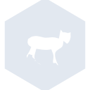

# tiddlywiki

[← Back to main README](../../README.md)

<table><tr>
  <td></td>
  <td></td>
  <td></td>
</tr></table>

## 16 px

### black
```
https://georgegach.github.io/compatible-icons/simple-icons/compat/tiddlywiki/16/black.png
```

### slate
```
https://georgegach.github.io/compatible-icons/simple-icons/compat/tiddlywiki/16/slate.png
```

### white
```
https://georgegach.github.io/compatible-icons/simple-icons/compat/tiddlywiki/16/white.png
```

## 64 px

### black
```
https://georgegach.github.io/compatible-icons/simple-icons/compat/tiddlywiki/64/black.png
```

### slate
```
https://georgegach.github.io/compatible-icons/simple-icons/compat/tiddlywiki/64/slate.png
```

### white
```
https://georgegach.github.io/compatible-icons/simple-icons/compat/tiddlywiki/64/white.png
```

## 128 px

### black
```
https://georgegach.github.io/compatible-icons/simple-icons/compat/tiddlywiki/128/black.png
```

### slate
```
https://georgegach.github.io/compatible-icons/simple-icons/compat/tiddlywiki/128/slate.png
```

### white
```
https://georgegach.github.io/compatible-icons/simple-icons/compat/tiddlywiki/128/white.png
```

## 512 px

### black
```
https://georgegach.github.io/compatible-icons/simple-icons/compat/tiddlywiki/512/black.png
```

### slate
```
https://georgegach.github.io/compatible-icons/simple-icons/compat/tiddlywiki/512/slate.png
```

### white
```
https://georgegach.github.io/compatible-icons/simple-icons/compat/tiddlywiki/512/white.png
```

## 1024 px

### black
```
https://georgegach.github.io/compatible-icons/simple-icons/compat/tiddlywiki/1024/black.png
```

### slate
```
https://georgegach.github.io/compatible-icons/simple-icons/compat/tiddlywiki/1024/slate.png
```

### white
```
https://georgegach.github.io/compatible-icons/simple-icons/compat/tiddlywiki/1024/white.png
```

## 16 px in base64

### black
```
data:image/png;base64,iVBORw0KGgoAAAANSUhEUgAAABAAAAAQCAYAAAAf8/9hAAAABmJLR0QA/wD/AP+gvaeTAAABGUlEQVQ4jaXTuy5EURQG4G8YCdO5N2gnKp5BoxAdDyAKXkCvk2gn8QISicoDqAkFlVKYgkhG4RbXiUtx1sRxnIPEn6zsnZX8//r3WnuRjwpqOMMF1iL3J8ziGC94j2iijgWUioij2MVVipiNaxxiPE3swkZYLSJmo4HN4KriEm+/kJo5ItVyuKhEYvCH3pzgAX3ojYJaAk10S7pewhH2MYaBqLiNZaxiCbdpgSefYypjCq85LuYxnU6UU/cODIXNOexJmnSPU0xiBf1FAi00grCO4XhSDYtZcpFAO7YkM+8JgRFJn76hLXOKqnfoxGPkJuI5edz/f6QWqtgJ60XEGxxIxluIGckyPfv6C+t+WaY0Wut8HlFTsM4f3+trrmWxZ/gAAAAASUVORK5CYII=
```

### slate
```
data:image/png;base64,iVBORw0KGgoAAAANSUhEUgAAABAAAAAQCAYAAAAf8/9hAAAABmJLR0QA/wD/AP+gvaeTAAAB20lEQVQ4jYWTP2uTURjFf+e+aTABTWPtH0KTjlKc/AgVxEEcFN21Ln4Awd2ldnYTdHHoZnEUhG7qqLu0tjFvS0ulaTEV+r73OCRtQxL0LPfycJ7znHu4jxiBNE3LmUrLBO5iJdGsFt15WqvVOoNcDRY2t/cfQFiS1ADGeqQs2i2ClxpT1VeSPCTwIz2aV8hfA/OC8VHODG3MepJ4cXaq+hVAzWazxNjF1zYLFjNDloZFkNkLYs0nRw9DCJUGcBNp+l/NguzMspiM1kIIlUYBIOIysCuYHpp2epfWbXdkrkhMWESA0BXUCaaK/RPcQnyw8+fC7yV9lvTJxJW5mfHrhhVD6XRIoWfwj4LLRAEU6lOV25LywWc0dw4eR7jTXyv0+R1DzAKdze32o62dX19wUjLhd8gONpJi5VYW45LE5GiBc+wWAhs54a3kenCuWLz00o5PGGgeLWCSPLAqcyC4bCFFNwic4CF2N0TcO7uJ1mUdCS4YHwNI3MDnwfX3hBjbW5I/YnbOB7hmmASVu1zmgIneHcxekNdibG+d/Z1W6/BqluRvQNcElRHZYHwo6XvAi7PT1W9dwwPY3N6/D+GFFOrgYo/0/2XqR5qm5SyUlg33eqR3hXj8bNQ6/wUhScahxa856QAAAABJRU5ErkJggg==
```

### white
```
data:image/png;base64,iVBORw0KGgoAAAANSUhEUgAAABAAAAAQCAYAAAAf8/9hAAAABmJLR0QA/wD/AP+gvaeTAAABM0lEQVQ4jaWTPUoDURSFv6cRTDr/G7UNVnENNhZipwsQC92AvZ1gG3ADgmDlAqwVLbSyFLWICLEwKv4G81nkDQ7JTBQ8MLzh8s55517OhQyoJbWq1tQ7dUctZd3NIi+rl+qnP2iqN+qaGvKIM+qx+mA+Guq5OpsmFtW9aPWvqKv7ahG1rN6rrV9IzQyRciEaKQF1YKLHeK6AV2AUGAFaAIlAExgCakAALoBToAKMAwKHIYRNdRvYAJ7SAu/RRVJbCCF8ZQx6FVhM1wqp/wFgMtpcUU+AIvACXAPzwBYwlieQoB4Ju8BUbKkKrHeS8wT6gQOgAQxHgWnac+pCX8dJfPUZGATeYm0uttPN/XeQEsRAHdmOax4e1TO1ktVOIrRke5k+OlLYe5k6RJJ1vo1f1Zx1/gbx66WI7/1CCQAAAABJRU5ErkJggg==
```

