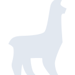
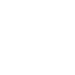

# tina

[← Back to main README](../../README.md)

<table><tr>
  <td></td>
  <td></td>
  <td></td>
</tr></table>

## 16 px

### black
```
https://georgegach.github.io/compatible-icons/simple-icons/compat/tina/16/black.png
```

### slate
```
https://georgegach.github.io/compatible-icons/simple-icons/compat/tina/16/slate.png
```

### white
```
https://georgegach.github.io/compatible-icons/simple-icons/compat/tina/16/white.png
```

## 64 px

### black
```
https://georgegach.github.io/compatible-icons/simple-icons/compat/tina/64/black.png
```

### slate
```
https://georgegach.github.io/compatible-icons/simple-icons/compat/tina/64/slate.png
```

### white
```
https://georgegach.github.io/compatible-icons/simple-icons/compat/tina/64/white.png
```

## 128 px

### black
```
https://georgegach.github.io/compatible-icons/simple-icons/compat/tina/128/black.png
```

### slate
```
https://georgegach.github.io/compatible-icons/simple-icons/compat/tina/128/slate.png
```

### white
```
https://georgegach.github.io/compatible-icons/simple-icons/compat/tina/128/white.png
```

## 512 px

### black
```
https://georgegach.github.io/compatible-icons/simple-icons/compat/tina/512/black.png
```

### slate
```
https://georgegach.github.io/compatible-icons/simple-icons/compat/tina/512/slate.png
```

### white
```
https://georgegach.github.io/compatible-icons/simple-icons/compat/tina/512/white.png
```

## 1024 px

### black
```
https://georgegach.github.io/compatible-icons/simple-icons/compat/tina/1024/black.png
```

### slate
```
https://georgegach.github.io/compatible-icons/simple-icons/compat/tina/1024/slate.png
```

### white
```
https://georgegach.github.io/compatible-icons/simple-icons/compat/tina/1024/white.png
```

## 16 px in base64

### black
```
data:image/png;base64,iVBORw0KGgoAAAANSUhEUgAAABAAAAAQCAYAAAAf8/9hAAAABmJLR0QA/wD/AP+gvaeTAAABAklEQVQ4jZXTvy5EQRTH8U/YEBsWm0hW/AnNVhIqpUKh9B5q77CF0gsoPYFGNuIFJAoSpYYoriArFJuguIeMze4yJ7mZm/md33fmzJnh/zGKSxSYyvD9xA46AThCFSoZgC1MhnEb3dwdtPGJeyx/T45kAOZj/MBbLmAatcQzkQvYw1z8VyRd6D3EDaxiRVnnEppoYDxyxlDvBzjBJmaVPR8U1cj5BajFinV/l1Xgqp/QxIOyVcO+dmpKV+tGwrB4RiudSM9gDTMB6eAGx6HtYxGPOB9Eb4X5TlnnaaJdh3bRa0pLKJS37BavWEi0A7yIBzQoGniKbR/iHbuJfhbg9dT0BUsTNIA5cQ7ZAAAAAElFTkSuQmCC
```

### slate
```
data:image/png;base64,iVBORw0KGgoAAAANSUhEUgAAABAAAAAQCAYAAAAf8/9hAAAABmJLR0QA/wD/AP+gvaeTAAABjklEQVQ4jZWQzWpTURSFv3VuSNugSX+Ibei/oiOhHUjRgQ507sRncODYd3DgSHwDJzoXnPsCOhIRRFqScklq03pTUfC2ZzlIG3KpP8kaHc5mf3utJUaU7aTVyd7JLE2W8vV6vX4EEEYFtPaye4IrxvyM5edpmlYASqMCgrgTzQVERfbdtNHIx3Jg6yYAopPEePuGlI/lwKbRfylC8mPgbJTlLwcHNeRqn6Rg51NjAcq/So8w9VMrpeNQvng2K0TY3TvctFm3WYOwYsVlWdcgLgAT/QSUCfnsOUCrnb2J0VtCM+AEjKz+0aEjlitEZgoRPne7VeMVYNY4+Wces2/ChwLg6txcLyThAfD1f30Ewse1hentAgDg+CTmSP7z2kDfhJ8Mfww6EOE69jTI4CPMJ0uvACQ/xiwB3cX52tu/AOItYBKUAhMEZavztWcAzXb2EAwikxSLkQaEsA9EKe7YfHeMi2cjBz0FMkcq5zs51YnCS3BPDs0gvZbC5Wa7dx9g9VL1heC9xPJu53BjGPAb8PeYIrTT450AAAAASUVORK5CYII=
```

### white
```
data:image/png;base64,iVBORw0KGgoAAAANSUhEUgAAABAAAAAQCAYAAAAf8/9hAAAABmJLR0QA/wD/AP+gvaeTAAABHklEQVQ4jZWSPy+DURSHn1cbfxqKJpIKGpZOEiaJxWAw+hYGs+9gMIkvYOwnsDXiIxgMRlNjeIWmDUOTPob34kpV3/cs9+ac83vOn3shp6kl9V5N1YW8uhhwpPYC4FqtAJQLMA6AeaACHAKDoh20zayjNr78UwUYq+EcAu+FAOoiUI00c0U7OAVWwr0MfL/CryWqu8AWsAk0gA2gCdSBmZA2DdRGAOoNsAcsA6V/uqmEnB+AWg0VaznGSoGHEa/aVJ+dbO1YF1cbAE6o/gacx454idvAUoD0gEegFWJnwDrwAtyNA+wDs0CHbOPdJEkuw3gnIaebJMlw3Agp2S97AvrAWhS7ALpkL/C3qXX1VW2pV+qHehzFb9W+uhPrPgFSKaRqYaAgEQAAAABJRU5ErkJggg==
```

