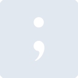
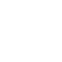

# tldraw

[← Back to main README](../../README.md)





## 16 px

### black
```
https://georgegach.github.io/compatible-icons/simple-icons/tldraw/16/black.png
```

### slate
```
https://georgegach.github.io/compatible-icons/simple-icons/tldraw/16/slate.png
```

### white
```
https://georgegach.github.io/compatible-icons/simple-icons/tldraw/16/white.png
```

## 64 px

### black
```
https://georgegach.github.io/compatible-icons/simple-icons/tldraw/64/black.png
```

### slate
```
https://georgegach.github.io/compatible-icons/simple-icons/tldraw/64/slate.png
```

### white
```
https://georgegach.github.io/compatible-icons/simple-icons/tldraw/64/white.png
```

## 128 px

### black
```
https://georgegach.github.io/compatible-icons/simple-icons/tldraw/128/black.png
```

### slate
```
https://georgegach.github.io/compatible-icons/simple-icons/tldraw/128/slate.png
```

### white
```
https://georgegach.github.io/compatible-icons/simple-icons/tldraw/128/white.png
```

## 512 px

### black
```
https://georgegach.github.io/compatible-icons/simple-icons/tldraw/512/black.png
```

### slate
```
https://georgegach.github.io/compatible-icons/simple-icons/tldraw/512/slate.png
```

### white
```
https://georgegach.github.io/compatible-icons/simple-icons/tldraw/512/white.png
```

## 1024 px

### black
```
https://georgegach.github.io/compatible-icons/simple-icons/tldraw/1024/black.png
```

### slate
```
https://georgegach.github.io/compatible-icons/simple-icons/tldraw/1024/slate.png
```

### white
```
https://georgegach.github.io/compatible-icons/simple-icons/tldraw/1024/white.png
```

## 16 px in base64

### black
```
data:image/png;base64,iVBORw0KGgoAAAANSUhEUgAAABAAAAAQCAYAAAAf8/9hAAAABmJLR0QA/wD/AP+gvaeTAAAAoUlEQVQ4ja3SPQoCMRCG4WeDooXgD3gNL+EpbbyDndcQBRt/GrG1kqyVFpvSBNx1ICSQdybffBM4oMb7x1VjXyFiqF3EKlVrHb3C3RM7DLBAPwfmerwiYIpbjispGGOd9kkO6uxB6JJM2cQHNhoPlhjlwJyJF02LIZ2/cqUW5tgmBSWlxe96xAqvHFOaQsQ9KZjlXv/LGOsO+THg1LJIjfMH/8FNtsm5WwIAAAAASUVORK5CYII=
```

### slate
```
data:image/png;base64,iVBORw0KGgoAAAANSUhEUgAAABAAAAAQCAYAAAAf8/9hAAAABmJLR0QA/wD/AP+gvaeTAAAA5UlEQVQ4jZ2QMU7DUBBE33wlmEiR4hQoFEBjam5AhbgBJ+AwHIM7pMs1kOgITaxIlimSgFBM46GlyFoxr/2z78+uVtXm1da1REYPbH6UeEtYRd9hAIkMUyTEad/hP4wGYUX8neDFShlub0DDQ7kUVkQfF7P81o3vDXWUCxtImpTV57MyJqA8zK2qraPHYwhXOJb4iGJD67mUpsJ3hnEvgcz28jx/BFTWuyU+LOha4aysd4v1+muK44+6BGObKw/aJ2DWX2DvBUPMA3ASxcJqSCOgsDo6AgnTdEc62ScSS/iXpDF+/wWuH0l3s8ukwAAAAABJRU5ErkJggg==
```

### white
```
data:image/png;base64,iVBORw0KGgoAAAANSUhEUgAAABAAAAAQCAYAAAAf8/9hAAAABmJLR0QA/wD/AP+gvaeTAAAAsUlEQVQ4jaXRsU4CURSE4W83Ei1IEBJDZ2XtS/BuPIbvYOdrmNCh0BhbKrJQjYVrx72R3Wlucf85mTOnSbLBE25dpzO2TZIOd1ea/9Q1STLQDG4qf0e8+13tGZOLVMraJ2mTzJN8laBaghle+ve+BI3uoB1jpl7iAa+YY4XpRapS4i5J0xe5K0G1FR7w1icoJq0NmOIRayxLUO0KHb77BIshA/6lFqcR/q7Fx8AhJ3z+AAdUo/qsbcOhAAAAAElFTkSuQmCC
```

