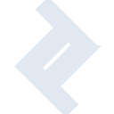
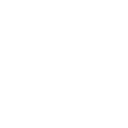

# toptal

[← Back to main README](../../README.md)





## 16 px

### black
```
https://georgegach.github.io/compatible-icons/simple-icons/toptal/16/black.png
```

### slate
```
https://georgegach.github.io/compatible-icons/simple-icons/toptal/16/slate.png
```

### white
```
https://georgegach.github.io/compatible-icons/simple-icons/toptal/16/white.png
```

## 64 px

### black
```
https://georgegach.github.io/compatible-icons/simple-icons/toptal/64/black.png
```

### slate
```
https://georgegach.github.io/compatible-icons/simple-icons/toptal/64/slate.png
```

### white
```
https://georgegach.github.io/compatible-icons/simple-icons/toptal/64/white.png
```

## 128 px

### black
```
https://georgegach.github.io/compatible-icons/simple-icons/toptal/128/black.png
```

### slate
```
https://georgegach.github.io/compatible-icons/simple-icons/toptal/128/slate.png
```

### white
```
https://georgegach.github.io/compatible-icons/simple-icons/toptal/128/white.png
```

## 512 px

### black
```
https://georgegach.github.io/compatible-icons/simple-icons/toptal/512/black.png
```

### slate
```
https://georgegach.github.io/compatible-icons/simple-icons/toptal/512/slate.png
```

### white
```
https://georgegach.github.io/compatible-icons/simple-icons/toptal/512/white.png
```

## 1024 px

### black
```
https://georgegach.github.io/compatible-icons/simple-icons/toptal/1024/black.png
```

### slate
```
https://georgegach.github.io/compatible-icons/simple-icons/toptal/1024/slate.png
```

### white
```
https://georgegach.github.io/compatible-icons/simple-icons/toptal/1024/white.png
```

## 16 px in base64

### black
```
data:image/png;base64,iVBORw0KGgoAAAANSUhEUgAAABAAAAAQCAYAAAAf8/9hAAAABmJLR0QA/wD/AP+gvaeTAAAAq0lEQVQ4ja3TwQoBURiG4WcnCwvlUhQp7slNWLgoC4WVDSkrG8SCZEsNixl1moac4Vue/vft++s/FKeHA6aovpn5mCUS3MtK6lj8KmlgjUdZSQvbTBAtaWMXwGcR6+ThDQa4BE3mqBXBzVztDfo4Bm87dP4Owyir98AJwwK4/Wn3KmaB5BoDh5IJbgG8/xZ+12QtPaqoVDDOmiRYlZGETRLpB4vOS3JAt2jgCTSPUopTaVUnAAAAAElFTkSuQmCC
```

### slate
```
data:image/png;base64,iVBORw0KGgoAAAANSUhEUgAAABAAAAAQCAYAAAAf8/9hAAAABmJLR0QA/wD/AP+gvaeTAAABq0lEQVQ4jZWRz2oTYRTFf/ebiaVIRheGhCazkiLuE8iqggo+gMUHcCm47jt0W1z4CGLFB/Dfpoig3QkuKgY6bWiNSjNZlDaZ77iYTDVmqnhXH5dzfpxzP6NkvnwdrQRZ9gSznhunt+I4Pi7TAbiyZeizR2bUHXR8pfoqSZLF/wLohBXQR0GQQ6JzIXYeud9Pr2SB35K4ZtjEo/duPJqrU5oAIHO6Ks9FAKHQYaVJSgF7B8Ou0DOMVt6JH7/qzN5kDrB3MOx6tAk0p6sexmPwQ6HQGR1dqG4NBoPqHGC3f9SW6SnQVH6hnsM2EPfBLudhOAxwD2u12mgGsNs/alvAc4mWADN6TraRSWsYdXLgfoC716xHbwtfWDzMsY5oTKnfgU0vrVlhhn0nW202one/pz77xiRJFlWpvjZoKwenQHRmxlZbjUsz5hlAAfGV6KWhDlCZSvoO7paZ544Yx/GxG6e3gW2DCYCZRs7b5zLzXIJidna0sBClL5DvgoWYfQozu7G0FH37a4JilpftxE7TO2DbBplJ1yfOv/lnhT/r2Hh0U/DBi0Oce1Cm+wmZ86+am1t6HgAAAABJRU5ErkJggg==
```

### white
```
data:image/png;base64,iVBORw0KGgoAAAANSUhEUgAAABAAAAAQCAYAAAAf8/9hAAAABmJLR0QA/wD/AP+gvaeTAAAArElEQVQ4ja3PvwqBURyHcZsMBuVSFCnuyU0YXJRBYbKQMlkQA8lKvR+Dt5zeTm/Hn+94+j1Pz6lUIkMfR8xQi92UDitkeHwlQQPLXyVNbLz2uQRt7LyXLkEH+wC+JH8nAm8xxDUoWaAeg1uF7C0GOAVve3T/C+eCcZ4HZ4wicKfs7zXMA8ktGS5IprgH8CEJLinZoJksyCVVTPKSDOtvJGFJhtVHgoLkiF7s5gkRybA6erreBgAAAABJRU5ErkJggg==
```

