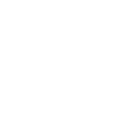

# torbrowser

[← Back to main README](../../README.md)




## 16 px

### black
```
https://georgegach.github.io/compatible-icons/simple-icons/torbrowser/16/black.png
```

### slate
```
https://georgegach.github.io/compatible-icons/simple-icons/torbrowser/16/slate.png
```

### white
```
https://georgegach.github.io/compatible-icons/simple-icons/torbrowser/16/white.png
```

## 64 px

### black
```
https://georgegach.github.io/compatible-icons/simple-icons/torbrowser/64/black.png
```

### slate
```
https://georgegach.github.io/compatible-icons/simple-icons/torbrowser/64/slate.png
```

### white
```
https://georgegach.github.io/compatible-icons/simple-icons/torbrowser/64/white.png
```

## 128 px

### black
```
https://georgegach.github.io/compatible-icons/simple-icons/torbrowser/128/black.png
```

### slate
```
https://georgegach.github.io/compatible-icons/simple-icons/torbrowser/128/slate.png
```

### white
```
https://georgegach.github.io/compatible-icons/simple-icons/torbrowser/128/white.png
```

## 512 px

### black
```
https://georgegach.github.io/compatible-icons/simple-icons/torbrowser/512/black.png
```

### slate
```
https://georgegach.github.io/compatible-icons/simple-icons/torbrowser/512/slate.png
```

### white
```
https://georgegach.github.io/compatible-icons/simple-icons/torbrowser/512/white.png
```

## 1024 px

### black
```
https://georgegach.github.io/compatible-icons/simple-icons/torbrowser/1024/black.png
```

### slate
```
https://georgegach.github.io/compatible-icons/simple-icons/torbrowser/1024/slate.png
```

### white
```
https://georgegach.github.io/compatible-icons/simple-icons/torbrowser/1024/white.png
```

## 16 px in base64

### black
```
data:image/png;base64,iVBORw0KGgoAAAANSUhEUgAAABAAAAAQCAYAAAAf8/9hAAAABmJLR0QA/wD/AP+gvaeTAAABKElEQVQ4jY3TwS5DURAG4E9tRLRKiJAICzuegWgsPJDHsLUQIl7B1kKsLIiEhYhoow0pGgttVWyoxTlNbstN+yeTm5xzZ/5/5vxDNyZxgBJq+IpRi2f7mJCCDVTwjXYi7vGAVrwro/Bf8ktPYidKuMARirHIC9aTsispyW18xG8Dl7hKKMkPYwerGEpp7QJ3yGMJz/jEIqZFiWnsbfzgCYeooh7baaGYQTaFuYNHjMc53SCHWbwhO0iBLWFGc3iP8seE2eQyfZL7IoNmn3+2sSD0n8doZB9Dc5AC88LgjrEsPGcVU2hkcCpMOg1nuMUmZgRnrmAEJwRvl/U3Ul0w0rWEkTosBelWLuLcXyuv9Updl75MZd3L9Ce5gwnsRaZX3etcxG5SNvwCKtZ+N/9sZQ8AAAAASUVORK5CYII=
```

### slate
```
data:image/png;base64,iVBORw0KGgoAAAANSUhEUgAAABAAAAAQCAYAAAAf8/9hAAAABmJLR0QA/wD/AP+gvaeTAAAB0UlEQVQ4jX2TzWpTURSFv3V6Q4I2f2IVJWkMONIIGTspgQ58i0KfQfEdNK8gOBAfomqtEycO6kQdNGhDsDVYSJpEsZje5aA3/TPpGu3B+RZrsc8Wp9Tp7F9xKm6CljBZIAeAGICGEL/1gR5VKoXehNFk+N7tLx/az0QoGYdTvi1DJHwNk7HoeKzVW6XCOkCYwGPzArR4DsZ2wOyh8NrwDVQOES+3d3sNACWxN0GLTJHgl+GyzNCwhTxndA/cidPUg1NxU4TSNBjA0kfglaURQXVbh4KvMuXoQE8DaOl87LMOvo98B8VrmK7EbaTPwB+jRgCyM+GjCh2hvM0y8icgh7kB7AmyIVnXTMXmoe22rJuCPvAbmEeMbOdmR59mdtLreAqI4YUVRFNSxfKOoABcwoww88AwwMUG4LLxvoLWsO4aBgTtAFclDQJ440y6/yKE96AvWA/A1xFb2DWkDHhd7Xa/SIZNmcpUPvlIxgNMK0hRDDXsTpyhHiqVQs9/WTV0pxaAH5gPUtiQlI+hJvgZR9FKtVjsHx/T9m6vEeA5UonkRhK1BCnbC3B0TPFctFJdyL5LEp6o3e4XQ5onoAaQje188miANBB+M077cbVY7E+Yf7JJzlaijsfCAAAAAElFTkSuQmCC
```

### white
```
data:image/png;base64,iVBORw0KGgoAAAANSUhEUgAAABAAAAAQCAYAAAAf8/9hAAAABmJLR0QA/wD/AP+gvaeTAAABOUlEQVQ4jY2TO0pDURRFF68SSTQRQRSDA9DCGUhCCgfkLMwERBGnYKsgVhaKEAuxSKIJSojBwvzEJlkWXuQ9zG/B48J99+yzD+wDMdQV9VStqW31O3ztcHeiZhmHWlQb6tAkFfVFHYR/dbUwrrjleGrqnXquVoNIS83HbTcmFKv2w9lV79VyzEkmAkrA5ti5fikDl0Af2AWGwDOQAw4JFqcxUt/UM7WpdsI4A7UaAekp3QFegWWgCDwCS8A68AGk5xE4ABrABvAJfAGpMNJSNKN4JhHQm/GmBGwBTSADLIbuKaA3j0AO6AAXwDbQDWKrQDcCroHRFIEb4AnYB9aACrADLABXqNkQillB6oQgPcSDBIBacHKUq+qt/6O8l/Cp5p28THWTy5Qsjolk1ePQ6d3kOlfVoz/bgR/nHOX50dWeIQAAAABJRU5ErkJggg==
```

