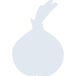
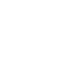

# torproject

[← Back to main README](../../README.md)





## 16 px

### black
```
https://georgegach.github.io/compatible-icons/simple-icons/torproject/16/black.png
```

### slate
```
https://georgegach.github.io/compatible-icons/simple-icons/torproject/16/slate.png
```

### white
```
https://georgegach.github.io/compatible-icons/simple-icons/torproject/16/white.png
```

## 64 px

### black
```
https://georgegach.github.io/compatible-icons/simple-icons/torproject/64/black.png
```

### slate
```
https://georgegach.github.io/compatible-icons/simple-icons/torproject/64/slate.png
```

### white
```
https://georgegach.github.io/compatible-icons/simple-icons/torproject/64/white.png
```

## 128 px

### black
```
https://georgegach.github.io/compatible-icons/simple-icons/torproject/128/black.png
```

### slate
```
https://georgegach.github.io/compatible-icons/simple-icons/torproject/128/slate.png
```

### white
```
https://georgegach.github.io/compatible-icons/simple-icons/torproject/128/white.png
```

## 512 px

### black
```
https://georgegach.github.io/compatible-icons/simple-icons/torproject/512/black.png
```

### slate
```
https://georgegach.github.io/compatible-icons/simple-icons/torproject/512/slate.png
```

### white
```
https://georgegach.github.io/compatible-icons/simple-icons/torproject/512/white.png
```

## 1024 px

### black
```
https://georgegach.github.io/compatible-icons/simple-icons/torproject/1024/black.png
```

### slate
```
https://georgegach.github.io/compatible-icons/simple-icons/torproject/1024/slate.png
```

### white
```
https://georgegach.github.io/compatible-icons/simple-icons/torproject/1024/white.png
```

## 16 px in base64

### black
```
data:image/png;base64,iVBORw0KGgoAAAANSUhEUgAAABAAAAAQCAYAAAAf8/9hAAAABmJLR0QA/wD/AP+gvaeTAAABB0lEQVQ4jZXSS0rDUBiG4YfWqnhpXYELEEei4EgEcagr0DW5gO5BNyEiOHAqFEFEREQQxTTRauOgfzCUFJsD4T+EvN8l5zRNtzZxgQ6uMJiSA6fIkOMSs3XgLXzhJ5zn6sBtdMP5Bgt1YDhBH09YrwvDPtJIsFoX7uDcqHuOMyxOC6+hF/B3CGTxbvs/eAMPGOIdSYgkIfSI3UnwEm6NLkkSrkWFYcw8kjSrBI6NzjwJoI/Pkkgx37BXQI2SwApaETkNl0ZA/F3fttKxlgWuw30+oJmYRdxhzAz3VRVa8Q9SfOBlrHvx3GG5SgAOAs5DqB/7QcxnHE2Ci7UTSfIQeI1qPRyOf/wLY7BZhRNKTu4AAAAASUVORK5CYII=
```

### slate
```
data:image/png;base64,iVBORw0KGgoAAAANSUhEUgAAABAAAAAQCAYAAAAf8/9hAAAABmJLR0QA/wD/AP+gvaeTAAABv0lEQVQ4jY2SPWuTURiGr/u8ST+MNDrE2moVqgURJ6mbqKuj4CauzoKrUPwJ/gL/QUEHB3FUqIviXD9TSJOUtqmhTZO+77kdkpZoEu1Zn+u+uc5zDhzjlCuNxbVq48dabWepUqmc6J+F/4arjWXEO8NF23e3t2fS/rn+GV7fueHAe+HE5mOnWby5sKD2sQxWNzenJD9SdN6R1Xzcu/13GCA3qmA8yz0DP0DURLw/OzO7N4wbaWD7dexecToX+TWKG1rwdWurKLQkGANIQ3herVYLw9iBJf5cb14V2UtJ8xZ2dCLUBq8F6eH5s8WVkQaVjcb1ELI3SJeQd3FsS2SSM8TlqLj8fb15Z6hBvV4/2cryn4N0AehESALkowkS7mO/zE0Xr0jK/jDoePyeguYMHcOkIEYrlRR74dhDz5RrO0cWRwUWpzB5IAVaoEQhBmQD2Bz00KmArg0URLJPgl2bCYHBOVvGJABBhwbaR7E8ULBROv3BUENEd5221ffRDJNdE9cmQvp2oGBROkiS8FiQAQUIBcQ+gETa2/hGCPFpqVRqDrzC4flWb95KYvpCaB5oIdrYY0iVJIQn50pTr/r531qdvgP9YXL4AAAAAElFTkSuQmCC
```

### white
```
data:image/png;base64,iVBORw0KGgoAAAANSUhEUgAAABAAAAAQCAYAAAAf8/9hAAAABmJLR0QA/wD/AP+gvaeTAAABF0lEQVQ4jZ2RPUoDURRGT4zx32illRuQVKJgJdmAgr17cQkuwD1o5wosBAtbYRCCiIgIQjDJkMQcC+/gECY68Tbf4913vvvzoESou2pLPVWXyjB5+EJN/Y4bdW4aeE/tq5/qrTo/DVxXz6Py/X9aP1O76ovamPRu5hePK6ACbALtaauvqdcxu+qlulwW3laTgIdhkMbd/l/wjvqkjtS22gmTThg9q81J8Ir6oA4CSHMjjPyJRK1mXH6Jx8AW0AcWgREwDK2EAmwAzSKDdaAWUA+oRt7ID0LrQKPI4A7oAAsBzYZm7WYdpMBj0Q5qsYOe+qG+jc2eRUtdnbTIw4ANo26cB6Gv6kkhnDM5iE4Mg/f4lUQ9Gn//BXjfXRhWkxq1AAAAAElFTkSuQmCC
```

