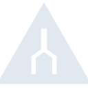
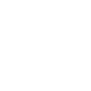

# trailforks

[← Back to main README](../../README.md)

<table><tr>
  <td></td>
  <td></td>
  <td></td>
</tr></table>

## 16 px

### black
```
https://georgegach.github.io/compatible-icons/simple-icons/compat/trailforks/16/black.png
```

### slate
```
https://georgegach.github.io/compatible-icons/simple-icons/compat/trailforks/16/slate.png
```

### white
```
https://georgegach.github.io/compatible-icons/simple-icons/compat/trailforks/16/white.png
```

## 64 px

### black
```
https://georgegach.github.io/compatible-icons/simple-icons/compat/trailforks/64/black.png
```

### slate
```
https://georgegach.github.io/compatible-icons/simple-icons/compat/trailforks/64/slate.png
```

### white
```
https://georgegach.github.io/compatible-icons/simple-icons/compat/trailforks/64/white.png
```

## 128 px

### black
```
https://georgegach.github.io/compatible-icons/simple-icons/compat/trailforks/128/black.png
```

### slate
```
https://georgegach.github.io/compatible-icons/simple-icons/compat/trailforks/128/slate.png
```

### white
```
https://georgegach.github.io/compatible-icons/simple-icons/compat/trailforks/128/white.png
```

## 512 px

### black
```
https://georgegach.github.io/compatible-icons/simple-icons/compat/trailforks/512/black.png
```

### slate
```
https://georgegach.github.io/compatible-icons/simple-icons/compat/trailforks/512/slate.png
```

### white
```
https://georgegach.github.io/compatible-icons/simple-icons/compat/trailforks/512/white.png
```

## 1024 px

### black
```
https://georgegach.github.io/compatible-icons/simple-icons/compat/trailforks/1024/black.png
```

### slate
```
https://georgegach.github.io/compatible-icons/simple-icons/compat/trailforks/1024/slate.png
```

### white
```
https://georgegach.github.io/compatible-icons/simple-icons/compat/trailforks/1024/white.png
```

## 16 px in base64

### black
```
data:image/png;base64,iVBORw0KGgoAAAANSUhEUgAAABAAAAAQCAYAAAAf8/9hAAAABmJLR0QA/wD/AP+gvaeTAAABA0lEQVQ4jZ3SvUoDURAF4C+JCpoQEEX8LQSfQgstDNgoPkFaESx9DH0BxcaHsEhvbxHSipUoFgqpVFyLnWXFbKKbA+eyc+7c2blzLqOxHBwbN8GxsIlnvGC77OEKukiCXVTLFDhCH6/Bfmj/QgP38efrYBJa43dyUVtnWI3vpyCs4fyvAuvYx0RB4RoOsDGqwJXc9wQfwSS0RVwUFActqWWJdHAd7AU7oSWR0ypqrye37Q5t+QzaoWX7vTiTLjjFISYjfojr7aCORyzIh9vAO26rmMUJZobdrQDTOMZcDZfYkr6+DFNYwnzEzYjrP3KaWKngzaBtmTtfQ+IMnxXslmh9AN9Rpzhg62ufyAAAAABJRU5ErkJggg==
```

### slate
```
data:image/png;base64,iVBORw0KGgoAAAANSUhEUgAAABAAAAAQCAYAAAAf8/9hAAAABmJLR0QA/wD/AP+gvaeTAAABl0lEQVQ4jZWSQWsTURSFv/MSKxUXlmCQUDUFt3YlFtx0Id0IunHtUkFwpX9DwQpuii6K/Rld9S/4B5JpBGemYKYNNJDkHRcd0zadBLyr++4577x737mwIJI8byV53lrEqS8CGV/7VmbP5lHCPOBXevwE9Ajp8WH+Z/O/BGxr7MkO8m1wwxO+2q7kVhaTo8GbILUNhaGQ1E6OBq+ruJotZFl28zQu/RS0Lf8AkPXKuLMcRg+bzeZgYQfDuPQxwCqAo1NHp+VLd09j/dPCETq/+2vGz13pjmoivDjMigdzBWrwXagFYOOgMAoKIxuXlDtE71QKdNP+lmEdwLiQ2FfQgYIOJPaNizOM9W7a37okYLsmsw00ynk7lveI3iV61/KeoFPeachs265NBXrZyXvg/nRahaGiNgxNQ1NRG1IYnjfudpKdfAAI3W5/hTh5B9y4+nHzQsuy3/Z6x416uO4vRqsX4WivAbf+LYnhqe2Vy0vje67Hz0rSosBxxjYFEMLxTEABDOX5Am1cN36JriwkcO4d02yWZ/4Cm7K39a2aBuEAAAAASUVORK5CYII=
```

### white
```
data:image/png;base64,iVBORw0KGgoAAAANSUhEUgAAABAAAAAQCAYAAAAf8/9hAAAABmJLR0QA/wD/AP+gvaeTAAABCElEQVQ4jZ2RMUoDYRBG32ZtlDQiiARFBeu0ARsbLfUIaYNgFa+hFxBszB1SpfIEFiGks45YGEghaHw2s7gx65L1wQc7HzPfP8tACWpDbZT1lKL21f5/h4/VF/VVPak6nKhDfxiqtSoBHXWmvoVmamfV4br6HC8/hAyv/ru/aK0bYDe+JyGAPeC2NEA9BM6BtYLgFLhQj8o2uAeyuwt8hAxvB7grDFDPgGaUU2AAPIYG4QE0o3dh9VQd5c72pLbVSagdXsZITfMbdIH9XOY70AK2Q63wMg6Aa4CauglcARuszjpwqW6h9tS5i0zUca4eh5dnrvYSdcry2bJf+/qjzvhM1NMKqy/xDVKOB0/juViDAAAAAElFTkSuQmCC
```

