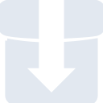

# transmission

[← Back to main README](../../README.md)

<table><tr>
  <td></td>
  <td></td>
  <td></td>
</tr></table>

## 16 px

### black
```
https://georgegach.github.io/compatible-icons/simple-icons/compat/transmission/16/black.png
```

### slate
```
https://georgegach.github.io/compatible-icons/simple-icons/compat/transmission/16/slate.png
```

### white
```
https://georgegach.github.io/compatible-icons/simple-icons/compat/transmission/16/white.png
```

## 64 px

### black
```
https://georgegach.github.io/compatible-icons/simple-icons/compat/transmission/64/black.png
```

### slate
```
https://georgegach.github.io/compatible-icons/simple-icons/compat/transmission/64/slate.png
```

### white
```
https://georgegach.github.io/compatible-icons/simple-icons/compat/transmission/64/white.png
```

## 128 px

### black
```
https://georgegach.github.io/compatible-icons/simple-icons/compat/transmission/128/black.png
```

### slate
```
https://georgegach.github.io/compatible-icons/simple-icons/compat/transmission/128/slate.png
```

### white
```
https://georgegach.github.io/compatible-icons/simple-icons/compat/transmission/128/white.png
```

## 512 px

### black
```
https://georgegach.github.io/compatible-icons/simple-icons/compat/transmission/512/black.png
```

### slate
```
https://georgegach.github.io/compatible-icons/simple-icons/compat/transmission/512/slate.png
```

### white
```
https://georgegach.github.io/compatible-icons/simple-icons/compat/transmission/512/white.png
```

## 1024 px

### black
```
https://georgegach.github.io/compatible-icons/simple-icons/compat/transmission/1024/black.png
```

### slate
```
https://georgegach.github.io/compatible-icons/simple-icons/compat/transmission/1024/slate.png
```

### white
```
https://georgegach.github.io/compatible-icons/simple-icons/compat/transmission/1024/white.png
```

## 16 px in base64

### black
```
data:image/png;base64,iVBORw0KGgoAAAANSUhEUgAAABAAAAAQCAYAAAAf8/9hAAAABmJLR0QA/wD/AP+gvaeTAAABBUlEQVQ4jaXTvUoDQRQF4C9hMbq4irViKvsUFj6Iz2Dna1jZ+xAKVnkE0c5OBcEfFNNE0kiMboIWOyFhnG3MgQvDmXPvnTlzp4ELtJGhhSV8YhtDFQo8YRmTsF8GTomfKF6Qm6EIXKwrm6Hzf5E1F0gGTQwWyB9kOMAh1rGiutJGQtzCvcqzET5wkuEaO3gP0cNzEE7xhW7QrapMbeMOdkPivLs9f1/hLdL00akzcZzgJilhXYEUn9TG5BA3uIxOUeIKt2bTmSyQq17jGN9z/AhHKi/yKCdp4iv2Ik08yn106sZ4E2fYD1c5x1ZKmIVqdUVO0QjrGNOTWMND6BT/troY4xHFLyF/WMXvGH+bAAAAAElFTkSuQmCC
```

### slate
```
data:image/png;base64,iVBORw0KGgoAAAANSUhEUgAAABAAAAAQCAYAAAAf8/9hAAAABmJLR0QA/wD/AP+gvaeTAAABgklEQVQ4jZ2TvW5TQRSEv9lsuBBxFSWKguwgohSpQokQb8AL8AzpeANqKnoeAiRoeAQEHR0gRUIJQrEVYy6JLN+Q+zMpYlN4bYEy5ezM7Nk95+ioX7wXbBtFRCb7hk257PJet9sdAwwGg7yslw+Rbwo1LZSCyvgwSjzEigIwgFDgFw2zGIPWDQhyAIk7ASsm0v+FFcO1zRMERHFttyii22ZfITwVWgVuGSKwNkecSRzYqpDPaT0Cv4wKS59Au7aHhqHsXgjh6LjTqabek5ONP/n62TvT7gK3QbnEtgJfIw1rCs4M9wUg0bTud3u9Z0AFsLn5Myub+BjUAcDGZihg7icqUCeklTZ2UQB2wlsplwaYMfizpA9F0flbxWi0Ucl8NHwBxosDxApoVdaLvT1dTOmdHZ076rlEDqz86wlbLX79o3/6aEp8P/79QDVvMXdnxYvGeBrypG1ds8SbeWaAaDCTDZkNsfyKgDBbyakwxuEiaw4QpyJtk69uTcwT7SgL9bdLjAajX0x8QVsAAAAASUVORK5CYII=
```

### white
```
data:image/png;base64,iVBORw0KGgoAAAANSUhEUgAAABAAAAAQCAYAAAAf8/9hAAAABmJLR0QA/wD/AP+gvaeTAAABJElEQVQ4jaXSv2pVQRgE8N9eD0YvXiRpUiimsrcIkgfxGdL5Glb2eQiF2PgIop1dIgRCbEyTGALhGvOHsTh7IB73CiEDyy6zM7P7fbslySesocMS7uMXnpVS5pBkhgM8wHXdv8RBh5fVfBM//Ys5Vup6VufVScN8G3STO5jBBCd38J902MRrPMZDfUnLDfES9vTNO8cZtjp8xXMc13GI71U44Dc+Vt0jfRPX8E2S9STH+RuHSaaDO8ksyY+R5ijJi0VNvGpw1y3hooAW39SOyTl28Hl0i0t8wW7VLAyY6l/jbSnlYiBLKed4o2/e9Kahda0neJ9kYyCSrOMDno7Fi77xEPKqlrLdMg8B+U/IO5S6HiNIp/9dp/ra741EzVP1T3qG/T9WznbAnpPsbwAAAABJRU5ErkJggg==
```

