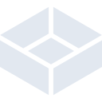

# truenas

[← Back to main README](../../README.md)

<table><tr>
  <td></td>
  <td></td>
  <td></td>
</tr></table>

## 16 px

### black
```
https://georgegach.github.io/compatible-icons/simple-icons/compat/truenas/16/black.png
```

### slate
```
https://georgegach.github.io/compatible-icons/simple-icons/compat/truenas/16/slate.png
```

### white
```
https://georgegach.github.io/compatible-icons/simple-icons/compat/truenas/16/white.png
```

## 64 px

### black
```
https://georgegach.github.io/compatible-icons/simple-icons/compat/truenas/64/black.png
```

### slate
```
https://georgegach.github.io/compatible-icons/simple-icons/compat/truenas/64/slate.png
```

### white
```
https://georgegach.github.io/compatible-icons/simple-icons/compat/truenas/64/white.png
```

## 128 px

### black
```
https://georgegach.github.io/compatible-icons/simple-icons/compat/truenas/128/black.png
```

### slate
```
https://georgegach.github.io/compatible-icons/simple-icons/compat/truenas/128/slate.png
```

### white
```
https://georgegach.github.io/compatible-icons/simple-icons/compat/truenas/128/white.png
```

## 512 px

### black
```
https://georgegach.github.io/compatible-icons/simple-icons/compat/truenas/512/black.png
```

### slate
```
https://georgegach.github.io/compatible-icons/simple-icons/compat/truenas/512/slate.png
```

### white
```
https://georgegach.github.io/compatible-icons/simple-icons/compat/truenas/512/white.png
```

## 1024 px

### black
```
https://georgegach.github.io/compatible-icons/simple-icons/compat/truenas/1024/black.png
```

### slate
```
https://georgegach.github.io/compatible-icons/simple-icons/compat/truenas/1024/slate.png
```

### white
```
https://georgegach.github.io/compatible-icons/simple-icons/compat/truenas/1024/white.png
```

## 16 px in base64

### black
```
data:image/png;base64,iVBORw0KGgoAAAANSUhEUgAAABAAAAAQCAYAAAAf8/9hAAAABmJLR0QA/wD/AP+gvaeTAAABCUlEQVQ4jaXTu0pDQRAG4C9Rgoi+gFVaBZ9AxUILA9bG3kttpWBtKwTBVhALO2vBS6cPIJJG8IKmkIBFiEVMEZs5GA7HEOPALP/O/v8MOzvLPy3X42wBM4FvcNVv0iIuUMd1CD8CF3sJR3GAV3TCkwTJvoYTjKevsYYHfHWRsxJ00MYzNkKrgmYG6RGrKAdupzhNVIYwhTNMYwzvOMU+9jCPLXxiAiN4wS5aYqliGduYxXk0MalWj9gcdoJbRSuPAiZxjCU/T9vp6lMew4EXcRSaQkLs9hoOUcJ9eClibxl8d2j80sQyVvCU0cRGaOWw7u/PuCk1yQMPUtqK/jDK/X6mW1z2qjqwfQM5kHVdZXz/9gAAAABJRU5ErkJggg==
```

### slate
```
data:image/png;base64,iVBORw0KGgoAAAANSUhEUgAAABAAAAAQCAYAAAAf8/9hAAAABmJLR0QA/wD/AP+gvaeTAAAB1ElEQVQ4jaWTPUjVYRjFf+f9XyWN6AbdtNKu0WQQJW21VUNDGG3NWRBFY0Xhat9DY6QEbY0SjX1MuQWVNEbqtdvtA7wiFeH9P6fBjGsoCZ71Oe/hPOc9D6wRWmkwWasfTvJBgLBeljuLz1Yl8OHTTE+ShmXtkzwOyXb0WbwO+9TOrZsmlhWoVqvt86nthsQJrK4/wxeQbOIQgHE1wfN1WeNcqVSagwV5VWr1gfnU9gbp7OLj5e1qG+jkj7wwPlmrn7EtVb7M3iV82rC+yVbDopI7roKdKbsu020oNHG+kzRSsGMqS9mFPGIQqduOr1iPkUYzdMdIks473G+5X0ol7EpKaSh3XtRkrf4LeE+WLqVG7I4sxuQ0SLAfsZmF5b+ReEUeQ1I6EIX0jjxuAbuSoFXQq0Y8DHFUDSQEwot2LZKsAkCIIyn3A0GvoFVTtfpf4mLSmdKoxZOIuC1AKV2UORbEcaztS4Kdqs28tdQjs6FJpmFUCfIryRjSTUldNIVoMSd7QrY1/Xl2IPBlpLJMS1PSS3qw+EOBPyJd27Fl43CS5O7O4khL/NyLfQ95eqUeGFfBj9qzxp5yR/G+JK+qyuHo439V/hdLjgmNlTuKT1firgm/Aa6o7dV6crgIAAAAAElFTkSuQmCC
```

### white
```
data:image/png;base64,iVBORw0KGgoAAAANSUhEUgAAABAAAAAQCAYAAAAf8/9hAAAABmJLR0QA/wD/AP+gvaeTAAABIklEQVQ4jaXTMWsTUBQF4PNC6FAQujgWsvobWic7tCAdrbu2i3S1i6ubQyh0FcQ/IJ0EjZv+gCJZhLbYZgo4hCxths/lhaZpU6o5cOG++865D869L5kTZdYFniRZqcfvpZTOvTqihS/o4xs6+FPz1l3CRezjzBXGDcbo4SMeTAoLXuAXLl3HdAMY4RTbKEEbw1tIx3iOrZqPpjhDtJtJfifZTfImyXKSfpLDJJ+SvKtGv0qyWeNhkrMkb5MsBRfo4ileYxWfq4lj9GvtMfYqt4uLRpKFJI+SfEiyPjFaEx43kjRrvpbkfdUsxE30cIAN/KyxUWvn0+TgCIMZJm7hGU5uMXGAo/EYX/r3Me7gapP97yLNu8r3/Uw/SilfZ746D/4CB5QRbhaoaZMAAAAASUVORK5CYII=
```

