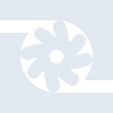

# turbo

[← Back to main README](../../README.md)





## 16 px

### black
```
https://georgegach.github.io/compatible-icons/simple-icons/turbo/16/black.png
```

### slate
```
https://georgegach.github.io/compatible-icons/simple-icons/turbo/16/slate.png
```

### white
```
https://georgegach.github.io/compatible-icons/simple-icons/turbo/16/white.png
```

## 64 px

### black
```
https://georgegach.github.io/compatible-icons/simple-icons/turbo/64/black.png
```

### slate
```
https://georgegach.github.io/compatible-icons/simple-icons/turbo/64/slate.png
```

### white
```
https://georgegach.github.io/compatible-icons/simple-icons/turbo/64/white.png
```

## 128 px

### black
```
https://georgegach.github.io/compatible-icons/simple-icons/turbo/128/black.png
```

### slate
```
https://georgegach.github.io/compatible-icons/simple-icons/turbo/128/slate.png
```

### white
```
https://georgegach.github.io/compatible-icons/simple-icons/turbo/128/white.png
```

## 512 px

### black
```
https://georgegach.github.io/compatible-icons/simple-icons/turbo/512/black.png
```

### slate
```
https://georgegach.github.io/compatible-icons/simple-icons/turbo/512/slate.png
```

### white
```
https://georgegach.github.io/compatible-icons/simple-icons/turbo/512/white.png
```

## 1024 px

### black
```
https://georgegach.github.io/compatible-icons/simple-icons/turbo/1024/black.png
```

### slate
```
https://georgegach.github.io/compatible-icons/simple-icons/turbo/1024/slate.png
```

### white
```
https://georgegach.github.io/compatible-icons/simple-icons/turbo/1024/white.png
```

## 16 px in base64

### black
```
data:image/png;base64,iVBORw0KGgoAAAANSUhEUgAAABAAAAAQCAYAAAAf8/9hAAAABmJLR0QA/wD/AP+gvaeTAAABLUlEQVQ4jaXTTytEYRQG8N+YWQwrVj6BhNjZW/oCFv6lJHt7JR/A2pINRVkorKRYi41sbBQ1miEUMyMGizm3Lg3CU6fe23vOc5/nnPdkUEHe31DJ4O2PxfCawzmq3yTl0Yz23zC3IINpXGMMayipK06ilsUQeiK6cIlTTOIMg3gJkgr64weC5APjDpqwH8kF3OMIe7jAdlpBmuAKE1iPgruQXIpzGSfojtw31HIp31UsoA2P8T2OHJbwhA30hjriMkENM+jEVFh5jruM+iRmcYOHdMcTCwV0hMxyyC6GhVscYhkjaQtpgldsqk9hF8fRwEJIPgjFW+mazy+xhDksYkV9xPMYRiv6MIBsIwtJFLGK0fA7GQVtGuCrXUiIqlIdb4D8f5dJk+8X6SdU3wEAmmtKxj7DuAAAAABJRU5ErkJggg==
```

### slate
```
data:image/png;base64,iVBORw0KGgoAAAANSUhEUgAAABAAAAAQCAYAAAAf8/9hAAAABmJLR0QA/wD/AP+gvaeTAAABzElEQVQ4jZ2TMWiTURSFv3P7S9NCkgpqWrAtFMTJVXQVp6KjCgW3OrnoUFx01EkdxFkRHOrgKEIR3MRZiuBQ1FhrUhH/FDVpa95xsGlqrBV64A333XvOPe+9+1StNZrgAruCm7F7MoD6M+CdUOufPXDBMCCobCux3ebS0tLgyMhI8+Ny44LNDaRLyT4dcMKwb0tpyt5/ys90oghSIdbnWu098x/q+YpCD20VMZNjlfJUtZ5fDHRtq4iqtdybgXl6cLh8qlrLn0s6ipVbaTCkBUxucciJVxKTHQexeVZTT31+tFjLZwMVDauQskBrNhOGY9gN6JtBqnd42ZbbaIXjlvFeyd+FWkScbwdZtH3fsIp5nNQ+EqapXgFBO5EuSzpsNA1E2OskASjsgSRdzeCLxTfc6wANhvTSTldAJYu1ZGZJSURklt4A85g549sdB9Hlu2JzU/QNCb3AvDX0o/jp5ALwY+xAaZpgSt6cCXUFjEg+LqXro8Plk0q8ljRAat9FXsCeWFxcKeF0z+bsxjr3xzP+FtJn5GeSnti+Q8TM6P7ig2q1URofH/raO3R/CwASTmY5oAVq9ua7pl3Itk0YCSreKNsJwQ4f6f9Q6xf6wt1Zf3BQtQAAAABJRU5ErkJggg==
```

### white
```
data:image/png;base64,iVBORw0KGgoAAAANSUhEUgAAABAAAAAQCAYAAAAf8/9hAAAABmJLR0QA/wD/AP+gvaeTAAABSUlEQVQ4jaWTvSuFYRjGf+97znAoRSm7konZaLYbfC2SxWSwkfwBZiMDYjAoDJJiFos/QFGHc5w4wnvQ8TN4Tr10fMS1Pd3Xfd1X1/3ckZoAOf6GJFL9YzPAaxY4AyrfkHJAA9D2a1m1UY3UcfVaHVbX1aIfUc2q/WlLwC5wCtwBy0AT0AcMAhPADNCanpbGjhqrB2qi5tWyeqzuq+fqdtpBnJp+BawDa2HqE5AFnoF2oAcoA1OBC4FQQwWYB1qAh/AeCZzFILgBdAFJPYEqMAl0AmNADLyEWsT7JqaBEnBfL4O82qGeqo/qrVoIyd+oR+qSOqhe1jJIC7yqm+qFuqeehADzIdBDNatupXs+/8QiMBtF0YK6AvQDc8AA0Ax0A71A5qs1GmyvqkNqSR1VM2oLdfDVLQgUwiaSOvUacv89JmK+P6SfUHkDRvNJmNMxlcIAAAAASUVORK5CYII=
```

