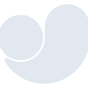
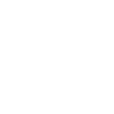

# ultralytics

[← Back to main README](../../README.md)

<table><tr>
  <td></td>
  <td></td>
  <td></td>
</tr></table>

## 16 px

### black
```
https://georgegach.github.io/compatible-icons/simple-icons/compat/ultralytics/16/black.png
```

### slate
```
https://georgegach.github.io/compatible-icons/simple-icons/compat/ultralytics/16/slate.png
```

### white
```
https://georgegach.github.io/compatible-icons/simple-icons/compat/ultralytics/16/white.png
```

## 64 px

### black
```
https://georgegach.github.io/compatible-icons/simple-icons/compat/ultralytics/64/black.png
```

### slate
```
https://georgegach.github.io/compatible-icons/simple-icons/compat/ultralytics/64/slate.png
```

### white
```
https://georgegach.github.io/compatible-icons/simple-icons/compat/ultralytics/64/white.png
```

## 128 px

### black
```
https://georgegach.github.io/compatible-icons/simple-icons/compat/ultralytics/128/black.png
```

### slate
```
https://georgegach.github.io/compatible-icons/simple-icons/compat/ultralytics/128/slate.png
```

### white
```
https://georgegach.github.io/compatible-icons/simple-icons/compat/ultralytics/128/white.png
```

## 512 px

### black
```
https://georgegach.github.io/compatible-icons/simple-icons/compat/ultralytics/512/black.png
```

### slate
```
https://georgegach.github.io/compatible-icons/simple-icons/compat/ultralytics/512/slate.png
```

### white
```
https://georgegach.github.io/compatible-icons/simple-icons/compat/ultralytics/512/white.png
```

## 1024 px

### black
```
https://georgegach.github.io/compatible-icons/simple-icons/compat/ultralytics/1024/black.png
```

### slate
```
https://georgegach.github.io/compatible-icons/simple-icons/compat/ultralytics/1024/slate.png
```

### white
```
https://georgegach.github.io/compatible-icons/simple-icons/compat/ultralytics/1024/white.png
```

## 16 px in base64

### black
```
data:image/png;base64,iVBORw0KGgoAAAANSUhEUgAAABAAAAAQCAYAAAAf8/9hAAAABmJLR0QA/wD/AP+gvaeTAAABDklEQVQ4jZXSSUoDQRQG4C9ph40ojqgLA5K40IUgHkAP4wk8gksPoHgFwWO4FkV0JRoTReNCCLbGqV10B0KbLkhBURT/UO+9+iODrSoqaONrEOEqzvCIF9Sxh3IvaRbb2MgBc7hFkttv2IdhHKCRlfaCK2xmBsf47WOQZBpH+OgD1rGIiwJxkuk0A4QTXAbwpIyZwPBqAUzX4DNA+MZoAI/LaBWA77jBRMCgHeEeWxjrATrS3qexHDBoRnjAPCLEeMYpxrGGoQJxB4claY/X2fkkzcUUFgIvyzTr3UsNdwLf5X9GVvKOFWlo4oAwls6mWlTWCHZwLo1pSzqTRma+KzeTUqDHSSzhJzN47Uf6AyRYaoe70AkOAAAAAElFTkSuQmCC
```

### slate
```
data:image/png;base64,iVBORw0KGgoAAAANSUhEUgAAABAAAAAQCAYAAAAf8/9hAAAABmJLR0QA/wD/AP+gvaeTAAABr0lEQVQ4jZWQvWqTcRjFf+efxjeL+aimTaVJUeyiBVddHMRNnJzVK3Bz9xoUcXDSRYRegaA3IB062FISEUKUfiHtazAlMe//ONSPKnmLnvWc8zznHPEf6O2k5zPiyVIcthuNxlcA/Yuxu9m/EJS9sDSLXcQMkJ83Z6sPfh3Y3OzXM8ZLYytdmKusSooA77f6MwnZW8PC0aOCgcUTrdjFma30EcE3iaoghoZdRW63zlRXutt7y3K4BZ6Q1p/U29p/anQHnPxdmcK3y2RTr0BLk6rZDIOlGxPMAE2y4mMg5G0jkQTs07nr4cV87lAQgFHuBzSGMCndT8EgIHZz6ANHfwBXct+bflDm+0jbfzIaIq2roHNAbsVgpVOjkt8URywjXRGuxMhYeB2raXQRnOcfxhBfqtNxkpTTDVBix20cihLT4Lnc7oBg48vnyiUB9HbSRcf4GtQ6zgSHeWT3wlTh+ny93A4AzZlKZxy5KvxOcHCM/wC8rkK4Nl8vt38k+Y21NZ8on0rvGu4B00AiyXYcgfai/WyhUX0oaXykymR0u/u1QsmtaGdZoo9na7X9Sbrv0Ku3Y1Ozk/IAAAAASUVORK5CYII=
```

### white
```
data:image/png;base64,iVBORw0KGgoAAAANSUhEUgAAABAAAAAQCAYAAAAf8/9hAAAABmJLR0QA/wD/AP+gvaeTAAABI0lEQVQ4jZWSzyrEURiGn/NrxqwkQlEozViwULKxdDGugDuwdAHKFagpd+AeZPInCzGNNMaCZAwNj8WcxeA3R/OtTr3v853zfecNDFFqGRgFrkIIr8OAy+qJeq8+qnV1V836TVPqprrWL6jT6o1/61XdQy2q+2pDfYk3XKjrsUFV/cppoNpAPVA7OWJdnVVrA2DVDupdwnCkniV0M2Aysb/Kf/vNgI+EoQuUEno7A1oDxDfgGhhLNHjJgB2g+Ut4B86BRdIjPheAY6AKbMTbuhGeA1YS8DtwGNQScElv1iZQBCaAmQRMZFYBUCvqbeq7cjKy9KOduhBD006A7ZiLcu6b1BF1Sz21F+2W+hDPNXVbLfQzYdCA6jgwD3wCjRDCU57vG6/ApGBXWrHMAAAAAElFTkSuQmCC
```

