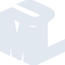

# uml

[← Back to main README](../../README.md)

<table><tr>
  <td></td>
  <td></td>
  <td></td>
</tr></table>

## 16 px

### black
```
https://georgegach.github.io/compatible-icons/simple-icons/compat/uml/16/black.png
```

### slate
```
https://georgegach.github.io/compatible-icons/simple-icons/compat/uml/16/slate.png
```

### white
```
https://georgegach.github.io/compatible-icons/simple-icons/compat/uml/16/white.png
```

## 64 px

### black
```
https://georgegach.github.io/compatible-icons/simple-icons/compat/uml/64/black.png
```

### slate
```
https://georgegach.github.io/compatible-icons/simple-icons/compat/uml/64/slate.png
```

### white
```
https://georgegach.github.io/compatible-icons/simple-icons/compat/uml/64/white.png
```

## 128 px

### black
```
https://georgegach.github.io/compatible-icons/simple-icons/compat/uml/128/black.png
```

### slate
```
https://georgegach.github.io/compatible-icons/simple-icons/compat/uml/128/slate.png
```

### white
```
https://georgegach.github.io/compatible-icons/simple-icons/compat/uml/128/white.png
```

## 512 px

### black
```
https://georgegach.github.io/compatible-icons/simple-icons/compat/uml/512/black.png
```

### slate
```
https://georgegach.github.io/compatible-icons/simple-icons/compat/uml/512/slate.png
```

### white
```
https://georgegach.github.io/compatible-icons/simple-icons/compat/uml/512/white.png
```

## 1024 px

### black
```
https://georgegach.github.io/compatible-icons/simple-icons/compat/uml/1024/black.png
```

### slate
```
https://georgegach.github.io/compatible-icons/simple-icons/compat/uml/1024/slate.png
```

### white
```
https://georgegach.github.io/compatible-icons/simple-icons/compat/uml/1024/white.png
```

## 16 px in base64

### black
```
data:image/png;base64,iVBORw0KGgoAAAANSUhEUgAAABAAAAAQCAYAAAAf8/9hAAAABmJLR0QA/wD/AP+gvaeTAAABU0lEQVQ4jYXTvUqdQRAG4MdgSBT/QmIhqMEmhSGgkFxALsFLSBHwBrwEKyvRVouUqZJWYiUo2GgVVAKecPyLR/Ff0egxxY6w59NjBj52d75533l3Zpb79hbfUcI+fmIYzx6IrbHXaMcQllHBbXwXWMcomorAD5jFZmSdQhfeYyb81SC6whq6c4LbkHoT+yrK+IY3EfwD15miiZxgG4c4xW5kuQvcwWqouCMvYSAnKGeARYzjAH+yrOeRaAudOfhJoR6tEdga59/4iks8jatWCpgaBWXMZ+eq2m4sF8G5ggu0oC/zNeBvEVSP4AYdIVVk/5/15wTNsb6UOnL2CPCjdNWFxjoBh2h7wP8CS9JsvMJGI45CekWawOeZmqL1oDf216QavMMnfMFx/NyrQ9AgtbSEMenh1dgg5jCJE6l1W7Ge4RdGQuWj1o5paXCOsYLPuFezf8OQZjxiz5seAAAAAElFTkSuQmCC
```

### slate
```
data:image/png;base64,iVBORw0KGgoAAAANSUhEUgAAABAAAAAQCAYAAAAf8/9hAAAABmJLR0QA/wD/AP+gvaeTAAACBUlEQVQ4jXWRv0/TURTFP+e1JWhaWgOCDa2GgcTYGONA4qj8AfofaPwDXJ1MXJSYGGOCLg4G4+Dg/+DsZIyLmwaw0CLy27SUtu848EVKgbO89/LOOffce0UfFmprFSnMGF2TnUNaQcy2tvNzk5Nq9fN1cPm5vHHJg94caGsa6zEwbhhJaLsQ60R9UHfnSblcbv43WKxtTQk/s3RZuG38KaYGHoV2e5yUZjAVcDEp1gbmQ6c7XSoNV/cN6pvGXieogAmAZS/ZfAmZ1ENa7YYzqXc2N4HUfmy9Ll/IPwBII9UNZ2SaQMO4gFRClLrdeCNk0lvRMSuUkjBmUSG+PWghDe4I8sn7eyB8Nr4rtCcYsT0m1DTUsZxxmCqO5lYPDELvRG1yEdfAuWhj4gLw0dAKIgNeKxYPxUmCQwScjeg2+3FHjc4LhgQFG8DV/jX2JHAzBmUlJnp2LKN2v+gUA3VlCkQyiTgm56lYqO1c6W3hbFJ2GPgLGMidJKzWNm5ZehrVraRPImA2LYaOf+jcr5WNr9EqASOKVNPYW0IFwyqmiBhESZrjKNu6CCDRsU0ojxWuRnNf0nuLbQBZfw418UgEUAs8L/O8NRArR2a09HvjerfLrALfbO6BsuAaqIjdsKgFpd50GrlXExPaTRyP48f6ej6zp5egO4JMFMvBvCiN5eckdXq5/wDnQeFJDfrkMQAAAABJRU5ErkJggg==
```

### white
```
data:image/png;base64,iVBORw0KGgoAAAANSUhEUgAAABAAAAAQCAYAAAAf8/9hAAAABmJLR0QA/wD/AP+gvaeTAAABdElEQVQ4jX2TzUqVQRjHf28qqfgVZiAcEzcuEkGhLqAbELoEF0I30CW0chW6tUXLVrqVXAkFbWolKkIn/PYommni1/m1OM+pYeT43zzzzsz/Y56ZFzKoI+qCWlaP1BX1tfow35sTB9Vu9ZX6Xa34HxfqD/Wt2pYTX6hL6na4zqn96nN1MearIXSlrqulVMCIehvjqrqpzqvDakn9pN4kiWZSgV31RD1TD8Kljj11LVLUxcvqWCqwmRC+qu/UY3U/cf0TRjtqX9qCB1kvO4HdqAA/gY/AJdACHBVFUUkJzZlABzABNAFPgD6gC+iJ9a389tIEFyEwlMwVwHVOaiRwG04t8V29jwigPksF2qP2AmfA+T3El+pn4EvegzpOqJ09xyP1G1ACHgNbzcCviF4B+oHWJE2OAeBpjG+g1oNRYBL4AJzG4mEDgYLalZaBaWAkP9u4uqzOqr/jEe1EPVc31DdqawODf0Ld6vv4R07VVXVKvdOzvyTxeIA080MgAAAAAElFTkSuQmCC
```

