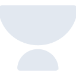
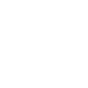

# unacademy

[← Back to main README](../../README.md)





## 16 px

### black
```
https://georgegach.github.io/compatible-icons/simple-icons/unacademy/16/black.png
```

### slate
```
https://georgegach.github.io/compatible-icons/simple-icons/unacademy/16/slate.png
```

### white
```
https://georgegach.github.io/compatible-icons/simple-icons/unacademy/16/white.png
```

## 64 px

### black
```
https://georgegach.github.io/compatible-icons/simple-icons/unacademy/64/black.png
```

### slate
```
https://georgegach.github.io/compatible-icons/simple-icons/unacademy/64/slate.png
```

### white
```
https://georgegach.github.io/compatible-icons/simple-icons/unacademy/64/white.png
```

## 128 px

### black
```
https://georgegach.github.io/compatible-icons/simple-icons/unacademy/128/black.png
```

### slate
```
https://georgegach.github.io/compatible-icons/simple-icons/unacademy/128/slate.png
```

### white
```
https://georgegach.github.io/compatible-icons/simple-icons/unacademy/128/white.png
```

## 512 px

### black
```
https://georgegach.github.io/compatible-icons/simple-icons/unacademy/512/black.png
```

### slate
```
https://georgegach.github.io/compatible-icons/simple-icons/unacademy/512/slate.png
```

### white
```
https://georgegach.github.io/compatible-icons/simple-icons/unacademy/512/white.png
```

## 1024 px

### black
```
https://georgegach.github.io/compatible-icons/simple-icons/unacademy/1024/black.png
```

### slate
```
https://georgegach.github.io/compatible-icons/simple-icons/unacademy/1024/slate.png
```

### white
```
https://georgegach.github.io/compatible-icons/simple-icons/unacademy/1024/white.png
```

## 16 px in base64

### black
```
data:image/png;base64,iVBORw0KGgoAAAANSUhEUgAAABAAAAAQCAYAAAAf8/9hAAAABmJLR0QA/wD/AP+gvaeTAAAAyklEQVQ4jaXSPUsDQRDG8V+OkEawsItFApYWdhY2FoF8OJsjH8gmvQkENK34guECcgqRNN7FIiceh6uXywPLsMs+/5nZWfZUC/MiNtGmhRUOGgJWEdKGZkgjPO8BeIALJNjsuBKcf5NivO9gfsNVtZwRljUzx6GeBphigaxkyoqzCS7LhtD8TzDEabG/xTXuqxejAOCpiD0c4xOPobKr6uIOaz8tfGCGozqAG78/Xo7xf+Yzf0/iBf2yoV0B5Lb/4TWQoIPDOm3U1hdx61Onw40KhwAAAABJRU5ErkJggg==
```

### slate
```
data:image/png;base64,iVBORw0KGgoAAAANSUhEUgAAABAAAAAQCAYAAAAf8/9hAAAABmJLR0QA/wD/AP+gvaeTAAABNElEQVQ4jaWRzS5DYRCGn3dOiRCOjVLhVJrYNOEeSNyEu9DrsHAJNl1b2HZlY2ErVuKv0lChKlho+40FGj8nDccsZ95n5p0Z+Gfo4qp9JFAWODieQ564M5ZpuvFoglYWGECBlrlzmbWBm87NZBWJ5p9haBKo2Nz0xL6jKuLh97DaiO2kEB/0r1+/am85rINPDYRFU65qMhNX4Nv7zi7vVxWxKakAIQ+y91JAND3Q6EXRRik/vvfBpP7//Pq+RC+smUXlN7p76ES1hZnJ0+9a+4nDTT6uh8hwQoLCrNy6xen4Ik37w8HZzVPBwksNtxL4yNvi/ixxTMdW5ufju4EOrNvZxVXuwwDSKGjJc2Fn4Ar167tlRJJm1UEYiyeNVvFzPvdF5AREW67b1CbO8JCFibRa5ngFP1BudBHPkawAAAAASUVORK5CYII=
```

### white
```
data:image/png;base64,iVBORw0KGgoAAAANSUhEUgAAABAAAAAQCAYAAAAf8/9hAAAABmJLR0QA/wD/AP+gvaeTAAAA2UlEQVQ4jaWRsWoCURREz1uCjZDCzhQJCDYp0lnYWAj5OBvJB6WxN0IgSRvUQDAgKhhs4h6bLdbNbuKu0zwYZubeuQ/ORFDfgFDRb1C3QL1iwDYCVhXNAKsI+DgjYIraVReWx0LtAKAO1U0J81odHO2iPqhfJ04e5hZS++pE/VT3KdM+4Z7UXtqT+/9qC7gHbhPqBXgMIbxntVHBdefJew1cAT/ArED7a3pTfVV3qQrf6rPaOCVgXHC8WB39WUG9S9bOQwDa6k2avMiIYmADLAtCasDlvzXK4ABJzCZaA3YFZAAAAABJRU5ErkJggg==
```

