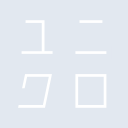
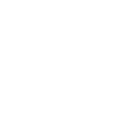

# uniqlo_ja

[← Back to main README](../../README.md)

<table><tr>
  <td></td>
  <td></td>
  <td></td>
</tr></table>

## 16 px

### black
```
https://georgegach.github.io/compatible-icons/simple-icons/compat/uniqlo_ja/16/black.png
```

### slate
```
https://georgegach.github.io/compatible-icons/simple-icons/compat/uniqlo_ja/16/slate.png
```

### white
```
https://georgegach.github.io/compatible-icons/simple-icons/compat/uniqlo_ja/16/white.png
```

## 64 px

### black
```
https://georgegach.github.io/compatible-icons/simple-icons/compat/uniqlo_ja/64/black.png
```

### slate
```
https://georgegach.github.io/compatible-icons/simple-icons/compat/uniqlo_ja/64/slate.png
```

### white
```
https://georgegach.github.io/compatible-icons/simple-icons/compat/uniqlo_ja/64/white.png
```

## 128 px

### black
```
https://georgegach.github.io/compatible-icons/simple-icons/compat/uniqlo_ja/128/black.png
```

### slate
```
https://georgegach.github.io/compatible-icons/simple-icons/compat/uniqlo_ja/128/slate.png
```

### white
```
https://georgegach.github.io/compatible-icons/simple-icons/compat/uniqlo_ja/128/white.png
```

## 512 px

### black
```
https://georgegach.github.io/compatible-icons/simple-icons/compat/uniqlo_ja/512/black.png
```

### slate
```
https://georgegach.github.io/compatible-icons/simple-icons/compat/uniqlo_ja/512/slate.png
```

### white
```
https://georgegach.github.io/compatible-icons/simple-icons/compat/uniqlo_ja/512/white.png
```

## 1024 px

### black
```
https://georgegach.github.io/compatible-icons/simple-icons/compat/uniqlo_ja/1024/black.png
```

### slate
```
https://georgegach.github.io/compatible-icons/simple-icons/compat/uniqlo_ja/1024/slate.png
```

### white
```
https://georgegach.github.io/compatible-icons/simple-icons/compat/uniqlo_ja/1024/white.png
```

## 16 px in base64

### black
```
data:image/png;base64,iVBORw0KGgoAAAANSUhEUgAAABAAAAAQCAYAAAAf8/9hAAAABmJLR0QA/wD/AP+gvaeTAAAA/ElEQVQ4jaXTP0sDQRAF8F80QdRgCg0qCDaC+AfstbLw+/oFrMTaRkLAyiYGkkIRMcrFWNwGx81ZaAaOm533bvbNvr0aJuaIhXk+hnrIn9HFC7ZxFLA+7lK+hn208gYr2EUD11mDJo4z7oyCBrbwVKG0mZ6ZqDqDekXt14jkIW6UrnTRwWHCOrgP3DNsQM23je8YB1INyyl/89PuRSzlIzT+Ir1qhEdcYgef2MRpwq5QJFUfSkcO8gavOFfO3cMgYAUusKq8Ew9VClphpB7amdoivUexmNs4TjsPhMsSGvTz+lTBSHkGw7RuYz3w9nCb8glOpkC08V8x99/4BXqnLm+EM1QAAAAAAElFTkSuQmCC
```

### slate
```
data:image/png;base64,iVBORw0KGgoAAAANSUhEUgAAABAAAAAQCAYAAAAf8/9hAAAABmJLR0QA/wD/AP+gvaeTAAABPUlEQVQ4jcWTPYuTQRSFnzNJEGNwCw26sGAjiOuCvVYW+3/3D1iJtY2Eha3WYhNIihURo7yZxyKJ++ajCGzhVDN3ztx7zrl38m1yK/dY5T6PAbrrjfA9ckn4ATkG3/xDJRP06wr42MKryNFGgkCfkhdUexQ/IXcJrANSztbAaH+HAdBDn1u8DdkimgE62Cdhx4OYbvVwX1sSMpP6mcSOuYSM1NOlBRlJvWqVeQ88BchdG/Mb6qIFCvBwdfgFbVqlAz7YklB7B/PeJ4FkTPWCcALUJM/UdwhJPhoaNMof4lng9WaCyk8oH8BTyI06XV8ZG+Qc8ogwKcm1K0UtBhxFi4B6U8JwqxfNEsa8HWx5ECxZhExTmAr9NjDQkEx0M94FiJkTx8pMABmCT1gNVCwvpX5BScGqb9ejlv/+G/8CTZ2NmUa5cdsAAAAASUVORK5CYII=
```

### white
```
data:image/png;base64,iVBORw0KGgoAAAANSUhEUgAAABAAAAAQCAYAAAAf8/9hAAAABmJLR0QA/wD/AP+gvaeTAAAA/ElEQVQ4jcXTP0sDQRAF8N9pDlGDKTSoINgI4h+w18oi39cvYCXWNhIEK5sYSApFxCgX1+I2sGzOQlI4cNzcvHfv3szsFSGEYIFYWuRlaCX5Kx7whl2cJNgQ9zHfwCE6ucAa9lHiJhNo4zTjzjkosYOXBqfteM1F0wxaDbVfIyWPcYugnkUfxxHr4zHhXmALimSNn5gmpAKrMf+IwrNYxkreQvkX600tPOMKe/jGNs4jdo0quvpSb+QoF3jHpbrvAUYJVqGHdfWZeGpy0ElaGqCbua3ifZIW8zVO45dHksOSCAzz+szBRD2DcXzuYjPhHeAu5gFnM6D497/xB+ZUN2Ymxc6+AAAAAElFTkSuQmCC
```

