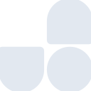

# unocss

[← Back to main README](../../README.md)

<table><tr>
  <td></td>
  <td></td>
  <td></td>
</tr></table>

## 16 px

### black
```
https://georgegach.github.io/compatible-icons/simple-icons/compat/unocss/16/black.png
```

### slate
```
https://georgegach.github.io/compatible-icons/simple-icons/compat/unocss/16/slate.png
```

### white
```
https://georgegach.github.io/compatible-icons/simple-icons/compat/unocss/16/white.png
```

## 64 px

### black
```
https://georgegach.github.io/compatible-icons/simple-icons/compat/unocss/64/black.png
```

### slate
```
https://georgegach.github.io/compatible-icons/simple-icons/compat/unocss/64/slate.png
```

### white
```
https://georgegach.github.io/compatible-icons/simple-icons/compat/unocss/64/white.png
```

## 128 px

### black
```
https://georgegach.github.io/compatible-icons/simple-icons/compat/unocss/128/black.png
```

### slate
```
https://georgegach.github.io/compatible-icons/simple-icons/compat/unocss/128/slate.png
```

### white
```
https://georgegach.github.io/compatible-icons/simple-icons/compat/unocss/128/white.png
```

## 512 px

### black
```
https://georgegach.github.io/compatible-icons/simple-icons/compat/unocss/512/black.png
```

### slate
```
https://georgegach.github.io/compatible-icons/simple-icons/compat/unocss/512/slate.png
```

### white
```
https://georgegach.github.io/compatible-icons/simple-icons/compat/unocss/512/white.png
```

## 1024 px

### black
```
https://georgegach.github.io/compatible-icons/simple-icons/compat/unocss/1024/black.png
```

### slate
```
https://georgegach.github.io/compatible-icons/simple-icons/compat/unocss/1024/slate.png
```

### white
```
https://georgegach.github.io/compatible-icons/simple-icons/compat/unocss/1024/white.png
```

## 16 px in base64

### black
```
data:image/png;base64,iVBORw0KGgoAAAANSUhEUgAAABAAAAAQCAYAAAAf8/9hAAAABmJLR0QA/wD/AP+gvaeTAAAA3ElEQVQ4jZ3TwUqCQRQF4M9fF+I6fY9q1aLHiN4iX6CXUfQFWvgUkRAUtAikRW00CFoIvzgt5hcknWnowIWBc+6ZO/fOpQzneMYn1njHBN2S5AEWCL+ixrTEYIztEYPQVPIn7hPJAXVVYJDTdEoM/u1ehE6BZpbRbVqYo50Q3OG2OV/jRpz9K4b4IN3hgIcmeSp+on3uDRclBldHknfx0moOKczxjcsE/1VhkzHYopfhexWWCTLgEU+ZKpfEBtUO37fACfrSyzQhjmUsLsYaK3F1T/duOnO4ziN0fwBMCF8G2IvpYAAAAABJRU5ErkJggg==
```

### slate
```
data:image/png;base64,iVBORw0KGgoAAAANSUhEUgAAABAAAAAQCAYAAAAf8/9hAAAABmJLR0QA/wD/AP+gvaeTAAABUElEQVQ4jaWTP0tbURjGf++5J21JIaYFUysYnR3tJyh0cS1IBscWnKxLcfIj+CEKrYujg4uQD+AiFLq1gwkmsUa5WMQO976Pg5RgcsMV+qzP3xfOMR6B04v0TZLz1cWcoGrBriRv+239o5WZfw7+NJ6SHwsWHxBGhtgPZQEV+a6gOUGIiNnb0gALWgYKl5o0Wx7gTNUIYmlAGf47IJYJlHCIq1BnCpl1B+mJUFLoDnbQbNR3AM5+py13fZLsmdAvxSdbS7PP+9YZpJrWbuJk4XV9pdNL9yxhVeLFaBrdEEKr9ITT/uUajJkBjAXHvzziHcRNbMw8wqtgkE0zK+Cg6lQeqkFiWNhsCPEd1497bVGCDQNmbWxyhTud6GG7Qvxs0JlsIANvx/y29iFWr3PBO0kvzbgBP4+Jrc83akOA3kX6Psv5xr/vbLrCw5H/ndm4A9YmiJ/i2AyxAAAAAElFTkSuQmCC
```

### white
```
data:image/png;base64,iVBORw0KGgoAAAANSUhEUgAAABAAAAAQCAYAAAAf8/9hAAAABmJLR0QA/wD/AP+gvaeTAAAA6ElEQVQ4jZ2TMUoDURRFzxtTDKmNi7BTKwuXIe5CN+BmlGQDFi7DgKBgIQSLsYmCYCEk5FjMjAiZ//14qg/3vst/f+ZCAeqR+qi+q19qo07VumR4T124zUqdlQRcq5uBANWmKthgH4iENikJyHlGJQH/Ti9iVOC5zfjWoc6BnYThJiIuAdQz4ByogWfgIiJeSXyenrtueNb9RL95UY//DFBPB4Z7nkI1s/8c+AROEvpHBawzARtgnNHHFbBMiAL3wEN3HmLZP9BqYL+FuqtOTJdpilrbFqaxreqbbXUPfq6ih27X+UqtvwEr5luXgx0HqAAAAABJRU5ErkJggg==
```

