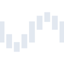

# unraid

[← Back to main README](../../README.md)

<table><tr>
  <td></td>
  <td></td>
  <td></td>
</tr></table>

## 16 px

### black
```
https://georgegach.github.io/compatible-icons/simple-icons/compat/unraid/16/black.png
```

### slate
```
https://georgegach.github.io/compatible-icons/simple-icons/compat/unraid/16/slate.png
```

### white
```
https://georgegach.github.io/compatible-icons/simple-icons/compat/unraid/16/white.png
```

## 64 px

### black
```
https://georgegach.github.io/compatible-icons/simple-icons/compat/unraid/64/black.png
```

### slate
```
https://georgegach.github.io/compatible-icons/simple-icons/compat/unraid/64/slate.png
```

### white
```
https://georgegach.github.io/compatible-icons/simple-icons/compat/unraid/64/white.png
```

## 128 px

### black
```
https://georgegach.github.io/compatible-icons/simple-icons/compat/unraid/128/black.png
```

### slate
```
https://georgegach.github.io/compatible-icons/simple-icons/compat/unraid/128/slate.png
```

### white
```
https://georgegach.github.io/compatible-icons/simple-icons/compat/unraid/128/white.png
```

## 512 px

### black
```
https://georgegach.github.io/compatible-icons/simple-icons/compat/unraid/512/black.png
```

### slate
```
https://georgegach.github.io/compatible-icons/simple-icons/compat/unraid/512/slate.png
```

### white
```
https://georgegach.github.io/compatible-icons/simple-icons/compat/unraid/512/white.png
```

## 1024 px

### black
```
https://georgegach.github.io/compatible-icons/simple-icons/compat/unraid/1024/black.png
```

### slate
```
https://georgegach.github.io/compatible-icons/simple-icons/compat/unraid/1024/slate.png
```

### white
```
https://georgegach.github.io/compatible-icons/simple-icons/compat/unraid/1024/white.png
```

## 16 px in base64

### black
```
data:image/png;base64,iVBORw0KGgoAAAANSUhEUgAAABAAAAAQCAYAAAAf8/9hAAAABmJLR0QA/wD/AP+gvaeTAAAA00lEQVQ4jdXQMUtCYRjF8R+3C0olWLjWp2h1q136BG59ATeXlihabG1saegDBIHkKmiTSzQ1SCBEm5HDtQafoOFeuI2e6eXl/M9znoe110ZJXy28r9jHEN/IkpIBT7hDFTuYoQMJ+tgtAC9wHtOq6OEWGRrop2hiCx85AYcB/656FkMTbKKZllzhEm/xXkbQBG1Y4Binf4AWTjDGqCB0L1gLXOMrqsEjXsoEpBjgM6od4SAMGR7iP0/zYEE3mtzgHfd4LgBzVUEdV5haXXj7PwFrrB9wgi3v4gATDAAAAABJRU5ErkJggg==
```

### slate
```
data:image/png;base64,iVBORw0KGgoAAAANSUhEUgAAABAAAAAQCAYAAAAf8/9hAAAABmJLR0QA/wD/AP+gvaeTAAABVUlEQVQ4jd2PsWoUYRRGz/fPxA1q3ESEJMWkEAJWVrFMp1jYWKjgA9jaaCEIkiYgIohvIWIvQiC96BNoYbJEZ1ndrBGTHbL//SzSRcFp9avvPZwD//zU5mgwGMyMx+OJT5z+YPMqOqxNvs4eLC+rSW0ABzH1nqkzL7GmpTRXNKnfmdm9D1D26tEGh7pVVd3h8cet/uhxythg42mIZzkX71LyTaFzvXq0UQaslmlyCvgNILjshGUKA0sLZ9dtp179PUk6GbDaKiHEE5OeA0iKwOuWXwNoqx41Sb5NpIvVYncN4HN/7/phinkFdzBeWpi9dBy6s/OtmhTFxyMD66rxA9sJIDvfVeZeG7tSjk1L+5bi05e9K9v1cOWoX1n2m8Dxx6wofyrlTQFs18OHUDxCvMC+JvGW0PlqsXvhbwYJoPkx9zR3Yt6OXeRxkfdvdIpmpU3Cf7BfEiaZiNHz9DcAAAAASUVORK5CYII=
```

### white
```
data:image/png;base64,iVBORw0KGgoAAAANSUhEUgAAABAAAAAQCAYAAAAf8/9hAAAABmJLR0QA/wD/AP+gvaeTAAAA5ElEQVQ4jeWSsUqCYRSGn//3B8sKLFq9i1Y33aUrcOsG2lpaxGjJ1bGloQsIBNELyKaWaJYgCDcjB31cTuCg8K3ROx7O+5z3HA78D6lH6r46VXtqVS0D5ImMF+AR2AOOgU/gEiBXh+rJjsk3ahcwzHfAA7AETtVhAdSBA2C2hdEIcwkgy7KOmkfyClAvEle4BT4CslI7wCvQRl2o5+r1RvSWeqFO1Ocd69XUxS+gr/5EPNSR+p4CKIAx8A2sgKZ6Fj1LYBD1bZqHF9SrSHKvfqlP6lvifUAtx3P04lkq6mEy4G9rDdBgsjozaXY8AAAAAElFTkSuQmCC
```

