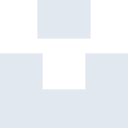
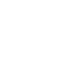

# unsplash

[← Back to main README](../../README.md)





## 16 px

### black
```
https://georgegach.github.io/compatible-icons/simple-icons/unsplash/16/black.png
```

### slate
```
https://georgegach.github.io/compatible-icons/simple-icons/unsplash/16/slate.png
```

### white
```
https://georgegach.github.io/compatible-icons/simple-icons/unsplash/16/white.png
```

## 64 px

### black
```
https://georgegach.github.io/compatible-icons/simple-icons/unsplash/64/black.png
```

### slate
```
https://georgegach.github.io/compatible-icons/simple-icons/unsplash/64/slate.png
```

### white
```
https://georgegach.github.io/compatible-icons/simple-icons/unsplash/64/white.png
```

## 128 px

### black
```
https://georgegach.github.io/compatible-icons/simple-icons/unsplash/128/black.png
```

### slate
```
https://georgegach.github.io/compatible-icons/simple-icons/unsplash/128/slate.png
```

### white
```
https://georgegach.github.io/compatible-icons/simple-icons/unsplash/128/white.png
```

## 512 px

### black
```
https://georgegach.github.io/compatible-icons/simple-icons/unsplash/512/black.png
```

### slate
```
https://georgegach.github.io/compatible-icons/simple-icons/unsplash/512/slate.png
```

### white
```
https://georgegach.github.io/compatible-icons/simple-icons/unsplash/512/white.png
```

## 1024 px

### black
```
https://georgegach.github.io/compatible-icons/simple-icons/unsplash/1024/black.png
```

### slate
```
https://georgegach.github.io/compatible-icons/simple-icons/unsplash/1024/slate.png
```

### white
```
https://georgegach.github.io/compatible-icons/simple-icons/unsplash/1024/white.png
```

## 16 px in base64

### black
```
data:image/png;base64,iVBORw0KGgoAAAANSUhEUgAAABAAAAAQCAYAAAAf8/9hAAAABmJLR0QA/wD/AP+gvaeTAAAAZklEQVQ4jWNgwAShDAwM/3HgUHTFTFgMIAkMvAEsWMQ+MjAw3GVgYPiJJs4OlaMuYGTAErIMDAzHGRgYnqCJyTAwMFhiM4So6GLAEb0DHwsUG8DIAPELOsAVjcrEGkA0GPgwoNgAAGxEG3BmE353AAAAAElFTkSuQmCC
```

### slate
```
data:image/png;base64,iVBORw0KGgoAAAANSUhEUgAAABAAAAAQCAYAAAAf8/9hAAAABmJLR0QA/wD/AP+gvaeTAAAAmElEQVQ4jcWSMQoCMRREZ/IXbAUrIWDhKfYgu4d0D+IpLFYCayNkS4v4tw1/YyEpMuXjMQmZECbzEgcSN8sBQBXj5XyccuZK4j9pX9BZQIdVv/og8cm5Kg50XGsP3IXzEgcLJaW796eQsxDePon01u1KkyWREcBkWF9y269QXcDnK6qFqj9mJK/W3f0DACiJZPkG7d+gumADYXQqav2SGJUAAAAASUVORK5CYII=
```

### white
```
data:image/png;base64,iVBORw0KGgoAAAANSUhEUgAAABAAAAAQCAYAAAAf8/9hAAAABmJLR0QA/wD/AP+gvaeTAAAAZ0lEQVQ4jcWRsQ2AMAwEzwiJJeiYgkEyM1PQsQAl1aehQCaWgoKUK8+vL/zgkJQUk3x+8OIr/QvGgjuBHbicn+7bv1jps8BmZsdTSJqB9ZWsnSuat/8KzQUmSQUfzbjUFlTT/wfNBRmIGGMrBkcsigAAAABJRU5ErkJggg==
```

