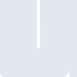
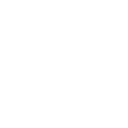

# uv

[← Back to main README](../../README.md)





## 16 px

### black
```
https://georgegach.github.io/compatible-icons/simple-icons/uv/16/black.png
```

### slate
```
https://georgegach.github.io/compatible-icons/simple-icons/uv/16/slate.png
```

### white
```
https://georgegach.github.io/compatible-icons/simple-icons/uv/16/white.png
```

## 64 px

### black
```
https://georgegach.github.io/compatible-icons/simple-icons/uv/64/black.png
```

### slate
```
https://georgegach.github.io/compatible-icons/simple-icons/uv/64/slate.png
```

### white
```
https://georgegach.github.io/compatible-icons/simple-icons/uv/64/white.png
```

## 128 px

### black
```
https://georgegach.github.io/compatible-icons/simple-icons/uv/128/black.png
```

### slate
```
https://georgegach.github.io/compatible-icons/simple-icons/uv/128/slate.png
```

### white
```
https://georgegach.github.io/compatible-icons/simple-icons/uv/128/white.png
```

## 512 px

### black
```
https://georgegach.github.io/compatible-icons/simple-icons/uv/512/black.png
```

### slate
```
https://georgegach.github.io/compatible-icons/simple-icons/uv/512/slate.png
```

### white
```
https://georgegach.github.io/compatible-icons/simple-icons/uv/512/white.png
```

## 1024 px

### black
```
https://georgegach.github.io/compatible-icons/simple-icons/uv/1024/black.png
```

### slate
```
https://georgegach.github.io/compatible-icons/simple-icons/uv/1024/slate.png
```

### white
```
https://georgegach.github.io/compatible-icons/simple-icons/uv/1024/white.png
```

## 16 px in base64

### black
```
data:image/png;base64,iVBORw0KGgoAAAANSUhEUgAAABAAAAAQCAYAAAAf8/9hAAAABmJLR0QA/wD/AP+gvaeTAAAAhklEQVQ4jbXSTQrCQAzF8d8MRT2JB/D+G0/gBdx5BEG0pdWFH7joTEqrD7IIf/LyAkm4ojeuAzbYIY3wtsGqACFjqPA+F8BkZdwrvLT5w6cYVHl0Qm0YPzphcYJhgUGYIFJqgi3b0MHzldczE/z/EyOljHbGYIvb2+D0akrqcPmqM47Yo3sAbqIecxB1BtQAAAAASUVORK5CYII=
```

### slate
```
data:image/png;base64,iVBORw0KGgoAAAANSUhEUgAAABAAAAAQCAYAAAAf8/9hAAAABmJLR0QA/wD/AP+gvaeTAAAAuElEQVQ4jZ2SMQ7CQAwEZ60I0fMHHsD/G17AB6igoUVIiCTKLUWgSs6HWOkqe+2xz7rc7i8oE+s62dpKHAAtombowBvQMggYIkTxmhlAnqLSGYCYi1Ql9ENOIhuFULWA59nSeGQAktzCS0ewnY8wE6QdMgAkCENJMtICVoOgpBuAMOowrn2WYI9duzMQdGkL2FXNAEaRQ7YkorXpTMYKxPCHd8Dq+Vzi1aavU2oEP79P8ACf8XS0Gd8yc0tC61UGuwAAAABJRU5ErkJggg==
```

### white
```
data:image/png;base64,iVBORw0KGgoAAAANSUhEUgAAABAAAAAQCAYAAAAf8/9hAAAABmJLR0QA/wD/AP+gvaeTAAAAh0lEQVQ4jbXSQQrCQAyF4W+GIu69gwfw/htP4AXceQRBtKUdNyounEmx+iCL8JOXF0gqpVwx+qwD1tghfeB9h1UFQsbU4GOugNnKKA1e2/zicwyaPDqhNYwfnbA4wbTAIEwQKXXBlm3k0AV8EyX4+ydGShn9F4M9bk+D06OpacDlrc44Yo/hDmYNH4uJR66DAAAAAElFTkSuQmCC
```

