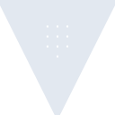
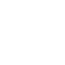

# vault

[← Back to main README](../../README.md)





## 16 px

### black
```
https://georgegach.github.io/compatible-icons/simple-icons/vault/16/black.png
```

### slate
```
https://georgegach.github.io/compatible-icons/simple-icons/vault/16/slate.png
```

### white
```
https://georgegach.github.io/compatible-icons/simple-icons/vault/16/white.png
```

## 64 px

### black
```
https://georgegach.github.io/compatible-icons/simple-icons/vault/64/black.png
```

### slate
```
https://georgegach.github.io/compatible-icons/simple-icons/vault/64/slate.png
```

### white
```
https://georgegach.github.io/compatible-icons/simple-icons/vault/64/white.png
```

## 128 px

### black
```
https://georgegach.github.io/compatible-icons/simple-icons/vault/128/black.png
```

### slate
```
https://georgegach.github.io/compatible-icons/simple-icons/vault/128/slate.png
```

### white
```
https://georgegach.github.io/compatible-icons/simple-icons/vault/128/white.png
```

## 512 px

### black
```
https://georgegach.github.io/compatible-icons/simple-icons/vault/512/black.png
```

### slate
```
https://georgegach.github.io/compatible-icons/simple-icons/vault/512/slate.png
```

### white
```
https://georgegach.github.io/compatible-icons/simple-icons/vault/512/white.png
```

## 1024 px

### black
```
https://georgegach.github.io/compatible-icons/simple-icons/vault/1024/black.png
```

### slate
```
https://georgegach.github.io/compatible-icons/simple-icons/vault/1024/slate.png
```

### white
```
https://georgegach.github.io/compatible-icons/simple-icons/vault/1024/white.png
```

## 16 px in base64

### black
```
data:image/png;base64,iVBORw0KGgoAAAANSUhEUgAAABAAAAAQCAYAAAAf8/9hAAAABmJLR0QA/wD/AP+gvaeTAAAAvklEQVQ4jZ2SvQoCQQyEP8XaZ1BR395fRNRO8BHsbGw8G6+4u0rl1OKyENbc6l5gIGwyk9mQFpABXZpF3gYODckAe4AhkADvSCTAwCmtjIYCeAoKo77UViwXJfASlF7toqe7WHtNdyGWkuvawlrICLiqpkzsPyTX0/uWgOUiF+i3eR0ZYOy5SIGbN70XEgDY8L1xh9kvMlS7sO4i+Hc/tobA9F+y5SJquoudEpjEkrWL4OY7AYETcKQ6onNd0weh+3DxrF7gSgAAAABJRU5ErkJggg==
```

### slate
```
data:image/png;base64,iVBORw0KGgoAAAANSUhEUgAAABAAAAAQCAYAAAAf8/9hAAAABmJLR0QA/wD/AP+gvaeTAAABQElEQVQ4jZ2SwU4bUQxFz3V2LDKBqgNIHQHf11aM2s/qH7BD6qIUVECwahCtqDQ0O6iQiCB5l0UQzDCTIvDOfvbxtZ91Nrq4xPR5jYl/Ievrq4oBrO0g2ASfv7gWn1suo8izExE/WurElaQJ0gS4ar2bvbXlwWkAEJSghgqbBds97B6w8IReOVTOSoEiz06wD5oATRCWMGbSAKS0t7Y8OH0AAKinTczfBz88xiSjKcG43j1p1r0BKPJsSLBf21LfcG173Phms7u+MvjVAgBERAk1FXAbcFMbvpo6lY2auvPubf8n0mEttGR4Uxv++8bq4u+5gNmIfHTXXUhVQp+ehluAIs+GUhy1AHinPvtcwL2KD43rlKpkPnfldgKKPBuiOH6MpG9d3ecC7lW8n+1C1TR1d3/WzkaXW39GF1/+l3MHY8t8J6LTMhgAAAAASUVORK5CYII=
```

### white
```
data:image/png;base64,iVBORw0KGgoAAAANSUhEUgAAABAAAAAQCAYAAAAf8/9hAAAABmJLR0QA/wD/AP+gvaeTAAAA0klEQVQ4jZ2SvUpDQRBGz1ysfYZ4Ud/eaCVqJ1iKWNgliI2x0eKGVMmNx2aFZdkNSQY+WJj9fnZmQx2AU46rZQc8HUkGeEQ9VxceXgu17yJiDrxU1FfAmLCq9J8j4h2glWKr/iZsi96n2gN0ACnFa+EwAiaMTff/Ui/Ur8xlUDfqOp1z97PqSNXbIuoyIa+b5k7UyyLFj/pduE+aAknkrr41Va93krNZ1P5F++0VkfuKwHQvciPF/u6ZyEMmcHUQuUixc/InrUZEzNQ3YIiIj9a9P6kCkeNM4G6nAAAAAElFTkSuQmCC
```

