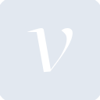
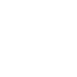

# velog

[← Back to main README](../../README.md)

<table><tr>
  <td></td>
  <td></td>
  <td></td>
</tr></table>

## 16 px

### black
```
https://georgegach.github.io/compatible-icons/simple-icons/compat/velog/16/black.png
```

### slate
```
https://georgegach.github.io/compatible-icons/simple-icons/compat/velog/16/slate.png
```

### white
```
https://georgegach.github.io/compatible-icons/simple-icons/compat/velog/16/white.png
```

## 64 px

### black
```
https://georgegach.github.io/compatible-icons/simple-icons/compat/velog/64/black.png
```

### slate
```
https://georgegach.github.io/compatible-icons/simple-icons/compat/velog/64/slate.png
```

### white
```
https://georgegach.github.io/compatible-icons/simple-icons/compat/velog/64/white.png
```

## 128 px

### black
```
https://georgegach.github.io/compatible-icons/simple-icons/compat/velog/128/black.png
```

### slate
```
https://georgegach.github.io/compatible-icons/simple-icons/compat/velog/128/slate.png
```

### white
```
https://georgegach.github.io/compatible-icons/simple-icons/compat/velog/128/white.png
```

## 512 px

### black
```
https://georgegach.github.io/compatible-icons/simple-icons/compat/velog/512/black.png
```

### slate
```
https://georgegach.github.io/compatible-icons/simple-icons/compat/velog/512/slate.png
```

### white
```
https://georgegach.github.io/compatible-icons/simple-icons/compat/velog/512/white.png
```

## 1024 px

### black
```
https://georgegach.github.io/compatible-icons/simple-icons/compat/velog/1024/black.png
```

### slate
```
https://georgegach.github.io/compatible-icons/simple-icons/compat/velog/1024/slate.png
```

### white
```
https://georgegach.github.io/compatible-icons/simple-icons/compat/velog/1024/white.png
```

## 16 px in base64

### black
```
data:image/png;base64,iVBORw0KGgoAAAANSUhEUgAAABAAAAAQCAYAAAAf8/9hAAAABmJLR0QA/wD/AP+gvaeTAAAAwUlEQVQ4jc3SvUoDURCG4SfBFAsp1mJjITbegKVVKq/AInfmTQRsLNMoXoAGU8a0KtjsbhdJUItz0qgr+9NkYGDOMN/LnI+BOxT4apgFbrUU7zLvxaJ19LuIqwAveMI13mPvFTdY1gF8YoAJ8thLMMP05/DBH4ATvOFYMBgOcYlhnQ0gxRkW8f2BFU7rAhKMcY+t4MsFjuoC4BxzbLAWvvYr/gOMBNefkcWtGgFSXAkGZlVD+3GJZQd92cdjS0iBh28RIT6a1mXZtQAAAABJRU5ErkJggg==
```

### slate
```
data:image/png;base64,iVBORw0KGgoAAAANSUhEUgAAABAAAAAQCAYAAAAf8/9hAAAABmJLR0QA/wD/AP+gvaeTAAABAklEQVQ4ja2SsUoDQRiEv1lMcRDwUsQIEgVfQKysrHwCC9/MlxBsLK3EBzCiZbS6EBMlkL1Oibe/xZ3N5ULM4pSz3wzDzyqbzO+QjoFtNlMuGCibeh8RLiW8iw4DGKmLDldaLhBjAk8mrgUfpac30I2Moa0tCAScWge99AJpXnohcXK3hl2phm81LOhDMRnNZnsU+GpBJ1hxLqm9fgEglLJoHWH2XDlfTno1OKyzjQWGEsxOi6B7iW+wcQh2BvT+VFC+2InkHs1YgD6R9RuxVXnD7ezvtodgLxC6oKSJWz7ir2Tp6D2/BHWA7kosm/r6YTfSv/zEPDZskDvBIKpEeODhBwR3V3ZPtmOCAAAAAElFTkSuQmCC
```

### white
```
data:image/png;base64,iVBORw0KGgoAAAANSUhEUgAAABAAAAAQCAYAAAAf8/9hAAAABmJLR0QA/wD/AP+gvaeTAAAAyklEQVQ4jc3SMU4CURSF4e8RLEhMxAItjA0bMFZUVqzAwp25CRMbSyrjAsRgqbRoYsNMB9F4LebZiJhhaDzdO7nnz70nL0XELU6xZzOVGKeIKBqEv1WkiIiGYdDaJrwOMMME13jL3gtu8FQH8ImdlNIF5tnrYISrn8PtXwDHeI2IIxTZ28c5dutsAF2c4DG/l5iiXxfQwRnu8KHqZYjDugAY4AHvWKhOW9FfgANV68/o5a02AnRxqSqwt27of/zEcot82cK4IaTA/Rf4HzMbdKimkQAAAABJRU5ErkJggg==
```

