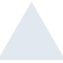
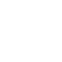

# vercel

[← Back to main README](../../README.md)

<table><tr>
  <td></td>
  <td></td>
  <td></td>
</tr></table>

## 16 px

### black
```
https://georgegach.github.io/compatible-icons/simple-icons/compat/vercel/16/black.png
```

### slate
```
https://georgegach.github.io/compatible-icons/simple-icons/compat/vercel/16/slate.png
```

### white
```
https://georgegach.github.io/compatible-icons/simple-icons/compat/vercel/16/white.png
```

## 64 px

### black
```
https://georgegach.github.io/compatible-icons/simple-icons/compat/vercel/64/black.png
```

### slate
```
https://georgegach.github.io/compatible-icons/simple-icons/compat/vercel/64/slate.png
```

### white
```
https://georgegach.github.io/compatible-icons/simple-icons/compat/vercel/64/white.png
```

## 128 px

### black
```
https://georgegach.github.io/compatible-icons/simple-icons/compat/vercel/128/black.png
```

### slate
```
https://georgegach.github.io/compatible-icons/simple-icons/compat/vercel/128/slate.png
```

### white
```
https://georgegach.github.io/compatible-icons/simple-icons/compat/vercel/128/white.png
```

## 512 px

### black
```
https://georgegach.github.io/compatible-icons/simple-icons/compat/vercel/512/black.png
```

### slate
```
https://georgegach.github.io/compatible-icons/simple-icons/compat/vercel/512/slate.png
```

### white
```
https://georgegach.github.io/compatible-icons/simple-icons/compat/vercel/512/white.png
```

## 1024 px

### black
```
https://georgegach.github.io/compatible-icons/simple-icons/compat/vercel/1024/black.png
```

### slate
```
https://georgegach.github.io/compatible-icons/simple-icons/compat/vercel/1024/slate.png
```

### white
```
https://georgegach.github.io/compatible-icons/simple-icons/compat/vercel/1024/white.png
```

## 16 px in base64

### black
```
data:image/png;base64,iVBORw0KGgoAAAANSUhEUgAAABAAAAAQCAYAAAAf8/9hAAAABmJLR0QA/wD/AP+gvaeTAAAAs0lEQVQ4jZ3RMWoCQRxG8d/GlBII6dIJnsLGRhtP4gXiWWLvGVLqJRYs1SIERAKK2kSJhTuwiO7u7AevGXgP/gzFe8+ova+MWutgjQ26sXKCFP8ZKZ5iAkPscoF99lZpTSxzcmCJlyqBT/zdCZwwLpNb+L4jB37QLgrMCuTA9JHcd/2yssAvBrdyA/MKcmCO53zgA4eIwBGjIL9iFSEHFniDCc41AmdMEmxv74nYKUGvpgwuqnNs5JHmGv8AAAAASUVORK5CYII=
```

### slate
```
data:image/png;base64,iVBORw0KGgoAAAANSUhEUgAAABAAAAAQCAYAAAAf8/9hAAAABmJLR0QA/wD/AP+gvaeTAAABNElEQVQ4jZWTPU7DQBCF32yMaWgiCwmFyAEJShBFREFDRYMUGu4Afa4BFIBoIsSZKDiAf0CQdZE4oeDH3kcBsqLEXpKtVjNvvnmrmQUsJ0qSRpQkDZvGsSWRLd3/3Y6rJKoq8dIfHQDShsh+nAwOFwKQlIx5D8JVgB5z3JEs1ZYGYz04h4hfBEQ2Yv1+VqaV6YDWeuXTuE8EWlOuwi/X7G573sjq4MO4lwDWZzoJmu63XFifELwNNwl2WDodqQnUSazTrUqAAh4EYpv7mslNrxQQ9odHAHYsxb8+gL3gNS32QgEAyRqIGwDefwCI1AW8IukUgGc97grg2ysnGWxFetwFAAnDYV25fOTk3OfDBCqTtqOW5ZZAc7FiAKCfO+Zaon6agsb+qSpNqMwheAqZWch5XeAHaP5xblYiICkAAAAASUVORK5CYII=
```

### white
```
data:image/png;base64,iVBORw0KGgoAAAANSUhEUgAAABAAAAAQCAYAAAAf8/9hAAAABmJLR0QA/wD/AP+gvaeTAAAAvUlEQVQ4jZ3RPUpDURRF4f00pQhil0IRHIWNjTaOJLWj0T5jSKmTCKQ0KUQQERQ7Ez4LvSRofH+rvmvdwzlJDRhiWPemFkww6Suf4RkvOO8qV5haM8VOl8AI7xuBD4zaynuY+8sc+20CN/jcEljitkk+weMWufCE07rAfY1cuPtPvvR9siZecfVb3sWshVyYYZAk5bbXSY4aN7zm+MdJcIBFh98LDzgMxlj1CKwwrvCWZNBh/E2WFS56ykmSL3Kcu+6Ey5EjAAAAAElFTkSuQmCC
```

