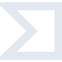

# virustotal

[← Back to main README](../../README.md)

<table><tr>
  <td></td>
  <td></td>
  <td></td>
</tr></table>

## 16 px

### black
```
https://georgegach.github.io/compatible-icons/simple-icons/compat/virustotal/16/black.png
```

### slate
```
https://georgegach.github.io/compatible-icons/simple-icons/compat/virustotal/16/slate.png
```

### white
```
https://georgegach.github.io/compatible-icons/simple-icons/compat/virustotal/16/white.png
```

## 64 px

### black
```
https://georgegach.github.io/compatible-icons/simple-icons/compat/virustotal/64/black.png
```

### slate
```
https://georgegach.github.io/compatible-icons/simple-icons/compat/virustotal/64/slate.png
```

### white
```
https://georgegach.github.io/compatible-icons/simple-icons/compat/virustotal/64/white.png
```

## 128 px

### black
```
https://georgegach.github.io/compatible-icons/simple-icons/compat/virustotal/128/black.png
```

### slate
```
https://georgegach.github.io/compatible-icons/simple-icons/compat/virustotal/128/slate.png
```

### white
```
https://georgegach.github.io/compatible-icons/simple-icons/compat/virustotal/128/white.png
```

## 512 px

### black
```
https://georgegach.github.io/compatible-icons/simple-icons/compat/virustotal/512/black.png
```

### slate
```
https://georgegach.github.io/compatible-icons/simple-icons/compat/virustotal/512/slate.png
```

### white
```
https://georgegach.github.io/compatible-icons/simple-icons/compat/virustotal/512/white.png
```

## 1024 px

### black
```
https://georgegach.github.io/compatible-icons/simple-icons/compat/virustotal/1024/black.png
```

### slate
```
https://georgegach.github.io/compatible-icons/simple-icons/compat/virustotal/1024/slate.png
```

### white
```
https://georgegach.github.io/compatible-icons/simple-icons/compat/virustotal/1024/white.png
```

## 16 px in base64

### black
```
data:image/png;base64,iVBORw0KGgoAAAANSUhEUgAAABAAAAAQCAYAAAAf8/9hAAAABmJLR0QA/wD/AP+gvaeTAAAAxElEQVQ4jaXTTUoDQRCG4WdESDDgSo+QdS6h0YXbgEfyOB4hutG5gRsXCjERzAESlWTTM06Yvx7ng6ZpqH7r666qBHdI9NALfrH7z0pwijkm+MYX3iMSj3GWHUZI8YMlLiMAr8FFrhM8BxcfEZASIIM8YRsg064AGOABmwC56gqAIR4DZImLOsBRg8WksJ83xJVUfMIKtzVxrZ/4iVlDosoypv7KeNPi9ABQbKQFrlsu54CqVl7jLQKQt3KvYTrGvR7jvAcGMVRxHjZjiAAAAABJRU5ErkJggg==
```

### slate
```
data:image/png;base64,iVBORw0KGgoAAAANSUhEUgAAABAAAAAQCAYAAAAf8/9hAAAABmJLR0QA/wD/AP+gvaeTAAABZElEQVQ4jZ3TP2tTURzG8e9zctE2gpE0LSEVi8KdCxY626Lt6ivoUnAT+jJ8Ge3k4OLgoIjaTYS+ACE4JKW3kRp6U2zon5v7OIgxS5NLftsZng/n4fyOWsfpKwJiyokCeu48j5HCVMDFrWx1Jivt217Guib4lwjtSUHbMVATQKfTuXPF7GfwCujEA28tLd77OA5od9IfwKMAUK/Xz6P8fA1zIFxT5L3WUfqsSIVh70aj0Y/cX7c5ANUUea+dpBuFgX/I5e/KE8FXHOYoebed9DYLAwBxrMusX9lEfPuLsNs6Sp8WBkZGYACplM8XBppN347KvQ/Yq0aneLDzoF59fRMQjR6SJCln4eyTYUVwGoJf3l+ovhlzy/9AkiTlTOUvwo9tn+T4xdJC9d248BAYXSRLPwcDbT9sVN5PCgOo2e3enclK+869DLpG7kqhNSk4XOXD4953yzHjX+TmCjl+i6b/zn8AYgiUy0zzAekAAAAASUVORK5CYII=
```

### white
```
data:image/png;base64,iVBORw0KGgoAAAANSUhEUgAAABAAAAAQCAYAAAAf8/9hAAAABmJLR0QA/wD/AP+gvaeTAAAAzklEQVQ4jaWTQU4CQRBFXxsTiCas9Aiz5hKgLtiScCSP4xGEDXADNrPARNFEDwCYPDed0MFhehh600lX16v+/auC+gwEWq6groACuGoL6AGvQB/YA9/AW4PcArgDQL1Vl+qvulGHuWy1VE0PbtSFulc/cpB/gAQyV3cR8nAWIAY66lTdRsjjWYAY7KqzCNmog1OAOutCst/X3KuV8KlOGks4+sQvdVxTqNLGZWLjKPPSA+Cokd7VpwZSS9WqVv4B1jkAsZUvHqZr4IULxvkPmegCJmTzepoAAAAASUVORK5CYII=
```

