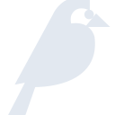

# wagtail

[← Back to main README](../../README.md)

<table><tr>
  <td></td>
  <td></td>
  <td></td>
</tr></table>

## 16 px

### black
```
https://georgegach.github.io/compatible-icons/simple-icons/compat/wagtail/16/black.png
```

### slate
```
https://georgegach.github.io/compatible-icons/simple-icons/compat/wagtail/16/slate.png
```

### white
```
https://georgegach.github.io/compatible-icons/simple-icons/compat/wagtail/16/white.png
```

## 64 px

### black
```
https://georgegach.github.io/compatible-icons/simple-icons/compat/wagtail/64/black.png
```

### slate
```
https://georgegach.github.io/compatible-icons/simple-icons/compat/wagtail/64/slate.png
```

### white
```
https://georgegach.github.io/compatible-icons/simple-icons/compat/wagtail/64/white.png
```

## 128 px

### black
```
https://georgegach.github.io/compatible-icons/simple-icons/compat/wagtail/128/black.png
```

### slate
```
https://georgegach.github.io/compatible-icons/simple-icons/compat/wagtail/128/slate.png
```

### white
```
https://georgegach.github.io/compatible-icons/simple-icons/compat/wagtail/128/white.png
```

## 512 px

### black
```
https://georgegach.github.io/compatible-icons/simple-icons/compat/wagtail/512/black.png
```

### slate
```
https://georgegach.github.io/compatible-icons/simple-icons/compat/wagtail/512/slate.png
```

### white
```
https://georgegach.github.io/compatible-icons/simple-icons/compat/wagtail/512/white.png
```

## 1024 px

### black
```
https://georgegach.github.io/compatible-icons/simple-icons/compat/wagtail/1024/black.png
```

### slate
```
https://georgegach.github.io/compatible-icons/simple-icons/compat/wagtail/1024/slate.png
```

### white
```
https://georgegach.github.io/compatible-icons/simple-icons/compat/wagtail/1024/white.png
```

## 16 px in base64

### black
```
data:image/png;base64,iVBORw0KGgoAAAANSUhEUgAAABAAAAAQCAYAAAAf8/9hAAAABmJLR0QA/wD/AP+gvaeTAAABBUlEQVQ4jZ3Suy9EURAG8J/HRkJD4VGgEq1GrxKF/8G/oVCpRKLSb61VaKmERhQKEYl4FworBLubsBR3rnBz7z58yeTMOWe++WbmHFpjFbeooY6NNjg/WEIlbB2L2EWpHXIfLvCFszgbxiFuMAXdTRKsYDz8QRyjjHc8Yw0DReQhXId61k7R26r8Mj4zxFrYA6bTwLwWJrCQc/eKnvC7mqnvFJRejfUK/WlwtpcZzOYkraIR/rlkkLk4yKh+SD5Pqn6JsSLyPF4isCEZYj32FRxJ5vMHv1uYkwyqhMdI8BYlb2KvSDnFKO5xIvkHLd86iy1Jz8udEmESd2Ej/0mwjSfsd0r8Bj7ETJqmCGKpAAAAAElFTkSuQmCC
```

### slate
```
data:image/png;base64,iVBORw0KGgoAAAANSUhEUgAAABAAAAAQCAYAAAAf8/9hAAAABmJLR0QA/wD/AP+gvaeTAAABrUlEQVQ4jZWRQU8TURSFz7nT0sVgWmPoQKFDJC5cGA2JWyAxMe75AYSwd2fiWtcuFBcsXfkH/AH+AjWsBIEYCrQwhlJIq8W2844bWipMEW/yNue+89137iP+UaWo9oIOSwJHSBDC23As96zbt6vNJwsGewqjb4Y3TpwnbfqTlO7e4SDz5qYymeGTryCmSH4rBtm7+/v1kTbjDwDGaXxUzGe3BgJ2otpLic8JDIGMCFUk7pHynZQ3cT3N08VEQKl0fNMyWBUQJrTXikH2PsnOwB0wg1cCJvo1Cb/Pzq3yYX2qq18ClMvVIqgnF3skGiQ8AGDrfHeXAB2zFYjjF3WJPoCUEU2ysZsI2ItqD0A+TEjVJBUDgICNQqHwKxEg2AqBoO/hMYCWBALwAWzHllro9/QApej4sZPunRkFyAmIAQwRaEr47MXx7O388EE/INWbRc5BrgExTaoqMIb0E9KGGZcnRnMfE6Kdb/N71Ag8tb8YWXWnmAvDbL3711dVL0LKtV4bLXAO7ycnc7XrmHuASuUopHFG0kGb3rvrGP8CdMxbFugD2r4zeuPH/wD+AB3upmrCqla8AAAAAElFTkSuQmCC
```

### white
```
data:image/png;base64,iVBORw0KGgoAAAANSUhEUgAAABAAAAAQCAYAAAAf8/9hAAAABmJLR0QA/wD/AP+gvaeTAAABG0lEQVQ4jZ2SPS8EcRCHn+UuEhoKLwUq0Wr0KlH4Dr6GQqUSiUp/tVahpRIaUShELhHvhcIJ4V4Sd4/i5uKc3TtMMtn5784zv5nZP/QwdV29U6tqTd3qxbTDK2opfFNdVvfV/G/gAfXSpl3Eu1H1WL1VZwD6utRYAyYjHlZPgQJQBl6ADXUoS31EvTHdztVcr/YLar0DrIY/qrOt3B8jqFPAUsq3N6A/4qSb+l5G65V4XquDrfxcBzwHzKfUrQCNiItJkpSz1I86VD/i8rTUr9SJLHhRfY3ERiyxFueSehL7+WbtIyzQXFQeeALqwDtQBLaTJDlI39pXB+Pqg3oW96D7v04psBMzr/4JDHhavQ8f+0+BXfVZPfwr+wlxOVCqclAuzwAAAABJRU5ErkJggg==
```

