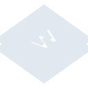

# wappalyzer

[← Back to main README](../../README.md)

<table><tr>
  <td></td>
  <td></td>
  <td></td>
</tr></table>

## 16 px

### black
```
https://georgegach.github.io/compatible-icons/simple-icons/compat/wappalyzer/16/black.png
```

### slate
```
https://georgegach.github.io/compatible-icons/simple-icons/compat/wappalyzer/16/slate.png
```

### white
```
https://georgegach.github.io/compatible-icons/simple-icons/compat/wappalyzer/16/white.png
```

## 64 px

### black
```
https://georgegach.github.io/compatible-icons/simple-icons/compat/wappalyzer/64/black.png
```

### slate
```
https://georgegach.github.io/compatible-icons/simple-icons/compat/wappalyzer/64/slate.png
```

### white
```
https://georgegach.github.io/compatible-icons/simple-icons/compat/wappalyzer/64/white.png
```

## 128 px

### black
```
https://georgegach.github.io/compatible-icons/simple-icons/compat/wappalyzer/128/black.png
```

### slate
```
https://georgegach.github.io/compatible-icons/simple-icons/compat/wappalyzer/128/slate.png
```

### white
```
https://georgegach.github.io/compatible-icons/simple-icons/compat/wappalyzer/128/white.png
```

## 512 px

### black
```
https://georgegach.github.io/compatible-icons/simple-icons/compat/wappalyzer/512/black.png
```

### slate
```
https://georgegach.github.io/compatible-icons/simple-icons/compat/wappalyzer/512/slate.png
```

### white
```
https://georgegach.github.io/compatible-icons/simple-icons/compat/wappalyzer/512/white.png
```

## 1024 px

### black
```
https://georgegach.github.io/compatible-icons/simple-icons/compat/wappalyzer/1024/black.png
```

### slate
```
https://georgegach.github.io/compatible-icons/simple-icons/compat/wappalyzer/1024/slate.png
```

### white
```
https://georgegach.github.io/compatible-icons/simple-icons/compat/wappalyzer/1024/white.png
```

## 16 px in base64

### black
```
data:image/png;base64,iVBORw0KGgoAAAANSUhEUgAAABAAAAAQCAYAAAAf8/9hAAAABmJLR0QA/wD/AP+gvaeTAAABA0lEQVQ4jaXTO0oDURTG8V90ELVNCheRfQRSuRD7dK7COo2te1ALwQUMliqIIiqJiRk1IQ+bMzAOmcTHBwcu957/Pd+5D1ZrO+JPauIqovlb+AD3WEQ84BC1dWADZxgU4DyGuMBeFdzGLeYlcFYYzyOnXQS30MXzkqoL3JTaWURuN1gpxkvAHi4xwQneSutjpAnq+U6hHBb9zrAbG5Wd1xNs4h1JTNawgydkuEYLGwV4gmmwUnxiVHEO0yX9j4JJReWjsP2CfunkizfwGjk9HJda1wq7GT58fwvDmMtwh30VauA0LA7Cbl4xw3nkrFQNHTxGO/0Yd/zgKRf1r8+Ua+13/gLOcHLJKDUzaAAAAABJRU5ErkJggg==
```

### slate
```
data:image/png;base64,iVBORw0KGgoAAAANSUhEUgAAABAAAAAQCAYAAAAf8/9hAAAABmJLR0QA/wD/AP+gvaeTAAAB1klEQVQ4jZWTP0+TYRTFf+dpLRQRURppOjSaaCIJg5I4uLg2IXEi8TM46ODi6AdwcdTBTyAORif9BAyERVg0saVDqU1beEFMfOF9j0OF/jElesZ7zr333HufB85AterJatWTZ2nCOKLe7C6GfLQR8tFGvdld/K8CtVb3kdFHwYJgATKftr/vPrOtUe1QoNHYLyQhfZvi20Izg5zxQSB8Pg6ZlWtXppt/OajtRMtHIVk3ujeYLCntddIFw92QHq3VdqLlU35ry7nzc3uvgsN95MKoRUNNUg671A+qnSr9cNiZfajt5u4m6IYgNzycdmV/SdES9nuJCjA9UDgGfw0izDGYLIzpYKdAEZMIpjDxiLmcCHNZcEbw05AV5DCSyBtaKT4M8jejiiFooLvgGJzJGreErguOhPaNC4Yp4KoQiJu4nyzUBueBrHErlOdnbyG9RsQ9XnsS6emsJvMn1UAElkQstPqjM7t0+g6qjaiSCX6JmbcI4PjknMYHoHPq7aWLeVwuXXrXczSARmO/cBySVdAdRIKJhYQcbCYQ69kkrJRKM+3+zkfvbqvejJ4CTxSYAHDKL+BFuXjxuSQPXXu0wAnqze6iCW96ovRBuXh5c5x2LP7lO/8G7ufJVHI8RsQAAAAASUVORK5CYII=
```

### white
```
data:image/png;base64,iVBORw0KGgoAAAANSUhEUgAAABAAAAAQCAYAAAAf8/9hAAAABmJLR0QA/wD/AP+gvaeTAAABK0lEQVQ4jZ2TQUpCURSGv6cPsaY6cAENHUSbEBy1kObNWkm4gdpDNQhagDQKC6KQFEvrJT7Sr0FXej3tSf1w4XLu+f7D4ZwLBVKrarUopwhuqtfhNP8KH6gPfutRPVKjTWBdPVfHrmqiXqqN3+C2eqcucuA8c1+EnHYWrKgddbCmquptrh1DbketoHbV2RpwpF6pqXqqvubeZ2o3BmpAJdsNMAr3BjAHtoE013UFqMVAGXgH4hCMgC3gCUiAHtACShk4BT6AcqR2gZ0QmAL1XKV5KLLUMBSIgZsSsAscB9cIeAEWGWAJC4xDTgqcAHvZabTUnpqoU3/uwiTEEvVe3Wed/FqkM/UtGAzUYZhIol6o+RZXTCL1UO2rz+H0Q6x4lXNG//9MGZON3/kTdIia4f2nIL0AAAAASUVORK5CYII=
```

