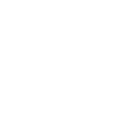

# wasmer

[← Back to main README](../../README.md)




## 16 px

### black
```
https://georgegach.github.io/compatible-icons/simple-icons/wasmer/16/black.png
```

### slate
```
https://georgegach.github.io/compatible-icons/simple-icons/wasmer/16/slate.png
```

### white
```
https://georgegach.github.io/compatible-icons/simple-icons/wasmer/16/white.png
```

## 64 px

### black
```
https://georgegach.github.io/compatible-icons/simple-icons/wasmer/64/black.png
```

### slate
```
https://georgegach.github.io/compatible-icons/simple-icons/wasmer/64/slate.png
```

### white
```
https://georgegach.github.io/compatible-icons/simple-icons/wasmer/64/white.png
```

## 128 px

### black
```
https://georgegach.github.io/compatible-icons/simple-icons/wasmer/128/black.png
```

### slate
```
https://georgegach.github.io/compatible-icons/simple-icons/wasmer/128/slate.png
```

### white
```
https://georgegach.github.io/compatible-icons/simple-icons/wasmer/128/white.png
```

## 512 px

### black
```
https://georgegach.github.io/compatible-icons/simple-icons/wasmer/512/black.png
```

### slate
```
https://georgegach.github.io/compatible-icons/simple-icons/wasmer/512/slate.png
```

### white
```
https://georgegach.github.io/compatible-icons/simple-icons/wasmer/512/white.png
```

## 1024 px

### black
```
https://georgegach.github.io/compatible-icons/simple-icons/wasmer/1024/black.png
```

### slate
```
https://georgegach.github.io/compatible-icons/simple-icons/wasmer/1024/slate.png
```

### white
```
https://georgegach.github.io/compatible-icons/simple-icons/wasmer/1024/white.png
```

## 16 px in base64

### black
```
data:image/png;base64,iVBORw0KGgoAAAANSUhEUgAAABAAAAAQCAYAAAAf8/9hAAAABmJLR0QA/wD/AP+gvaeTAAABDklEQVQ4jZXTPUrDQRDG4ScfCKIBW/UEniCdvWAn6bSwsfUeegDBU6S1shDTipUBRTSiIhaJIn4m/C0yxjXGJL6w7LLzzm9nYJbhquARu5ga4e1pERMJIMMHzlBCbhTgAKdYSQAZWtjHCcr9SZsoxrkWCU3s4TjayJJ1h2oKaKGOpQSQ4RqXEb+JVr5iVymgkby6FeanxNwJWBOvcdeAfF8rM1jGJNq4jeQ85lCI+56Kfmsh9g6e8YLpAT6DKkhVwGyA/tQwwFj6L6CNt0GAkdMVqmNVd5hKaaCqOxzZgHWP9zjXwl/UHb4fKuMID32ANWzjAoejSsxhA+e+p64SsXmsj9Mn3a+7E9VUhhk/AfCFVKtCfS/bAAAAAElFTkSuQmCC
```

### slate
```
data:image/png;base64,iVBORw0KGgoAAAANSUhEUgAAABAAAAAQCAYAAAAf8/9hAAAABmJLR0QA/wD/AP+gvaeTAAABqUlEQVQ4jZWSPWvTURjFf+cmiFJjMqVpMUVEUEE66OBQEFfBNZuIgrtTwVE/hSKdHZzExQ+gSweRikU3SaLm2oDmX99tco9DXhpNGurZnnvPc+55nntgBuqtTq0ZO9v1+Ol+jHFuGif8e9D48PnC5qYPDGtDIRCu/+bgRrvdLtjWOF8TAh+zpyRXFLiVEkHi4UAoU+CFE5WArlUrxfWRg2bMbtrOA8jOIU4ksxaCbgi/NHwRFElcFJwCHjdi9mgkYNKddzF71dzKLiENrZXsdMaoBCTjlqDb57uM0rmRgNC2xUknP0jJz0At8DfQIrAkKEjBCX+19avvVJ62xJKULoMPGbrgFtADAvYikJNSd7whP+VjTg9c9ZC/Az8whyd5A/ZeF0AOa2HgYE/MEtgX/ktAVlf0l/iXgOWJQE2DxZte0BXgNaKw68DheRBbU7uSd5B3huWxcvFJdb64jHUbxqLcjNl5lO4ZHccc2X1VV5W8LFFDel+dL65MjABQrRTXj5ZLZw2rhrfD1JH8c2mhtEq+u9JNWtvPqMQY5xqtzt167GT1Vqc2i/sHznO2vZKUEqAAAAAASUVORK5CYII=
```

### white
```
data:image/png;base64,iVBORw0KGgoAAAANSUhEUgAAABAAAAAQCAYAAAAf8/9hAAAABmJLR0QA/wD/AP+gvaeTAAABLUlEQVQ4jZWSPy/DQRyHn582EqkmBotKrGKxdrNLbNKNwWL1FiydvACJF2AWi9ixiRjQQYQIwoLGn0jbPIZeudavv9Qnudzl7nPP988dZEitqHV1Sy1keeNLc+pwBFBtqJdqUU1i/1AKowqcqYvRXh4YB3aBc7XcG3VNzYf1UYj6rO6rp6GMWI/qTgx4UWvqfARQvVNvwvl9KKWj27iEOjANbAMHwAPwDpSAKaAICLwBX524aT0YAxaAEaAZQK3gKwG5sN/VnF7NhLkFfACfwGiKj7QMYuWAiQDqqyzAQPovoMlvE7sAyV9vqmrAEnBB+2V+AMfAU59LjTDakZJkD5gF1rtcalk9UV97ft2yuqFeq4eZ+amJuqpeRb+uEs4m1ZWBClUL6mbIppLl/QatqgOdrEgPFwAAAABJRU5ErkJggg==
```

