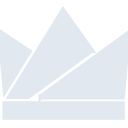

# wazirx

[← Back to main README](../../README.md)

<table><tr>
  <td></td>
  <td></td>
  <td></td>
</tr></table>

## 16 px

### black
```
https://georgegach.github.io/compatible-icons/simple-icons/compat/wazirx/16/black.png
```

### slate
```
https://georgegach.github.io/compatible-icons/simple-icons/compat/wazirx/16/slate.png
```

### white
```
https://georgegach.github.io/compatible-icons/simple-icons/compat/wazirx/16/white.png
```

## 64 px

### black
```
https://georgegach.github.io/compatible-icons/simple-icons/compat/wazirx/64/black.png
```

### slate
```
https://georgegach.github.io/compatible-icons/simple-icons/compat/wazirx/64/slate.png
```

### white
```
https://georgegach.github.io/compatible-icons/simple-icons/compat/wazirx/64/white.png
```

## 128 px

### black
```
https://georgegach.github.io/compatible-icons/simple-icons/compat/wazirx/128/black.png
```

### slate
```
https://georgegach.github.io/compatible-icons/simple-icons/compat/wazirx/128/slate.png
```

### white
```
https://georgegach.github.io/compatible-icons/simple-icons/compat/wazirx/128/white.png
```

## 512 px

### black
```
https://georgegach.github.io/compatible-icons/simple-icons/compat/wazirx/512/black.png
```

### slate
```
https://georgegach.github.io/compatible-icons/simple-icons/compat/wazirx/512/slate.png
```

### white
```
https://georgegach.github.io/compatible-icons/simple-icons/compat/wazirx/512/white.png
```

## 1024 px

### black
```
https://georgegach.github.io/compatible-icons/simple-icons/compat/wazirx/1024/black.png
```

### slate
```
https://georgegach.github.io/compatible-icons/simple-icons/compat/wazirx/1024/slate.png
```

### white
```
https://georgegach.github.io/compatible-icons/simple-icons/compat/wazirx/1024/white.png
```

## 16 px in base64

### black
```
data:image/png;base64,iVBORw0KGgoAAAANSUhEUgAAABAAAAAQCAYAAAAf8/9hAAAABmJLR0QA/wD/AP+gvaeTAAABGUlEQVQ4jaXRvUoDURAF4I9kSSFWIqKFAcXGIpWNhWAjNmLlM1j4HL6FDyC2gihYiY2IjWJhI/EHTdAo/qHGEIjF3uAal6zigSnuzJw5c+fQHT0ZdfmM+iqGsZc1KA2TuEEF490aB1NyEU7QCnGMQkpfAZ6w2FFYxltiQB0rHT1jKMM9HrETtiniKkFuxy1mAnkJ10FcJdF0jt0UciuIrGETDyFXjdAMU59xhKmUv1awhWmMIhfyzQiN8LhACX0JYgOnOMCcnwdvROFAVdz5blctEPuxgN6UzeqRL5tKYvuID7SBWYykENv4yGMo/K2IVxyKjzmPgS5kKEdB/VJsXQ0vmMBZBhm2YV+6bb+J9QjvQf2vyAXu//AJon1c19ndFMcAAAAASUVORK5CYII=
```

### slate
```
data:image/png;base64,iVBORw0KGgoAAAANSUhEUgAAABAAAAAQCAYAAAAf8/9hAAAABmJLR0QA/wD/AP+gvaeTAAABq0lEQVQ4jZWSvWsUURTFf+fNc4WYhGBEE1P4gRYWqQRRUCwEG0sbCbYWtmIp+E/Yi62NCIIi1jZplDCoIIZMNuOaNWQ3fiQus3MsNiTDZrPiLe855917zn0wpPI8HxmGA4RhYDcZeZLl6/eGcbQfUG+0LxqeW2W37MZrJ4+PfRi4weLqz6n+pu3YtR8bH8WaDknxNE1d6+elqWshKYtPy82NO1Vgpdl6KHFip1GGs+OT7UdVzvJq+8zYZPujskZrzZDIftdNDtw6WHRqRRLeYmb6vDaDmJs5NvEm+9a669IPJI0qa6znoGkAmSUHZdhXBqTVDuZVacYJXMJMGBoRVGwTNozfYy4PyCQXelnCVeA07l1PdhGBTs+nl5BmgcMVbQf8GZgH3QBPVe+moE6UtGWXXyV9B8654rmEeaEjIeim7dG9m2kruixta8HBs0Kxp/aKrReC68Ap2/3aHk3+E4FnCsxtB/kLk0pas30b6dBA5W42v6PRQoDMdt2oKfEDOI9YhMGTdx/gdQzivuEC0k4+vY33/eUVC/oSDZvI9X+y94wPAXvzv3X99RfSD8OR2sA7RAAAAABJRU5ErkJggg==
```

### white
```
data:image/png;base64,iVBORw0KGgoAAAANSUhEUgAAABAAAAAQCAYAAAAf8/9hAAAABmJLR0QA/wD/AP+gvaeTAAABMElEQVQ4jaXRv0vVcRTG8ZfywSElRBpsEQyXhiZBDIqWaGlsi1aHVv+F/gv/hQZBBMXJVZxEoiWKRG8/VOgm6vUiPA19osvty7XyGc953uc5n/NhgJLcGNS/UkleJ1n8X3g+yZckrSR3BxknG2olydv81m6SkQbfiCTtJAt9jVdJznoGdJIs9XlmkryX5DjJtySbSSaTTCXZz5/6muRxhV8mOUjSHkrSwu06+CP28LDhtW2s4ybuYxyfCy6r4Tt28KABbmENj3AHw7V+WdDtSb+HiR6wi3fYxlP0H7xb0MEnHKH3uw4reAvPMNawWacg2K3ppTYOsIonmG4Af+miYBnP/TzkKd7gGC8wOgCGs1LT97Bf1z7BLD5cAcPGUJItzP2FuUkrBec1/V81XNnr6QcvTMROqtksggAAAABJRU5ErkJggg==
```

