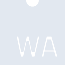
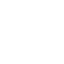

# webassembly

[← Back to main README](../../README.md)

<table><tr>
  <td></td>
  <td></td>
  <td></td>
</tr></table>

## 16 px

### black
```
https://georgegach.github.io/compatible-icons/simple-icons/compat/webassembly/16/black.png
```

### slate
```
https://georgegach.github.io/compatible-icons/simple-icons/compat/webassembly/16/slate.png
```

### white
```
https://georgegach.github.io/compatible-icons/simple-icons/compat/webassembly/16/white.png
```

## 64 px

### black
```
https://georgegach.github.io/compatible-icons/simple-icons/compat/webassembly/64/black.png
```

### slate
```
https://georgegach.github.io/compatible-icons/simple-icons/compat/webassembly/64/slate.png
```

### white
```
https://georgegach.github.io/compatible-icons/simple-icons/compat/webassembly/64/white.png
```

## 128 px

### black
```
https://georgegach.github.io/compatible-icons/simple-icons/compat/webassembly/128/black.png
```

### slate
```
https://georgegach.github.io/compatible-icons/simple-icons/compat/webassembly/128/slate.png
```

### white
```
https://georgegach.github.io/compatible-icons/simple-icons/compat/webassembly/128/white.png
```

## 512 px

### black
```
https://georgegach.github.io/compatible-icons/simple-icons/compat/webassembly/512/black.png
```

### slate
```
https://georgegach.github.io/compatible-icons/simple-icons/compat/webassembly/512/slate.png
```

### white
```
https://georgegach.github.io/compatible-icons/simple-icons/compat/webassembly/512/white.png
```

## 1024 px

### black
```
https://georgegach.github.io/compatible-icons/simple-icons/compat/webassembly/1024/black.png
```

### slate
```
https://georgegach.github.io/compatible-icons/simple-icons/compat/webassembly/1024/slate.png
```

### white
```
https://georgegach.github.io/compatible-icons/simple-icons/compat/webassembly/1024/white.png
```

## 16 px in base64

### black
```
data:image/png;base64,iVBORw0KGgoAAAANSUhEUgAAABAAAAAQCAYAAAAf8/9hAAAABmJLR0QA/wD/AP+gvaeTAAAA3ElEQVQ4je3TwUpCURAG4C/LlRUhGS18gfYtXbToCXojX6RFbyBthJZt3UkLISjKMMsQC1wYpos7YeS9N6GtPxyYM2f+n3/OmQOzjHVpgWZW3UYEaejjCgWc4iCtKE9gJRT+Q14LpAu84zniFwwwxaPktXp4+MvBtcUg9ULkJnIXqOP1u3jrF3kXJUxwhM0gHoajGs4wQiXLwT6KqIb9Ecr4kExjGfd5LezhPNwVcRu5Pu7QRgvjLIFtNIL8hQ528BYtnOA49lj+YRN0w/5QcmGfePpRM4iz3N+4Eub8U0aXLINQegAAAABJRU5ErkJggg==
```

### slate
```
data:image/png;base64,iVBORw0KGgoAAAANSUhEUgAAABAAAAAQCAYAAAAf8/9hAAAABmJLR0QA/wD/AP+gvaeTAAABE0lEQVQ4je3TP2uTYRiF8es8aabW8hpsqGI/gLtjB4eCk4vfyC/Sod+g2KHQ0dVNHAShNQ750wSSCA62ea4uCg5voCVr7/mc33DgzmA0l5YLnh3sP30H8GM4P09425pbBxjGxVwIRT1K6D8IuO+VTcqPQDuwNIwEQibAFFiJP5MIGSKDtYAI1U8hSv0IDIFpSb6q6uqE+AG4/tfZ+h8I2U3YFv8k5VW1dkIR3YdMks4h+B5YAHutG0ieCV2tL5Os1IXYA38F+5CeeLVuAwhNgWMoW0qX5LvQEMeGS6xfCvkM/m4HYKdSTsFuSI18C3mCZUb1kOSN8DpkBq2/4A0wgTyHLIO3hEYzAV/8Dc2ADtBs/Ex39sOHbsz2qNgAAAAASUVORK5CYII=
```

### white
```
data:image/png;base64,iVBORw0KGgoAAAANSUhEUgAAABAAAAAQCAYAAAAf8/9hAAAABmJLR0QA/wD/AP+gvaeTAAAA20lEQVQ4je3TMU6CURAE4E+QSjCEKBHjBewtLSw8gTfyIhTewNCQUNraGQsTE40WCkKBJhairgVrY/4fTWid6r3NzGR231tRjp5ERPTLSCsREYoxxAAVHKJdRFpk8CdUlhH/GxQbPOMxzyOM8YF7BB5w91uCsyT3UjDGZdZOcIynb/LqD/E61vCGXVRTuJWJ9nGEKTbLEmyghp2MP0ULL+a/sYXbRS000c10NVxnbYgbXOAcr2UGdZym+BNXaGCSLRxgL++FuzDLfjvmr/KeCUbYTs4k59Ncepm+ANsTc/jOv6WEAAAAAElFTkSuQmCC
```

