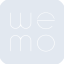
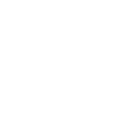

# wemo

[← Back to main README](../../README.md)





## 16 px

### black
```
https://georgegach.github.io/compatible-icons/simple-icons/wemo/16/black.png
```

### slate
```
https://georgegach.github.io/compatible-icons/simple-icons/wemo/16/slate.png
```

### white
```
https://georgegach.github.io/compatible-icons/simple-icons/wemo/16/white.png
```

## 64 px

### black
```
https://georgegach.github.io/compatible-icons/simple-icons/wemo/64/black.png
```

### slate
```
https://georgegach.github.io/compatible-icons/simple-icons/wemo/64/slate.png
```

### white
```
https://georgegach.github.io/compatible-icons/simple-icons/wemo/64/white.png
```

## 128 px

### black
```
https://georgegach.github.io/compatible-icons/simple-icons/wemo/128/black.png
```

### slate
```
https://georgegach.github.io/compatible-icons/simple-icons/wemo/128/slate.png
```

### white
```
https://georgegach.github.io/compatible-icons/simple-icons/wemo/128/white.png
```

## 512 px

### black
```
https://georgegach.github.io/compatible-icons/simple-icons/wemo/512/black.png
```

### slate
```
https://georgegach.github.io/compatible-icons/simple-icons/wemo/512/slate.png
```

### white
```
https://georgegach.github.io/compatible-icons/simple-icons/wemo/512/white.png
```

## 1024 px

### black
```
https://georgegach.github.io/compatible-icons/simple-icons/wemo/1024/black.png
```

### slate
```
https://georgegach.github.io/compatible-icons/simple-icons/wemo/1024/slate.png
```

### white
```
https://georgegach.github.io/compatible-icons/simple-icons/wemo/1024/white.png
```

## 16 px in base64

### black
```
data:image/png;base64,iVBORw0KGgoAAAANSUhEUgAAABAAAAAQCAYAAAAf8/9hAAAABmJLR0QA/wD/AP+gvaeTAAABEklEQVQ4jZXT2UoDQRAF0GOMexBBEXzQ/xHxy/0GMbgFUTAaxSSOiQ+5Q9pRNDY0td6qWzXTcIouXjBd8L7gAieiLAps3gtF56fIUeEb4D36G+4wLAoM2tgyO2/Yxj2q+IcYR1ZooYc1HKDTMj+jQq8i37GODezGtx8btAtQTWspsva1wmo1TD6i7zQLfOAcz7hOrJ+OW5hkxAqbNajsNgpwJbQfsRfqU1ylyDIO6wLlDiZJnDRuOV6ryPlWoBe7j7PQvg3lm8RWk3tTg8odtEOthw6OAqi/yGGRe/kTA+Y7WWqMNsFr7IH53r4wWGuwYbbQYZj0Ax43chf+lSs8RE6LuK6/H82vj+kkyn+e8yCY409QJJhYVTLOBwAAAABJRU5ErkJggg==
```

### slate
```
data:image/png;base64,iVBORw0KGgoAAAANSUhEUgAAABAAAAAQCAYAAAAf8/9hAAAABmJLR0QA/wD/AP+gvaeTAAABmElEQVQ4jY2TW24TQRRET3XMGHCUIJFEAmTEMtgEGwF2k2WxBkSICIlwBCYPYTt2Hz5mPInhx/erddVVdW4/8vXi57tCORYPICO2Km+hTKqrjzm9+P0FfLOd8N/KSYF6CKBcdd0FcNsl3QSW3eaZ8AMyv9d7MOixwx9gjzBRlyEjUmZWF8ZZdJmSgp6TDNEXyO6gN4P5/TptqvWOsJ8kQAP+Ao46SgB6A8GAakLs26YkTIQmlhm4qtqEPNswCKyAz4Qr9JtmQDIthSNlBFZwD7JM8pQuovQE8oqQVA5CeVtK5oGxMgBehljNQgmyv9aVBwQVI0k1VqUCtTO3giUU0HV/w4BwDhZhqn5CR8D3hGXgLFoMDQHw7L9D7NZj8ByyS3gtNFaWCUDG7dwBOW2NHhJ0HElsd92PJtR0j0u4tqyPcPMah71KB7Sxj4BZkkbrFMp1cIEMHxh4CxkhTwggh0nu2nSHSR6rA2RFnBIOkZ0O76ZoLlt29jrTBuh+ZXZdUyY7wPNe3GJfFqkfICctyZYVbggnKXn/F6Zvzj/rmky3AAAAAElFTkSuQmCC
```

### white
```
data:image/png;base64,iVBORw0KGgoAAAANSUhEUgAAABAAAAAQCAYAAAAf8/9hAAAABmJLR0QA/wD/AP+gvaeTAAABMElEQVQ4jZ2TUU8CMRCEvztPQI8YEzkTH1D/jiH+cn+D4YIiiT5I5IyAcOMD01w9fVA2abbb7kynuy2SbiWVkir93SpJY0mjRNIYuGY/K1OgcPBmvwbePa+AjedL4BlYRQSDDMgdfAAnwItBuUFr+w2QAjOgC1wA/TRii5nDqZ9ADzgCzrx27hiALALJI7EPa6lVdaxk6/lpm2AL3LsWj96b+8QcqH3FDXAcQImkcNrKwEPLfgUGli7gwSQHwDAQxDWonVi3Rny9NMr5QTBzPAfuLPvJkqfe6zh3GkBxDTJLmwF94NKA0JFhlDv5TQE0HUhaV6tpHteCpkvfFHRbamBX0KWVzA1ex7mZmXOax1Gwe0CBtOe8rUkKdp0AqBJJJXDFflYiaeSv+Z/vvDDm5gulrdM44spv/QAAAABJRU5ErkJggg==
```

