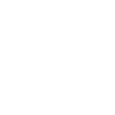

# xcode

[← Back to main README](../../README.md)




## 16 px

### black
```
https://georgegach.github.io/compatible-icons/simple-icons/xcode/16/black.png
```

### slate
```
https://georgegach.github.io/compatible-icons/simple-icons/xcode/16/slate.png
```

### white
```
https://georgegach.github.io/compatible-icons/simple-icons/xcode/16/white.png
```

## 64 px

### black
```
https://georgegach.github.io/compatible-icons/simple-icons/xcode/64/black.png
```

### slate
```
https://georgegach.github.io/compatible-icons/simple-icons/xcode/64/slate.png
```

### white
```
https://georgegach.github.io/compatible-icons/simple-icons/xcode/64/white.png
```

## 128 px

### black
```
https://georgegach.github.io/compatible-icons/simple-icons/xcode/128/black.png
```

### slate
```
https://georgegach.github.io/compatible-icons/simple-icons/xcode/128/slate.png
```

### white
```
https://georgegach.github.io/compatible-icons/simple-icons/xcode/128/white.png
```

## 512 px

### black
```
https://georgegach.github.io/compatible-icons/simple-icons/xcode/512/black.png
```

### slate
```
https://georgegach.github.io/compatible-icons/simple-icons/xcode/512/slate.png
```

### white
```
https://georgegach.github.io/compatible-icons/simple-icons/xcode/512/white.png
```

## 1024 px

### black
```
https://georgegach.github.io/compatible-icons/simple-icons/xcode/1024/black.png
```

### slate
```
https://georgegach.github.io/compatible-icons/simple-icons/xcode/1024/slate.png
```

### white
```
https://georgegach.github.io/compatible-icons/simple-icons/xcode/1024/white.png
```

## 16 px in base64

### black
```
data:image/png;base64,iVBORw0KGgoAAAANSUhEUgAAABAAAAAQCAYAAAAf8/9hAAAABmJLR0QA/wD/AP+gvaeTAAABgElEQVQ4jXXTPWtUURAG4OeaFU0WUUJEMbEJRthKi3QWViLY2uQ/mD9glzYopNIqIAg22qSQQErBShBBGzGxiSYqZvPpR667ZlOcuezJsjkw3DNz33nn8xS6p44JDGS2MSygjRKbWMM03lags1jErwD9y6QM4At8QidkDbcwWGAJN1BEhH7nVDhdz2ybaNZwM6KdwVAG2An9b5APhv0bWhjFToH/YRzNnHfxALcxHGV2gmQ9sO/wVPxYz+qr5DUmcYDv8f0Y5B08ghPH1NzGBzwJB0HSilJVGR9H8AXLaGAVF9DESC+wH8FvPMZ97OESfgT2Yi+4lt1XpVF9xYo09wmcl/rxJ0pr4GS/DAppGxuYkUZbx088w3uc7s06Vy4HuB73q9IebOMh3uCco6uuJo3nIPQrUqM60uz3sB9EsxGwFdluVCTNSHc7HJu6e7ESval2ox24Encqgimp82VkUjmUeOXocu2HvMwbB9dwD58xjrvS65zCnG7Xt/Ac80HoEIwvdz/I2zrYAAAAAElFTkSuQmCC
```

### slate
```
data:image/png;base64,iVBORw0KGgoAAAANSUhEUgAAABAAAAAQCAYAAAAf8/9hAAAABmJLR0QA/wD/AP+gvaeTAAACDUlEQVQ4jWWRPUwTcBDFf+/aBmhFwACKQEAjJp1wN9HV3cXRHRdHN1YTEjcnExMTY+JgnEyIiwOLJi7q4gcO2GoRKNAKSj/+zwHQUt52l3vv3t0TB6hUKoVW9My0W8oc9hSeAD0XtAx7sqtElFP41tTI4FsALVerA7m9eAK+gpRD0qEAySb4IPhqNIs9A2D7O6Gb0agvaWV1axFzGSysKmGOwdEjuWxzqaNbBTaymKuCRkL9EnksDCBvg/KC3ybJKfokY/xDqAmMg7ZDImdc09GVNTkWlPwaqyRUi3AB2BBaB05IvLLTfNiEITrpQichXcO6DS6CsjbjktYN08CpduLj1NjQoyPE/wK0sN4jHiJqtjGq2G4K+gEiPA5dm/8dAN/IxmfkosyKxOnAGxbD3bPHBcROMvdppztA3eiszapxyJzpHs922F5BKoNLEf5ixyfBDHhEaAnYxbQsioLcEQciMMhOBScXZebl1AAXQGuEH2PeAb3R5bqzmDSsIRUMk0RcBOWBLcyC4Y3EoCHTKZAFJ0TCEOiCYRhj7AFB3fIfmzxw1xCGppBk1g8dbNmMIrYNU8Aeoo7IWPzEHpSQxDlgCNgFUjv0DCDaeC6gidW3nyA7oDFQA7uMNNmRb0umV/ByenTgxcHzobS6Odu253Aso3Qe6zrwK6O4kfA9tP91m83IxNOJ4f4HkgzwF+Vk/0jbbdqdAAAAAElFTkSuQmCC
```

### white
```
data:image/png;base64,iVBORw0KGgoAAAANSUhEUgAAABAAAAAQCAYAAAAf8/9hAAAABmJLR0QA/wD/AP+gvaeTAAABm0lEQVQ4jX3TS29OURQG4OdQob40RdyiRAiSjhiYGRiJH2DS/8AfMDMVEiNGEonEhEQMRGIo6ahJI2EixaS06tLqlX5tfa/B2U2PT1nJytlrnXev67srRZK0cBJbbchhPMEa2pjBBK5UVTW6frE/ybMki0naSVYa2k4ymuRRkrFsyESSC0l6qyTPcQ5VybCZbC+ZzzR8M5juwXmsoA87G4C5Yv8swXuL/xNWMYC5Ksmv4hxoXJ7HDVzEHvQjJchkwb7EfaWnyfwtw0nOJukkmSrfN0nmy//bsOUfPa/hNe6VamCqlN5X7IH/BfiAtxjEOA5gGnu7gZsFWMIdXMUCDuFzwR7sBvc0zuPqVX3EO4ypibUPw/hRWhvEts0qqNAqgGvq1bbwFQ/wCju6q24aRwq4Vc6n1DyYxU2MYJc/qa4HnaJwQj2oqHe/gOUS6HpJuFqq/bZewSz2q5l3VP1oFkqmLyVrhWPYXWbRwWOQZCjJUnk4nSTjhSjtJC+6yLVc9GlzcJKcxmW8x3FcwiKGcKsx9e94iLtVVQV+Axa/BARdVzvHAAAAAElFTkSuQmCC
```

