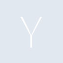
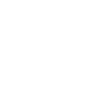

# ycombinator

[← Back to main README](../../README.md)

<table><tr>
  <td></td>
  <td></td>
  <td></td>
</tr></table>

## 16 px

### black
```
https://georgegach.github.io/compatible-icons/simple-icons/compat/ycombinator/16/black.png
```

### slate
```
https://georgegach.github.io/compatible-icons/simple-icons/compat/ycombinator/16/slate.png
```

### white
```
https://georgegach.github.io/compatible-icons/simple-icons/compat/ycombinator/16/white.png
```

## 64 px

### black
```
https://georgegach.github.io/compatible-icons/simple-icons/compat/ycombinator/64/black.png
```

### slate
```
https://georgegach.github.io/compatible-icons/simple-icons/compat/ycombinator/64/slate.png
```

### white
```
https://georgegach.github.io/compatible-icons/simple-icons/compat/ycombinator/64/white.png
```

## 128 px

### black
```
https://georgegach.github.io/compatible-icons/simple-icons/compat/ycombinator/128/black.png
```

### slate
```
https://georgegach.github.io/compatible-icons/simple-icons/compat/ycombinator/128/slate.png
```

### white
```
https://georgegach.github.io/compatible-icons/simple-icons/compat/ycombinator/128/white.png
```

## 512 px

### black
```
https://georgegach.github.io/compatible-icons/simple-icons/compat/ycombinator/512/black.png
```

### slate
```
https://georgegach.github.io/compatible-icons/simple-icons/compat/ycombinator/512/slate.png
```

### white
```
https://georgegach.github.io/compatible-icons/simple-icons/compat/ycombinator/512/white.png
```

## 1024 px

### black
```
https://georgegach.github.io/compatible-icons/simple-icons/compat/ycombinator/1024/black.png
```

### slate
```
https://georgegach.github.io/compatible-icons/simple-icons/compat/ycombinator/1024/slate.png
```

### white
```
https://georgegach.github.io/compatible-icons/simple-icons/compat/ycombinator/1024/white.png
```

## 16 px in base64

### black
```
data:image/png;base64,iVBORw0KGgoAAAANSUhEUgAAABAAAAAQCAYAAAAf8/9hAAAABmJLR0QA/wD/AP+gvaeTAAAAk0lEQVQ4jcXTMQrCUBAE0BeRFBZewATBA3h6r2FnZZEyjY0gxEaMxbcImuR/+IhTDrvD7s5sgV4GFjnNPxN44D7Cd3imCHQ44DLgWhxTBdbYoxlwZ2yxTBGAGqf3FK2wVjVWWJi2scFNuEeNzVjRnAsVriinmmMCJVbCTSYRy0EvktTsIH3Z8oFdbII5F5Lw/2d6AYfwGaUoMioPAAAAAElFTkSuQmCC
```

### slate
```
data:image/png;base64,iVBORw0KGgoAAAANSUhEUgAAABAAAAAQCAYAAAAf8/9hAAAABmJLR0QA/wD/AP+gvaeTAAAAt0lEQVQ4jc2TvWoCQRhFz1mChYWVXZRAujR5B985r2FnlSKFxSLYWGkjcy1kieDuGFgCTn3n3Pv9ud0dwojXjPn8PwDlDJzupTkC5SGgJEflC9jfYFvC+k8AcVbgE/z57W75Bt+Al4cAAEuWNtk0sEdbaM7qok97R7wSnJaSldqSnEI+wF6z4SnEBYUDMhFfh2SDAGWiTAmzQZNqgi6HVDd19CL1N7GzD+9iqISoApB56hU8wTFdACJ3M9YfEnT9AAAAAElFTkSuQmCC
```

### white
```
data:image/png;base64,iVBORw0KGgoAAAANSUhEUgAAABAAAAAQCAYAAAAf8/9hAAAABmJLR0QA/wD/AP+gvaeTAAAAlUlEQVQ4jcXTMQrCQBCF4S8iKSy8gAmCB/D0XsPOyiJlGhtBiI24FkkRNMkuBvHBNo+Zn9l5u1kIIZihxZzmnwEeuA/4DZ4pgAYHXHpejWMqYI09qp53xhbLFACUOHVT1NprFUOF2USMFW7afZTYDBVNpVDginysOQbIsdLuZFSxdxC68zUgqo9Y3rSLTTCVQpL+/5letekinByiT8EAAAAASUVORK5CYII=
```

