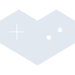

# youtubegaming

[← Back to main README](../../README.md)





## 16 px

### black
```
https://georgegach.github.io/compatible-icons/simple-icons/youtubegaming/16/black.png
```

### slate
```
https://georgegach.github.io/compatible-icons/simple-icons/youtubegaming/16/slate.png
```

### white
```
https://georgegach.github.io/compatible-icons/simple-icons/youtubegaming/16/white.png
```

## 64 px

### black
```
https://georgegach.github.io/compatible-icons/simple-icons/youtubegaming/64/black.png
```

### slate
```
https://georgegach.github.io/compatible-icons/simple-icons/youtubegaming/64/slate.png
```

### white
```
https://georgegach.github.io/compatible-icons/simple-icons/youtubegaming/64/white.png
```

## 128 px

### black
```
https://georgegach.github.io/compatible-icons/simple-icons/youtubegaming/128/black.png
```

### slate
```
https://georgegach.github.io/compatible-icons/simple-icons/youtubegaming/128/slate.png
```

### white
```
https://georgegach.github.io/compatible-icons/simple-icons/youtubegaming/128/white.png
```

## 512 px

### black
```
https://georgegach.github.io/compatible-icons/simple-icons/youtubegaming/512/black.png
```

### slate
```
https://georgegach.github.io/compatible-icons/simple-icons/youtubegaming/512/slate.png
```

### white
```
https://georgegach.github.io/compatible-icons/simple-icons/youtubegaming/512/white.png
```

## 1024 px

### black
```
https://georgegach.github.io/compatible-icons/simple-icons/youtubegaming/1024/black.png
```

### slate
```
https://georgegach.github.io/compatible-icons/simple-icons/youtubegaming/1024/slate.png
```

### white
```
https://georgegach.github.io/compatible-icons/simple-icons/youtubegaming/1024/white.png
```

## 16 px in base64

### black
```
data:image/png;base64,iVBORw0KGgoAAAANSUhEUgAAABAAAAAQCAYAAAAf8/9hAAAABmJLR0QA/wD/AP+gvaeTAAAAzUlEQVQ4jc3SQUqCURQF4C8tsKxoARJ/O3AdTt2RW2gDLaGZY0etISInJZVIIkQmCTbwPviLx//bzANncO+57x3ueY99QoFRsPiPfoQBJtgEn3GN1g66B6xCmJWGVqGV9U1G/9V8yQz+5QTzVDdijRme8BgDi4qsbvGWioO46QNLfOEstIvSoSnG6GKNYzThMBqnwU+cVLiLuYR1M5wucW6beA5tdMIw4RU3qehgiHf1Ic5xh6ucUw/38s/2bZtDv2bF+o+zKwrVX3tP8ANqXljtl/JCwgAAAABJRU5ErkJggg==
```

### slate
```
data:image/png;base64,iVBORw0KGgoAAAANSUhEUgAAABAAAAAQCAYAAAAf8/9hAAAABmJLR0QA/wD/AP+gvaeTAAABOklEQVQ4jc2Syy5DYRSFv/UfhKbkNBJBRE7fwIxn8AgmBp6hQ88gMTAx8gDCg3gAibikF6pRKhFETs8yaCulF0PWaGWvvf9/7Qv8NdQj13dPSQRHAG3YLi4VbvoTR+k6sycXGq1dzA5ouZPumggn6dtcqZnQHqerXG9dgFbBU4KmYb5r7gNc7vJV8NQP8x/gssr1lnsho7rw4vimdQvOYWKA0KnUA3ZF4hKogZ9H1Qd8KnT/9V7HgV9EeLOzd4JmhbAd9026YbiyWZOcYs0gIoAJQWqUN84Dr5ic8ZC/vxaW71FBGiztI2rd/nLDbBsWwBuSp/vC9SzTgQCq1eZKFkWHBNYxhXEzRLQE522zlSzG1+rXbu4eN6MQ9mwlg2sjBSpZRilZjo8HGuvht8MqFvX+3dAI/Hba/wefDe+Xa7na2wAAAAAASUVORK5CYII=
```

### white
```
data:image/png;base64,iVBORw0KGgoAAAANSUhEUgAAABAAAAAQCAYAAAAf8/9hAAAABmJLR0QA/wD/AP+gvaeTAAAA3UlEQVQ4jc2SzUpCARCFP/vDwkBo40JE36DnaNsbtXcRvkg71658BolcWP4UpQRhacLnZi5dSe7VnQcGZs7hDDPDwMFAraudiPrOunqq3qlD//CittRinl5QH4EacAZ8AFfRewkMIk/0NJbAoKCaIidAJWfbEXABlAGOgnwHnoEnYAh8ZjR4AF6TIpngC/gGfoDL0Mop0xvQB66BFXAOHAOcBFGKmMd4WSil8hVqM666L8bqPQBqVW2r0x2MM7WrNv7Npt6oPXWxxfir9tXbzAXNeZyc+2w0ynztw8Eaq2c77mgOYzEAAAAASUVORK5CYII=
```

