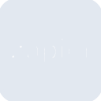

# zapier

[← Back to main README](../../README.md)





## 16 px

### black
```
https://georgegach.github.io/compatible-icons/simple-icons/zapier/16/black.png
```

### slate
```
https://georgegach.github.io/compatible-icons/simple-icons/zapier/16/slate.png
```

### white
```
https://georgegach.github.io/compatible-icons/simple-icons/zapier/16/white.png
```

## 64 px

### black
```
https://georgegach.github.io/compatible-icons/simple-icons/zapier/64/black.png
```

### slate
```
https://georgegach.github.io/compatible-icons/simple-icons/zapier/64/slate.png
```

### white
```
https://georgegach.github.io/compatible-icons/simple-icons/zapier/64/white.png
```

## 128 px

### black
```
https://georgegach.github.io/compatible-icons/simple-icons/zapier/128/black.png
```

### slate
```
https://georgegach.github.io/compatible-icons/simple-icons/zapier/128/slate.png
```

### white
```
https://georgegach.github.io/compatible-icons/simple-icons/zapier/128/white.png
```

## 512 px

### black
```
https://georgegach.github.io/compatible-icons/simple-icons/zapier/512/black.png
```

### slate
```
https://georgegach.github.io/compatible-icons/simple-icons/zapier/512/slate.png
```

### white
```
https://georgegach.github.io/compatible-icons/simple-icons/zapier/512/white.png
```

## 1024 px

### black
```
https://georgegach.github.io/compatible-icons/simple-icons/zapier/1024/black.png
```

### slate
```
https://georgegach.github.io/compatible-icons/simple-icons/zapier/1024/slate.png
```

### white
```
https://georgegach.github.io/compatible-icons/simple-icons/zapier/1024/white.png
```

## 16 px in base64

### black
```
data:image/png;base64,iVBORw0KGgoAAAANSUhEUgAAABAAAAAQCAYAAAAf8/9hAAAABmJLR0QA/wD/AP+gvaeTAAAAt0lEQVQ4jc2STQrCMBSEv7S1VgQXHsar9CbetyuRIihoU/8SF51AKFhquzEwkMCbb15eAlACFdAAfqQaeUq0GWvsqzKirZi2rBFp8krmmH8BWOA9BHjRzaKlu1Ib1TyBB3ATyOnsYsAZKGQ0veQrsJaWCkiCNwCMuihEDpCTDE5nD6S6jgfIorQjkGsfijbARcBcnWbSNiR/e8a7kgf/yH/8AzvDbxOgngGoU+AA7OimvBibLN/+A6g9SuhP5LENAAAAAElFTkSuQmCC
```

### slate
```
data:image/png;base64,iVBORw0KGgoAAAANSUhEUgAAABAAAAAQCAYAAAAf8/9hAAAABmJLR0QA/wD/AP+gvaeTAAAA80lEQVQ4ja2STUoDQRgFqzpDTAi4ELL1Wt4kh/CWzsafIIygToyZeS4SDUiiY/Ctmm6q+nXzWT80V/ZcA/PAlEFJS1x2srC+bW6Qy2Hgdw91wcxPggHMvIADax80TMvp8DbDBKGFdEcFygbymrACAq72LO/IOvJC0iJ9cA32X4LEBpwoq4DbPSBplWdlZpyhZ4QUUyBl/4REYANOhB5QgeIjIYk9ZFeIUWK3W1MB2zvDPWaMQJ8R0EHOCU8UNI5DGrAiqZSLANZ3TQ5/nG+Ynl+mszp6Ys5+Aj/zH3OQ9nQ8bSEuT+ddFkYsCPXfmqQV6k4WH6QJc7pFq700AAAAAElFTkSuQmCC
```

### white
```
data:image/png;base64,iVBORw0KGgoAAAANSUhEUgAAABAAAAAQCAYAAAAf8/9hAAAABmJLR0QA/wD/AP+gvaeTAAAAr0lEQVQ4jc2TzQrCMBCEv9RSK4IHH8DX6vPrTYqgoKm/HS8TKB6KNhcXlmQh882GbJDUSNpKivo+ojVNkLQFNkyLXZAUgcVEQBckaaIYgCJH/AugA15jgCcQgSsgrykewB24GNS77oeAI1BbGD6cz8DSObdBkbQJENxFbXKCHCzoXQuY+ToCKAdue6DyPh1aAScDK3daOtcAY894s/PojPzHHHQZ+q4A2gxAS+53fgPXCLZ6sFQrUgAAAABJRU5ErkJggg==
```

