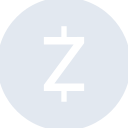
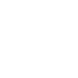

# zcash

[← Back to main README](../../README.md)

<table><tr>
  <td></td>
  <td></td>
  <td></td>
</tr></table>

## 16 px

### black
```
https://georgegach.github.io/compatible-icons/simple-icons/compat/zcash/16/black.png
```

### slate
```
https://georgegach.github.io/compatible-icons/simple-icons/compat/zcash/16/slate.png
```

### white
```
https://georgegach.github.io/compatible-icons/simple-icons/compat/zcash/16/white.png
```

## 64 px

### black
```
https://georgegach.github.io/compatible-icons/simple-icons/compat/zcash/64/black.png
```

### slate
```
https://georgegach.github.io/compatible-icons/simple-icons/compat/zcash/64/slate.png
```

### white
```
https://georgegach.github.io/compatible-icons/simple-icons/compat/zcash/64/white.png
```

## 128 px

### black
```
https://georgegach.github.io/compatible-icons/simple-icons/compat/zcash/128/black.png
```

### slate
```
https://georgegach.github.io/compatible-icons/simple-icons/compat/zcash/128/slate.png
```

### white
```
https://georgegach.github.io/compatible-icons/simple-icons/compat/zcash/128/white.png
```

## 512 px

### black
```
https://georgegach.github.io/compatible-icons/simple-icons/compat/zcash/512/black.png
```

### slate
```
https://georgegach.github.io/compatible-icons/simple-icons/compat/zcash/512/slate.png
```

### white
```
https://georgegach.github.io/compatible-icons/simple-icons/compat/zcash/512/white.png
```

## 1024 px

### black
```
https://georgegach.github.io/compatible-icons/simple-icons/compat/zcash/1024/black.png
```

### slate
```
https://georgegach.github.io/compatible-icons/simple-icons/compat/zcash/1024/slate.png
```

### white
```
https://georgegach.github.io/compatible-icons/simple-icons/compat/zcash/1024/white.png
```

## 16 px in base64

### black
```
data:image/png;base64,iVBORw0KGgoAAAANSUhEUgAAABAAAAAQCAYAAAAf8/9hAAAABmJLR0QA/wD/AP+gvaeTAAABEElEQVQ4jZXTwS5DURAG4M/FxkKKdC22HkK16V4kPIsHEQvSeAQ8gIiVkEhs2FW0bOqmK5JWEy2LnhvXdW/xJ3MWM2dm/vnnHL5jEYe4R4y3YHHwNbCgAHW0McRHgQ3RQi0vuZOTkDDI+juopmm3CzreBsuLtVCaxh7WMJVi9IALHOEG75jNzD+PcoQKosxIbZxihB42cZe5EyVjxBNEG2AXW+jmxJ8ViJTYNZbxVBDvC0de8BEruJrQoFc0Qhfbgf5gQoF4Bq8oZwS6xAmWsBN8G1jP3HuJcB7UTmMVx5gLateDFmmMcMZ4t60Cir8+pKRazf+fciXDSNXfP9OP5AQlHKBpvJ2+r+/cxH6aNnwCFASj2lpFIMsAAAAASUVORK5CYII=
```

### slate
```
data:image/png;base64,iVBORw0KGgoAAAANSUhEUgAAABAAAAAQCAYAAAAf8/9hAAAABmJLR0QA/wD/AP+gvaeTAAABxklEQVQ4jXWTz2qTQRTFf2fylRahIV+lRCGaBlzVTd+gtOQFXLhwVegbqEjfQfsAIgguXLnRB9D+ARfuuih1W2Mo+lUkMRUhNZ3jol9qkn69MMzAuefcc2fmipFot3/NeSpugpYxs0AZANEDnUDcdl9P6vVKZ8jR8HCUdZtn9ksRasaB4ojGbQ+0vlCrbF0IHGXd5sC8FlTH89U/3z09IZRF+8HCzXRbue090O3LBXWQC9ydRIxbcZqlxFNxM7c9Ch4GwmdL5zbNaiQuCjX+965bSZ9nAbQ82bOsVoT3tiNn8U9WLd8DDiZMBKMVff3ePQbmi+9Mpzi+MNoN4rnh+hiKjhObslRMR+wPIptJiY/2OBnAdjmIkebHuLSjfb8kvcHUCnOEA+KkAPsZffY42I8kLV3hD5vfAS4L2P7048bcO6wDw4bRQ8zOZQfqBfAOECeAxWrWe0spXJMUAjQt18eKQARvqdXqpsywJzOWkEtd/ZHsVpxhKdTrlY7/sm7ICtq8k6/JyGKSrDXStHvxgF++dVYCvEKqAYXDlNtux1Ky1pif3YWRaQQ47HQqyame2lrFLgOzBgl6SD3hD4NpbzTStDvk/AOjusoWAB6g3QAAAABJRU5ErkJggg==
```

### white
```
data:image/png;base64,iVBORw0KGgoAAAANSUhEUgAAABAAAAAQCAYAAAAf8/9hAAAABmJLR0QA/wD/AP+gvaeTAAABJklEQVQ4jZWTvU5CQRBGT26orEBjpyG0VL4BQuiNiU+ihQ+hnZWG+Ar6AIZYamKpVhhBGyTaqAEt4Fiw6PVmrz8n2WJ3Zmdmv3wLKdR59VC9UQfqW1iDcNZSS8RQm2pPHZvPWO2qjdjlfuTCbIIsfbWeHruX0/EyrBhdtVgAdoGlzItugWugHfYNoApUUjnLwE4C1IAkU6AHnAATYAisA1eZnASoExTO413dUzfUx0j8gRyRZlyoZfU+Jz5CHeUE79SKev5Dg2ECvERs8QRsAZvAStQ4U14LocBiJnAGHAMLwHY4WwNWM3nPCXAa1E5TBY6AuaB2EyhnciZAG7Xk1BQxfjUSAGrD/1u59m0ete7fP1ONGGpRPVA7Tg028us7d9T9z7EDH/7rXqoH55SxAAAAAElFTkSuQmCC
```

