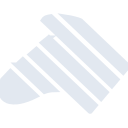
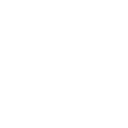

# zebpay

[← Back to main README](../../README.md)

<table><tr>
  <td></td>
  <td></td>
  <td></td>
</tr></table>

## 16 px

### black
```
https://georgegach.github.io/compatible-icons/simple-icons/compat/zebpay/16/black.png
```

### slate
```
https://georgegach.github.io/compatible-icons/simple-icons/compat/zebpay/16/slate.png
```

### white
```
https://georgegach.github.io/compatible-icons/simple-icons/compat/zebpay/16/white.png
```

## 64 px

### black
```
https://georgegach.github.io/compatible-icons/simple-icons/compat/zebpay/64/black.png
```

### slate
```
https://georgegach.github.io/compatible-icons/simple-icons/compat/zebpay/64/slate.png
```

### white
```
https://georgegach.github.io/compatible-icons/simple-icons/compat/zebpay/64/white.png
```

## 128 px

### black
```
https://georgegach.github.io/compatible-icons/simple-icons/compat/zebpay/128/black.png
```

### slate
```
https://georgegach.github.io/compatible-icons/simple-icons/compat/zebpay/128/slate.png
```

### white
```
https://georgegach.github.io/compatible-icons/simple-icons/compat/zebpay/128/white.png
```

## 512 px

### black
```
https://georgegach.github.io/compatible-icons/simple-icons/compat/zebpay/512/black.png
```

### slate
```
https://georgegach.github.io/compatible-icons/simple-icons/compat/zebpay/512/slate.png
```

### white
```
https://georgegach.github.io/compatible-icons/simple-icons/compat/zebpay/512/white.png
```

## 1024 px

### black
```
https://georgegach.github.io/compatible-icons/simple-icons/compat/zebpay/1024/black.png
```

### slate
```
https://georgegach.github.io/compatible-icons/simple-icons/compat/zebpay/1024/slate.png
```

### white
```
https://georgegach.github.io/compatible-icons/simple-icons/compat/zebpay/1024/white.png
```

## 16 px in base64

### black
```
data:image/png;base64,iVBORw0KGgoAAAANSUhEUgAAABAAAAAQCAYAAAAf8/9hAAAABmJLR0QA/wD/AP+gvaeTAAABPUlEQVQ4jaXSO0ucYRCG4ct8IpFgqShYprAOpLISPKCV/o5UNhZCQAkiKCLaKNiI2Ii4YLHsosEUEYskRRBFLFTEwsLzCUstvllYll1FnGrelzk898zwTksq/NeiGQ3xfnxr4b84xzcc4hQDbynQgmNcox//cYep0sBKCF/wSYrQjVk0okOKln2pez2OcIMx7Ic/hC3cYwFV5ZL7cInv2MMtprETCOPYwANWkBQQEmTwhM/ojC4NaEMeH9GFn7gKnFaoRi8OQuoIdqP7JP6F7EX8CX8eyxFvVbqywSLZE9LJ32Mu2AuyN8Nfwle4COln+IHt4J0p6riIX5GYDX++MLjbKPAUAxwPzqx0nb8jMYOc9CqHFZ1AHifSw1lHe8lmarAWSnIYRV1JjCSGWckS9EjX2fRC3Kv24T3JZe0Z6EdYR1pmYp8AAAAASUVORK5CYII=
```

### slate
```
data:image/png;base64,iVBORw0KGgoAAAANSUhEUgAAABAAAAAQCAYAAAAf8/9hAAAABmJLR0QA/wD/AP+gvaeTAAAB9UlEQVQ4jaWST2jPcRzGX8/n+5vyZ2JoG7O1gwvlQs5mtoNoLTnJn5JayUnc5OSmkIhClMMOmxwc7KC0RZnVljhw0Py+2m8/LL8fOcj2flwQ+S3Kc3zeT0/vnueB/4RqkXmeL5wtLGmsK2QL+MJMS8vSmfkMUi3SdfXDGWksZme7ouAnxXK1lJcrJ/7ZoBBpn+TPlk5DXJBdxpzMp6vn/8lgNotW2/eFZpBOAf1hXoIPFcuVS79q/8igVPq06itzo040JNIVInqc1CQ4G+HulNhI6HZL09IDkvzbB5NTH3u/prkXJF8nmMLRF/IQJrfjmIiHYUYt734zXR2wnQnAdpaXqwOyJizvRTTaXBTeCWo39CexGbPO4qakNoc7kIYz24X8bWUXaD9yJ2Q3MKuT6AIGUVqcoCPwCKQQdDk0ZvxaeGsqlj8OYq4C12xNiTgKcc/4ldBh2+Nhngp6ceSBJlDsUabAabuKpcoMogF4H/hygh5QO+YWYpNgfch3ZNYAW+T0wMQi4HVr8/KDyXLd9wxXJukI0pDxY4vWCPpsj8v0gj7Iadhim1MaXtu07BBAQdIjwhuAMHqJGGprWn78RzPPn7uzfkX1LtANjAidW5i+nJE097M+25ntQq1R/bhPlqo7itMfnk2++9w8n+6vsF1zuf+FbymcABOI54ghAAAAAElFTkSuQmCC
```

### white
```
data:image/png;base64,iVBORw0KGgoAAAANSUhEUgAAABAAAAAQCAYAAAAf8/9hAAAABmJLR0QA/wD/AP+gvaeTAAABaUlEQVQ4jaWSMUgUcBTGf39PhBKXIEQdwiEIRytnRW0IQ5qDaG9qCQkEnQKlwSARBFFxMEixIQyTEE9aKrghiAaTw8Hl7ig12vo19A7k9NDLb3o83vvee9/34JxIJyXVC0Az0AAUU0rFmljVj2pBfah+V/fUx7UQXFPz6g/1kZpTD9SJsxLcUmfU7SAZUj+rh+rkac2X1R31pzqmfot4RP0QJPPqcf3Uu2pJHVa/qvvqc/VLnDCuvld/qUtqJkVjBngF5IB7/HPgBTAAtAOLwA3gKjAHXAF6gM2MWg/cAe4DvcAs0Ar0A0tAYxRngT+R/wTkgW7U12HZkyNrPwvlD9XpuL289lbEL9WbSS0Cl4ACMAUMxtoLwHWgA1gB2oAuYAO4CORTSg+IiWWUQqh19Y3aqWZj4rK6qv5WR0M3UN+qu/E479S+Cmca1LU4Z1V9qjZV2lcWs9pvZNTbYWdLtbpTodb9d3M1/AW3FXcz1jEO2gAAAABJRU5ErkJggg==
```

