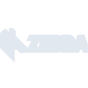

# zebratechnologies

[← Back to main README](../../README.md)





## 16 px

### black
```
https://georgegach.github.io/compatible-icons/simple-icons/zebratechnologies/16/black.png
```

### slate
```
https://georgegach.github.io/compatible-icons/simple-icons/zebratechnologies/16/slate.png
```

### white
```
https://georgegach.github.io/compatible-icons/simple-icons/zebratechnologies/16/white.png
```

## 64 px

### black
```
https://georgegach.github.io/compatible-icons/simple-icons/zebratechnologies/64/black.png
```

### slate
```
https://georgegach.github.io/compatible-icons/simple-icons/zebratechnologies/64/slate.png
```

### white
```
https://georgegach.github.io/compatible-icons/simple-icons/zebratechnologies/64/white.png
```

## 128 px

### black
```
https://georgegach.github.io/compatible-icons/simple-icons/zebratechnologies/128/black.png
```

### slate
```
https://georgegach.github.io/compatible-icons/simple-icons/zebratechnologies/128/slate.png
```

### white
```
https://georgegach.github.io/compatible-icons/simple-icons/zebratechnologies/128/white.png
```

## 512 px

### black
```
https://georgegach.github.io/compatible-icons/simple-icons/zebratechnologies/512/black.png
```

### slate
```
https://georgegach.github.io/compatible-icons/simple-icons/zebratechnologies/512/slate.png
```

### white
```
https://georgegach.github.io/compatible-icons/simple-icons/zebratechnologies/512/white.png
```

## 1024 px

### black
```
https://georgegach.github.io/compatible-icons/simple-icons/zebratechnologies/1024/black.png
```

### slate
```
https://georgegach.github.io/compatible-icons/simple-icons/zebratechnologies/1024/slate.png
```

### white
```
https://georgegach.github.io/compatible-icons/simple-icons/zebratechnologies/1024/white.png
```

## 16 px in base64

### black
```
data:image/png;base64,iVBORw0KGgoAAAANSUhEUgAAABAAAAAQCAYAAAAf8/9hAAAABmJLR0QA/wD/AP+gvaeTAAAApUlEQVQ4je3QMYoCQRAF0DfiLMKAiZouCEYewBt4gE29hkcw2Dt4AiNhF4xMvYGm3kFUFhGcMamFBiM11A/Nb7p+/V9dvPE0MowxwAWjRwzK4AM+scMvejihEbxHHvoJvjGFKjkbdLEM4TmplQn/xX2bhShPplqjQDvSP+K9ikmFSQ1VhiEWWOEHfXRQxxHN+MI5aSwww9d/6hDz+9Z3i9azBq+KK7wLJ4qeIm5eAAAAAElFTkSuQmCC
```

### slate
```
data:image/png;base64,iVBORw0KGgoAAAANSUhEUgAAABAAAAAQCAYAAAAf8/9hAAAABmJLR0QA/wD/AP+gvaeTAAAA4klEQVQ4je3QMUoDURSF4f+8yWgkoAQVrAKClQtwA2IlFrZuwyVYZA9ZgZWg4A7cgdgKM0QYK5/RYgjJPVYq2oWU+rUXfg4X/i1N9fPLebIOAs0HOxtniweaHICE3marMdjt93PVvN4I9mS3hq4Sre2JoLQI5rpADFMqRqqb7O+eHwKdJBgBh0Yz4fLzCAgwdou0JnhU1eSpoPyaBPcWPdAW4S5i5VcAIIAEuMOcYxfcAnfga6P9ZLbt6GC9C6+T1GJNQxGyErhXFOkywqcAVE/5qG7y1aIP/GE8nmwuFfjDPgBHE15exUP2LwAAAABJRU5ErkJggg==
```

### white
```
data:image/png;base64,iVBORw0KGgoAAAANSUhEUgAAABAAAAAQCAYAAAAf8/9hAAAABmJLR0QA/wD/AP+gvaeTAAAAsUlEQVQ4je3QMUpDYRCF0TNiRAjYqK0gWLkAd5AF2GYbLsHCPWQFqYQIVrbuQFv3ICoiD/JuCv/AS6kp9WtmmGHu3Bn+2ZpKcoULLKtq+huBHoV3nFTVa5I7nOEL+y2+YYQe17jBTDZ5TnKa5CFJn6Qb9PpB/Gz5SyXpmvKaJ4xx1LbvtXqaU83FDlJJJrjHIxY4xzF28YGDdkI3GBxjjstv6WSS5PanD9wgyeFWAn+YFUJ+b0jTvtfVAAAAAElFTkSuQmCC
```

